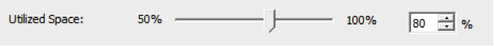

During VMworld I noticed a lot of focus of the attendees was on the IO load balancing features of Storage DRS (SDRS), however SDRS is more than only IO load balancing. Both space load balancing feature and initial placement are just as incredible, powerful and as useful as IO load balancing. Actually the term space load balancing isn’t really doing the algorithm any justice as it sounds it makes “unnecessary” moves around space usage, whereas “out of space avoidance” suits more the nature of this SDRS algorithm, because it will make crucial recommendations that in my opinion bring a lot of value. Initial placement and IO load balancing will be featured in future articles, but in this post I would like to focus on the out of space avoidance feature of SDRS. When SDRS is enabled, it will automatically make recommendations based on space utilization and IO load. IO load balancing can be activated or deactivated when enabling or disabling the option “Enable I/O metric for SDRS recommendations”. SDRS does not offer the option to enable or disable out of space avoidance; out of space avoidance is enabled by default and can only be disabled by disabling SDRS in its entirety. **Thresholds** By default, SDRS monitors the datastore space utilization and generates migration recommendations if the datastore utilization is exceeding the “_space utilization ratio threshold_”. The utilized space threshold determines the maximum acceptable space load of the VMFS datastore. And this is a part of the SDRS settings of the datastore cluster. This threshold is set by default to 80% and can be set to any value between 50 and 100 percent. \[caption id="attachment\_1715" align="aligncenter" width="619" caption="Space utilization ratio threshold"\]\[/caption\] Be aware that this threshold applies to each datastore that is a member of the datastore cluster; if you want to have similar absolute space headroom, it is recommended to add similar sized datastores to the datastore cluster. If the threshold is reached, SDRS will not migrate a random virtual machine to a random datastore, it needs to adhere to certain rules. Besides running a cost-benefit analysis on the registered virtual machines in the datastore, it also takes the “_space utilization ratio difference threshold_” into account. \[caption id="attachment\_1718" align="aligncenter" width="619" caption="Space utilization ratio difference threshold"\]\[/caption\] The utilization difference setting allows SDRS to determine which datastores should be considered as destination for virtual machines migrations. The space utilization ratio difference threshold indicates the required difference of utilization ratio between the destination and source datastores. The difference threshold is an advanced option of the SDRS runtime rules and is set to a default value of 5%. Consequently SDRS will not move any virtual machine disk from an 83% utilized datastore to a 78% utilized datastore. The reason why SDRS uses this setting is to avoid recommending migrations of marginal value. SDRS also uses space growth rate to avoid risky migrations. A migration is considered risky if it has to be undone in the near future. SDRS defines near future as a time window that is longer than the lead-time of a storage vMotion and defaults to 30 hours. This option cannot be changed in any supported way. Hence, SDRS will avoid moving any virtual machine disk to a datastore that is expected, based on growth rate, to exceed the utilization threshold within the next 30 hours. **Space Utilization** How does SDRS determine if VMFS datastore has exceeded the threshold? It does this by comparing the “_Space utilization_” against the utilized space threshold. Space utilization is determined by dividing the total consumed space on the datastore by the datastore capacity.

> Space utilization = total consumed space on the datastore / datastore capacity

To determine the space utilization of the datastore, SDRS requires the “per-VMDK” usage statistic and the VMFS datastore usage statistic. The per-VMDK statistic provides SDRS data about the allocated space in the VMDK, while the VMFS datastore statistic provides information about the datastore utilization. \[caption id="attachment\_1719" align="aligncenter" width="297" caption="Out of Space avoidance input"\]\[/caption\] Now this is one of the more cool parts of the algorithm, as mentioned, SDRS takes into account the allocated amount of disk space instead of the provisioned disk space using thin disk. SDRS receives the per-VMDK statistics and space utilization per datastore on an ongoing basis. If the utilization exceeds the threshold the SDRS algorithm is triggered immediately and does not have to wait to complete his invocation period. By receiving space utilization information frequently, SDRS is able to understand and trend-map the data-growth within the VMDK. The growth rate is estimated using historical usage samples, with recent samples weighing more than older historical usage samples. By including this information in the cost-benefit risk analysis SDRS attempts to avoid migrating virtual machines with data-growth rates that will likely cause the destination datastore to exceed the threshold in the near future. By including the estimated growth rate, SDRS is equipped with an outage avoiding strategy. This avoiding outage intelligence helps most organization to adopt thin provisioned disks located in the virtualization stack. You still need to think about the over-subscription level, but SDRS will helps to control the environment and avoid outage caused by out-of-space situations as much as possible. **Migration candidate selection** Now how does SDRS know which virtual machines to move? As mentioned before SDRS uses a cost-benefit risk analysis. Moving virtual machines is expensive, both on CPU and memory subsystems as well as the IO subsystems. Therefore SDRS aims to generate recommendations that have the lowest impact on the environment while delivering improvements and solve any violation. SDRS considers the size of the VMDK (allocated space) and the activity of the IO workload to calculate the cost aspect of the CB analysis. When a datastore exceeds the space utilization threshold, SDRS will try to move the number of megabytes out of the datastore to correct the space utilization violation. In other words, SDRS attempts to select a virtual machine that is closest in size required to bring the space utilization of the datastore to the space utilization ratio threshold. **Caveats** Before enabling SDRS on arrays configured to use deduplication or replication technologies you might want to check your array vendor on their recommendation of combining SDRS with their technology. Duncan has written an excellent article about the interop between SDRS and various technologies. Please read if you already haven’t: [http://www.yellow-bricks.com/2011/07/15/storage-drs-interoperability/](http://www.yellow-bricks.com/2011/07/15/storage-drs-interoperability/) **Key Takeaway** SDRS out of space avoidance alone is reason enough to use SDRS. Having an automated way of distributing virtual machines across your datastore landscape can result in a more efficient usage of available storage space, while reducing the management effort. Understanding the outage avoidance measures inside the algorithm might help to consider using thin-provisioned VMDK format to decrease the footprint of the virtual machines, speed up SDRS migrations and possibly increase the VM density per datastore.
