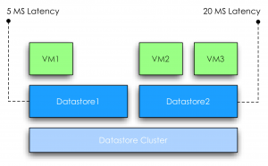
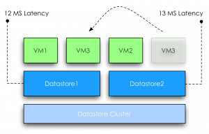

This article is a part of the series on architecture and design on datastore clusters. This article zooms in on why it’s recommended to use similar type disks in a datastore cluster. **In-tier balancing solution** SDRS can be considered as an “in-tier” balancing solution, suggesting that a datastore cluster should be populated with datastores that provide similar performance, continuity, capacity or service level. Although it’s not a technical requirement to have similar configured datastores, using heterogeneous configurations in a datastore cluster can lead to unexpected results. Understanding the SDRS’ main goal and the load balancing process can assist you in architecting your datastore cluster. **SDRS load balancing goal** The main focus of SDRS is to correct imbalance from both a space utilization and latency perspective on the datastore level. SDRS determines the imbalance level (space or latency) of the datastore cluster and migrates one or multiple virtual machine disk to solve the imbalance. In order to select an appropriate migration candidate (virtual machine) SDRS relies on device and workload modeling to understand the impact of a workload on the latency of the datastore, SDRS uses virtual machine statistics and datastore utilization to understand the impact of virtual machine placement on the space utilization of a datastore. **Modeling** Let’s take a closer look at modeling. SDRS captures device performance to create a performance model; by using the SIOC injector and a reference workload it understands and learns the performance of each device. This way SDRS gets a clear picture of the datastores inside the datastore cluster. Workload modeling is used by SDRS to understand and learn the virtual machine workloads inside the datastore cluster. The workload modeling process creates a workload metric of each virtual disk and analyzes the impact of the data points on latency. SDRS combines and correlates the outcome of device and workload modeling and space utilization into a unified recommendation. This means that when SDRS decides to migrate a specific VMDK, it considers the workload metric of the virtual disk and analyzes the impact of that specific workload on the latency of the destination datastore. If both IO metric and space utilization functions are enabled on the datastore cluster, SDRS combines the outcome of device modeling, workload modeling and space utilization and weights them regarding to violated threshold. Interesting enough, even when you disable IO load balancing, SDRS attempts to take overall IO statistics into account when finding a suitable datastore. **Impact of load balancing construct on datastore cluster configuration** Although SDRS analyzes devices and each virtual machines’ workload it’s is key to understand that SDRS’ main priority is to correct the threshold violation of datastore. Although it tries to find the best suitable datastore for a specific workload, modeling is still used as a metric to understand and achieve the goal of getting the best overall performance out of the datastore cluster. In other words, modeling is used for balancing the load on the datastores and not to respect specific wishes of a virtual machine disk. In one way you can argue that SDRS load balancing has somewhat of a socialistic nature. Benefit for the society (datastores inside a datastore cluster) outweighs the individual need (single virtual machine performance). Let’s look at an example to better understand this concept. **Example scenario** VM1 is running on a datastore1. SDRS determined that the normalized load\* is 5ms latency. VM2 and VM3 are running on a datastore2. SDRS considers datastore2 to have a normalized load of 20ms latency, violating the default threshold of 15ms. Normalized load: SDRS aggregates the device modeling and workload modeling into a metric called normalized load.  SDRS moves VM3 to datastore1; at this point the overall latency of the datastore2 is reduced 13ms. However due to moving VM3 to datastore1, the latency is increased from 5ms to 12ms. At this point the increase in latency will impact the workload of VM1, however the “society” benefits from the move because after the move no datastore is violating the latency threshold of the SDRS cluster anymore.  In this scenario the overall IOPS will be higher, which aligns with the goal of SDRS utilizing overall capacity and performance. **Note:** As this subject is complex enough, I used a very simple example. In this scenario the latency "moved" with the VM. In real life this is not necessarily the fact, when a virtual machine is moved the latency will go up with the same amount at which the latency went down on the source. **Load Balancing in a Heterogeneous configuration** What if the datastore cluster contains a mix of datastores that are backed by different types of disks? For a moment, let’s focus on the performance impact of a heterogeneous configuration. As mentioned before, device and workload modeling helps SDRS to find the most suitable datastore for a specific workload, however when combining different types of disk, for example, SSD, FC and SATA, it is not uncommon to see the fastest datastore fill up first. If one of the smaller SSD’s run out of space, SDRS is required to solve the space utilization threshold violation and will migrate a workload from a faster datastore to a slower datastore, prioritizing space utilization over IO utilization. Although future invocations of the SDRS algorithm might solve the problem by moving VMDK’s around to find a more optimal balance, no priority or guarantees can be assigned to a specific virtual disk avoiding potential decrease in performance of a specific VMDK. Now at this point most of you wonder if VASA and storage profiles can be used in such a configuration to associate specific profiles to virtual machines and make these VMs compliant to specific datastores. SDRS does not incorporate storage profiles compliancy in the load balancing algorithms and unfortunately not every storage vendor offers VASA providers of their arrays. Some excellent articles about VASA and Profile driven storage can be found at [Yellow Bricks.com](http://Yellow Bricks.com) and [blogs.vmware.com/vSphere/storage](http://blogs.vmware.com/vSphere/storage "VMware Storage Blog") VASA: [http://blogs.vmware.com/vsphere/2011/08/vsphere-50-storage-features-part-10-vasa-vsphere-storage-apis-storage-awareness.html](http://blogs.vmware.com/vsphere/2011/08/vsphere-50-storage-features-part-10-vasa-vsphere-storage-apis-storage-awareness.html "http://blogs.vmware.com/vsphere/2011/08/vsphere-50-storage-features-part-10-vasa-vsphere-storage-apis-storage-awareness.html") Profile driven storage: [http://www.yellow-bricks.com/2011/07/13/vsphere-5-0-profile-driven-storage-what-is-it-good-for/]( http://www.yellow-bricks.com/2011/07/13/vsphere-5-0-profile-driven-storage-what-is-it-good-for/ " http://www.yellow-bricks.com/2011/07/13/vsphere-5-0-profile-driven-storage-what-is-it-good-for/") To guarantee specific performance to virtual machines it is recommended to uses similar type disks to back the datastores of a datastore cluster. This configuration offers a stable and predictable service level to the virtual infrastructure. If multiple types of disks are available, it is recommended to split and create multiple datastore clusters each containing groups of identical types of disks. Previous articles in the SDRS short series Architecture and design of Datastore clusters: Part1: [Architecture and design of datastore clusters](http://frankdenneman.nl/2011/09/architecture-and-design-of-datastore-clusters/ "Architecture and design of Datastore clusters") Part2: [Partially connected datastore clusters](http://frankdenneman.nl/2011/10/partially-connected-datastore-clusters/ "Partially connected datastore clusters")
