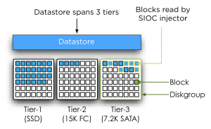

In its basic form Storage DRS can be used together with any array, however there are a few combinations of Storage array features and Storage DRS features that don’t mix easily. One of the most sought after question is can Storage DRS work with Array based Auto-tiering? And the answer is yes, yes you can use initial placement and out of space avoidance features that Storage DRS offers, however it is not recommended to enable the I/O metric feature. **Modeling** The main goal of the I/O metric function, popular called I/O load balancing, is to resolve the imbalance of performance delivered from datastores in the datastore cluster. To avoid hotspots in the datastore cluster and decrease overall latency imbalance, Storage DRS I/O load balancing uses device modeling and virtual machine workload modeling. Device modeling helps Storage DRS to understand the performance characteristics of the devices backing the datastores, while virtual machine workload modeling analyzes virtual machine workload running inside the datastore cluster. Both device and workload modeling assists Storage DRS to asses the improvement of I/O latency that will be achieved after a virtual machine migration. **Device modeling and the SIOC injector** To understand and learn the performance of the devices backing the datastore, Storage DRS uses the Storage IO Control (SIOC) workload injector. To characterize the datastore, SIOC injector opens and read random blocks of the datastore. As the SIOC injector does not open every block backing the datastore, we cannot ensure that the SIOC injector opens an identical number of blocks of each performance tier to characterize the disk. As multiple performance tiers of disk back the datastore there is a possibility that the SIOC injector might open blocks located on similar speed disks, either slow or fast, while the datastore is primarily backed by disk with a different performance level. Let’s use an example to clarify this further.  In the diagram pictured above, SIOC opens random blocks and perform its tests. Unfortunately it doesn’t open blocks on other disks. While most of the blocks backing the datastore are located on faster performing disks, Storage DRS device modeling will characterize this disk with performance similar to 7.2K SATA disks. This inaccurate characterization of datastore performance might lead to an incorrect performance assessment and can lead to Storage DRS withholding a migration recommendation while there is sufficient performance available. **Segment migration triggered by auto-tiering algorithms** By using SIOC injector Storage DRS evaluate the performance of the disks, however Auto-tiering solutions migrate LUN segments (chunks) to different disk types based on the use pattern. Hot segments (frequently accessed) typically move to faster disks while cold segments move to slower disks. Depending on the array type and vendor there are different kind of policies and threshold for these migrations. By default Storage DRS is invoked every 8 hours and requires performance data over more than 16 hours to generate I/O load balancing decisions. Multiple storage vendors offer auto-tiering solutions, each using different time-cycles to collect and analyze workload before moving LUN segments. Some auto-tiering solutions move chunks based on real-time workload while other arrays move chunks after collecting performance data for 24 hours. This means that auto tiering solutions alter the landscape in which the SIOC injector performs its test. Let’s turn to another scenario for clarification. In this scenario, SIOC is primarily opening blocks located in the Tier-1 diskgroup belonging to the datastore. As the datastore isn’t using these segments that often (cold) the auto tiering solution decides to migrate these segments to a lower tier. In this case the segments are migrated to 15K disks instead of SSD devices.  Storage DRS expects that the behavior of the device remains the same for at least 16 hours; it will base its calculation on these facts. Auto tiering solutions might change the underlying structure of the datastore based on its algorithm and timescales, conflicting with Storage DRS its calculation. The misalignment of Storage DRS invocation and auto-tiering algorithms cycles makes it unpredictable when LUN segments may be moved, potentially colliding with the Storage DRS calculations and recommendations. Together with the transparency of auto tiering algorithms to Storage DRS and the non-existing communication between Storage DRS and Auto-tiering algorithms create the basis of the recommendation to disable I/O metric on datastore clusters backed by devices participating in an auto-tiering solution. Always verify these recommendations with your storage vendor. **Additional information:** Duncan wrote an excellent article about the Storage IO Control workload injector, which can be found [here](http://www.yellow-bricks.com/2011/08/05/sdrs-and-auto-tiering-solutions-the-injector/). More info on device modeling and load balancing can be found in the article [impact of load balancing on datastore cluster configuration](http://frankdenneman.nl/2012/01/impact-of-load-balancing-on-datastore-cluster-configuration/). **Note**: This article is describing Storage DRS behavior based on vSphere 5.
