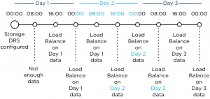

Storage DRS load balancing frequency differs from DRS load balance frequency, where DRS runs every 5 minutes to balance CPU and memory resources, Storage DRS uses a far more complex load balancing scheme. Let’s take a closer look at Storage DRS load balancing. **Default invocation period** The invocation period of Storage DRS is every 8 hours and uses what’s called past-day statistics. Storage DRS triggers a load balancing evaluation process if a datastore exceeds the space utilization threshold. Storage DRS load balances space utilization of the datastores and if I/O metric is enabled, load balances on I/O utilization as well. Space utilization and I/O load on a datastore are two different load patterns, therefore Storage DRS uses different methods to accumulate and analyze IO load patterns and space utilization of the datastores within the datastore cluster. **Space load balancing statistic collection** Analyzing space utilization is rather straightforward; Storage DRS needs to understand the growth rate of each virtual machine and the utilization of each datastore. It collects information from the vCenter database to understand the disk usage and file structure of each virtual machine. Each ESXi host reports datastore utilization at a frequent interval and this is stored in the vCenter database as well. Storage DRS checks whether the datastore utilization is above the user-set threshold. When generating a load balance recommendation, Storage DRS knows where to move a virtual machine as it knows the current space growth of virtual machines on destination datastores, preventing a threshold violation direct after the placement. I/O load utilization is a different beast. I/O load may grow over time, however the datastore can experience a temporary increase of load. How does Storage DRS handle these spikes? Enter past-day statistics! **I/O load balancing statistic collection** Storage DRS uses two main information sources for I/O load balancing statistic collection, vCenter and the SIOC injector. vCenter statistics is uses to understand the workload each virtual disk is generating, this is called workload modeling. SIOC injector is used to understand the device performance and this is called device modeling. See “[Impact of load balancing on datastore cluster configuration](http://frankdenneman.nl/2012/01/impact-of-load-balancing-on-datastore-cluster-configuration/)” for more info about device and workload modeling. Data of workload and device modeling is aggregated in a performance snapshot and is used as input for generating migration recommendations. Migrating virtual machine disk files takes time and most of all it impacts the infrastructure, migrating based on peak value is the last thing you want to do when you are introducing long-term high impact workloads. Therefore Storage DRS starts to recommend I/O load-related recommendations once an imbalance persists for some period of time. To avoid being caught out by peak load moments, Storage DRS does not use real-time statistics. It aggregates all the data points collected over a period of time. By using 90th percentile values, Storage DRS filters out the extreme spikes while still maintaining a good view of the busiest period of that day as this value translate to the lowest edge of the busiest period. As workloads shift during the day enough information needs to be collected to make a good assessment of the workloads. Therefore Storage DRS needs at least 16 hours of data before recommendation are made. By using at least 16 hours worth of data Storage DRS has an enough data of the same timeslot so it can compare utilization of datastores for example: datastore 1 to datastore 2 on Monday morning at 11:00. As 16 hour is 2/3 of the day Storage DRS receives enough information to characterize the performance of datastore on that day. But how does this tie in with the 8 hour invocation period? **8-hour invocation period and 16 hours worth of data** Storage DRS uses 16 hours of data, however this data must be captured in the current day otherwise the performance snapshot of the previous day is used. How is this combined with the 8-hour invocation periods?  This means that technically, the I/O load balancing is done every 16 hours. Usually after midnight, after the day date, the stats are fixed and rolled up. This is called the rollover event. The first invocation period (08:00) after the rollover event uses the 24 hours statistics of the previous day. After 16 hours are passed of the current day, Storage DRS uses the new performance snapshot and may evaluate moves.
