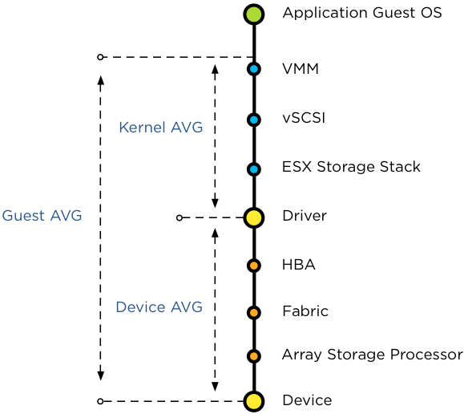

Today someone asked if the congestion threshold of SIOC is related to which host latency threshold? Is it the Device average (DAVG), Kernel Average (KAVG) or Guest Average (GAVG)?  Well actually it’s none of the above. DAVG, KAVG and GAVG are metrics in a host-local centralized scheduler that has complete control over all the requests to the storage system. SIOC main purpose is to manage shared storage resources across ESXi hosts, providing allocation of I/O resources independent of the placement of virtual machines accessing the shared datastore. And because it needs to regulate and prioritize access to shared storage that spans multiple ESXi hosts, the congestion threshold is not measured against a host-side latency metric. But to which metric is it compared? In essence the congestion threshold is compared with the weighted average of D/AVG per host, the weight is the number of IOPS on that host. Let’s expand on this a bit further. **Average I/O latency** To have an indication of the load of the datastore on the array, SIOC uses the average I/O latency detected by each host connected to that datastore. Average latency across hosts is used to cope with the variety of workloads, the characteristic of the active workloads, such as read versus writes, I/O size and degree of sequential I/Os in addition to array behavior such as block location, caching policies and I/O scheduling. To calculate and normalize the average latency across hosts, each host writes its average device latency and number of I/Os for that datastore in a file called IORMSTATS.SF stored on the same datastore.  A common misconception about SIOC is that it’s compute cluster based. The process of determining the datastore-wide average latency really reveals the key denominator – _hosts connected to the datastore_ - . All hosts connected to the datastore write to the IORMSTATS.SF file, regardless of cluster membership. Other than enabling SIOC, vCenter is not necessary for normal operations. Each connected host reads the IORMSTATS.SF file each 4 seconds and locally computes the datastore-wide average to use for managing the I/O stream. Therefor cluster membership is irrelevant. **Datastore wide normalized I/O latency** Back to the process of computing the datastore wide normalized I/O latency. The average device latencies of each host are normalized by SIOC based on the I/O request size. As mentioned before, not all storage related workloads are the same. Workloads issuing I/Os with a large request size result in longer device latencies due to way storage arrays process these workloads. For example, when using a larger I/O request size such as 256KB, the transfer might be broken up by the storage subsystem into multiple 64KB blocks. This operation can lead to a decline of transfer rate and throughput levels, increasing latency. This allows SIOC to differentiate high device latency from actual I/O congestion at the device itself. **Number of I/O requests complete per second** At this point SIOC has normalized the average latency across hosts based on I/O size, next step is to determine the aggregate number of IOPS accessing the datastore. As each host reports the number of I/O requests complete per second, this metric is used to compare and prioritize the workloads. I hope this mini-deepdive into the congestion thresholds explains why the congestion threshold could never be solely related to a single host-side metric . Because the datastore-wide average latency is a normalized value, the latency observed of the datastore per individual host may be different than the latency SIOC reports per datastore. .
