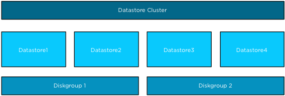
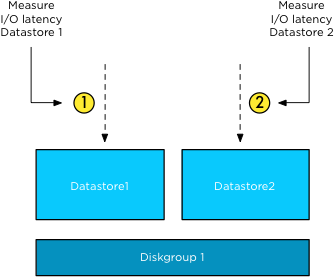
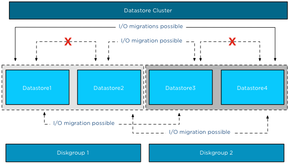

One of the cool new features of Storage DRS in vSphere 5.1 is the datastore correlation detector used by the SIOC injector. Storage arrays have many ways to configure datastores from among the available physical disk and controller resources in the array. Some arrays allow sharing of back-end disks and RAID groups across multiple datastores. When two datastores share backend resources, their performance characteristics are tied together: when one datastore experiences high latency, the other datastore will also experience similar high latency since IOs from both datastore are being serviced by the same disks. These datastores are considered “performance-related”. I/O load balancing operations in vSphere 5.1 avoid recommending migration of virtual machines between two performance-correlated datastores. **I/O load balancing algorithm** Storage DRS collects several virtual machine metrics to analyze the workload generated by the virtual machines within the datastore cluster. These metrics are aggregated in a workload model. To effectively distribute the different load of the virtual machines across the datastores, Storage DRS needs to understand the performance (latency) of each datastore. When a datastore violates its I/O load threshold, Storage DRS moves virtual machines out of the datastore. By linking workload models to device models, Storage DRS is able to select a datastore with a low I/O load when placing a virtual machine with a high I/O load during load balance operations. **Performance related datastores** However if data is moved between datastores that are backed by the same disks, the move may not decrease the latency experienced on the source datastore as the same set of disks, spindles or RAID-groups service the destination datastore as well. I/O load balancing recommendations should avoid using two performance-correlated datastores, since moving a virtual machine from the source datastore to the destination datastore has no effect on the datastore latency. How does Storage DRS discover performance related datastores? How does it work? The datastore correlation detector measures performance during isolation and when concurrent IOs are pushed to multiple datastores. The basic mechanism of correlation detector is rather straightforward: compare the overall latency when two datastores are being used alone in isolation and when there are concurrent IO streams on both of the datastores. If there is no performance correlation, the concurrent IO to the other datastore should have no effect. Contrariwise, if two datastores are performance correlated, then concurrent IO stream should amplify the average IO latency on both datastores. Please note that datastores will be checked for correlation on a regular basis. This allows Storage DRS to detect changes to the underlying storage configuration. **Example scenario** In this scenario Datastore1 and Datastore2 are backed by disk devices grouped in Diskgroup1, while Datastore3 and Datastore4 are backed by disk devices grouped in Diskgroup2. All four datastores belong to a single datastore cluster.  After SIOC has run the workload and device models on a datastore, SIOC picks a random datastore in the datastore cluster to check for correlations. If both datastores are idle, the datastore correlation detector uses the same workload to measure the average I/O latency in isolation and concurrent I/O mode. **Isolation** The SIOC injector measures the average IO latency of Datastore1 in isolation. This means it measures the latency of the outstanding I/O of Datastore1 alone. Next, it measures the average IO latency of Datastore2 in isolation.  **Concurrent I/Os** The first two steps are used to establish the baseline for each datastore. In the third step the SIOC injector sends concurrent I/O to both datastores simultaneously.  This results in the behavior that Storage DRS does not recommend any I/O load balancing operations between Datastore1 and 2 and Datastore3 and 4, but it can recommend for example to move virtual machines from Datastore1 to Datastore2 or from Datastore2 to Datastore3, etc. All moves are possible as long as the datastores are not correlated.  **Enable Storage DRS on performance-correlated datastores?** When two datastores are marked as performance-correlated, Storage DRS does not generate IO load balancing recommendations between those two datastores. However Storage DRS can be used for initial placement and still generate recommendations to move virtual machines between two correlated datastores to address out of space situations or to correct rule violations. Please keep in mind that some arrays use a subset of disk out of a larger diskpool to back a single datastore. With these configurations, it appears that all disks in a diskpool back all the datastores but in reality they don't. Therefor I recommend to set Storage DRS automation mode to manual and review the migration recommendations to understand if all datastores within the diskpool are performance-correlated.
