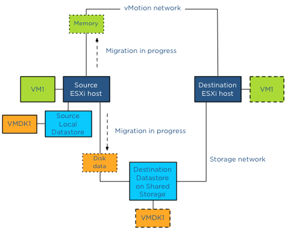

vSphere 5.1 vMotion enables a virtual machine to change its datastore and host simultaneously, even if the two hosts don't have any shared storage in common. For me this is by far the coolest feature in the vSphere 5.1 release, as this technology opens up new possibilities and lays the foundation of true portability of virtual machines. As long as two hosts have (L2) network connection we can live migrate virtual machines. Think about the possibilities we have with this feature as some of the current limitations will eventually be solved, think inter-cloud migration, think follow the moon computing, think big! The new vMotion provides a new level of ease and flexibility for virtual machine migrations and the beauty of this is that it spans the complete range of customers. It lowers the barrier for vMotion use for small SMB shops, allowing them to leverage local disk and simpler setups, while big datacenter customers can now migrate virtual machines between clusters that may not have a common set of datastores between them. Let’s have a look at what the feature actually does. In essence, this technology combines vMotion and Storage vMotion. But instead of either copying the compute state to another host or the disks to another datastore, it is a unified migration where both the compute state and the disk are transferred to different host and datastore. All is done via the vMotion network (usually). The moment the new vMotion was announced at VMworld, I started to receive questions. Here are the most interesting ones that allows me to give you a little more insight of this new enhancement. **Migration type** One of the questions I have received is, will the new vMotion always move the disk over the network? This depends on the vMotion type you have selected. When selecting the migration type; three options are available:  This may be obvious to most, but I just want to highlight it again. A Storage vMotion will never move the compute state of a VM to another host while migrating the data to another datastore. Therefore when you just want to move a VM to another host, select vMotion, when you only want to change datastores, select Storage vMotion. **Which network will it use?** vMotion will use the designated vMotion network to copy the compute state and the disks to the destination host when copying disk data between non-shared disks. This means that you need to the extra load into account when the disk data is being transferred. Luckily the vMotion team improved the vMotion stack to reduce the overhead as much as possible.  **Does the new vMotion support multi-NIC for disk migration?** The disk data is picked up by the vMotion code, this means vMotion transparently load balances the disk data traffic over all available vMotion vmknics. vSphere 5.1 vMotion leverages all the enhancements introduced in the vSphere 5.0 such as Multi-NIC support and SDPS. Duncan wrote a [nice article]( http://www.yellow-bricks.com/2011/07/20/vsphere-50-vmotion-enhancements/) on these two features. **Is there any limitation to the new vMotion when the virtual machine is using shared vs. unshared swap ?** No, either will work, just as with the traditional vMotion. **Will the new vMotion features be leveraged by DRS/DPM/Storage DRS ?** In vSphere 5.1 DRS, DPM and Storage DRS will not issue a vMotion that copies data between datastores. DRS and DPM remains to leverage traditional vMotion, while Storage DRS issues storage vMotions to move data between datastores in the datastore cluster. Maintenance mode, a part of the DRS stack, will not issue a data moving vMotion operation. Data moving vMotion operations are more expensive than traditional vMotion and the cost/risk benefit must be taken into account when making migration decisions. A major overhaul of the DRS algorithm code is necessary to include this into the framework, and this was not feasible during this release. **How many concurrent vMotion operations that copies data between datastores can I run simultaneously?** A vMotion that copies data between datastores will count against the limitations of concurrent vMotion and Storage vMotion of a host. In vSphere 5.1 one cannot perform more than 2 concurrent Storage vMotions per host. As a result no more than 2 concurrent vMotions that copy data will be allowed. For more information about the costs of the vMotion process, I recommend to read the article: “[Limiting the number of Storage vMotions](http://frankdenneman.nl/2012/06/limiting-the-number-of-storage-vmotions/)” **How is disk data migration via vMotion different from a Storage vMotion?** The main difference between vMotion and Storage vMotion is that vMotion does not “touch” the storage subsystem for copy operations of non-shared datastores, but transfers the disk data via an Ethernet network. Due to the possibilities of longer distances and higher latency, disk data is transferred asynchronously. To cope with higher latencies, a lot of changes were made to the buffer structure of the vMotion process. However if vMotion detects that the Guest OS issues I/O faster than the network transfer rate, or that the destination datastore is not keeping up with the incoming changes, vMotion can switch to synchronous mirror mode to ensure the correctness of data. **I understand that the vMotion module transmits the disk data to the destination, but how are changed blocks during migration time handled?** For disk data migration vMotion uses the same architecture as Storage vMotion to handle disk content. There are two major components in play – bulk copy and the mirror mode driver. vMotion kicks off a bulk copy and copies as much as content possible to the destination datastore via the vMotion network. During this bulk copy, blocks can be changed, some blocks are not yet copied, but some of them can already reside on the destination datastore. If the Guest OS changes blocks that are already copied by the bulk copy process, the mirror mode drive will write them to the source and destination datastore, keeping them both in lock-step. The mirror mode driver ignores all the blocks that are changed but not yet copied, as the ongoing bulk copy will pick them up. To keep the IO performance as high as possible, a buffer is available for the mirror mode driver. If high latencies are detected on the vMotion network, the mirror mode driver can write the changes to the buffer instead of delaying the I/O writes to both source and destination disk. If you want to know more about the mirror mode driver, [Yellow bricks](http://www.yellow-bricks.com/2011/07/14/vsphere-5-0-storage-vmotion-and-the-mirror-driver/) contains a out-take of our book about the mirror mode driver.  **What is copied first, disk data or the memory state?** If data is copied from non-shared datastores, vMotion must migrate the disk data and the memory across the vMotion network. It must also process additional changes that occur during the copy process. The challenge is to get to a point where the number of changed blocks and memory are so small that they can be copied over and switch over the virtual machine between the hosts before any new changes are made to either disk or memory. Usually the change rate of memory is much higher than the change rate of disk and therefore the vMotion process start of with the bulk copy of the disk data. After the bulk data process is completed and the mirror mode driver processes all ongoing changes, vMotion starts copying the memory state of the virtual machine. **But what if I share datastores between hosts; can I still use this feature and leverage the storage network?** Yes and this is very cool piece of code, to avoid overhead as much as possible, the storage network will be leveraged if both the source and destination host have access to the destination datastore. For instance, if a virtual machine resides on a local datastore and needs to be copied to a datastore located on a SAN, vMotion will use the storage network to which the source host is connected. In essence a Storage vMotion is used to avoid vMotion network utilization and additional host CPU cycles.  **Because you use Storage vMotion, will vMotion leverage VAAI hardware offloading?** If both the source and destination host are connected to the destination datastore and the datastore is located on an array that has VAAI enabled, Storage vMotion will offload the copy process to the array. **Hold on, you are mentioning Storage vMotion, but I have Essential Plus license, do I need to upgrade to Standard?** To be honest I try to keep away from the licensing debate as far as I can, but this seems to be the most popular question. If you have an Essential Plus license you can leverage all these enhancements of vMotion in vSphere 5.1. You are not required to use a standard license if you are going to migrate to a shared storage destination datastore. **For any other licensing question or remark, please contact your local VMware SE / account manager.** **Update:** Essential plus customers, please update to vCenter 5.1.0A. For more details read the follow article: ["vMotion bug fixed in vCenter Server 5.1.0a".](http://frankdenneman.nl/vmware/vmotion-bug-fixed-in-vcenter-server-5-1-0a/ "http://frankdenneman.nl/vmware/vmotion-bug-fixed-in-vcenter-server-5-1-0a/") Get notification of these blogs postings and more DRS and Storage DRS information by following me on Twitter: [@frankdenneman](https://twitter.com/FrankDenneman)
