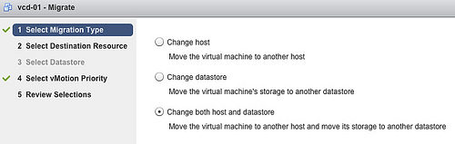

Just a reminder as I received a lot of questions and comments about this: The new vMotion functionality - migrating virtual machines between host without shared storage - is only available via the web client. Please note that in the vSphere 5.1 release all new features are only visible via the web client and not in the old vSphere client.  For more information about the vMotion functionality: [vSphere 5.1 vMotion deepdive](frankdenneman.nl/2012/09/vsphere-5-1-vmotion-deepdive "vSphere 5.1 vMotion deepdive") Get notification of these blogs postings and more DRS and Storage DRS information by following me on Twitter: [@frankdenneman](https://twitter.com/FrankDenneman)
