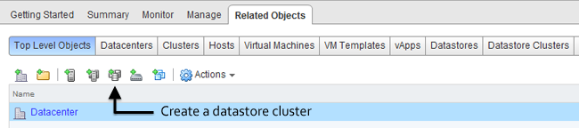
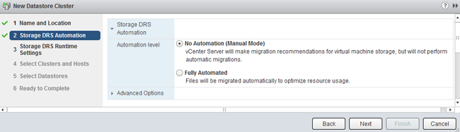

vSphere 5.1 main user interface is provided by the web client, during beta testing I spend some time to get accustomed to the new user interface. In order to save you some time, I created this write-up on how to create a datastore cluster using the web client. I assume you already installed the new vCenter 5.1. If not, check out’s Duncan post on how to install the [new vCenter Server Appliance](http://www.yellow-bricks.com/2012/09/11/back-to-basics-deploying-the-vcenter-server-appliance/). Before showing the eight easy steps that need to be taken when creating a datastore cluster, I want to list some constraints and the recommendations for creating datastore clusters. **Constraints:** • VMFS and NFS cannot be part of the same datastore cluster. • Similar disk types should be used inside a datastore cluster. • Maximum of 64 datastores per datastore cluster. • Maximum of 256 datastore clusters per vCenter Server. • Maximum of 9000 VMDKs per datastore cluster **Recommendations:** • Group disks with similar characteristics (RAID-1 with RAID-1, Replicated with Replicated, etc.) • Leverage information provided by vSphere Storage APIs - Storage Awareness **The Steps** **1\. Go to the Home screen and select Storage**  **2\. Select the Datastore Clusters icon in Related Objects view.**  **3\. Name and Location** The first steps are to enable Storage DRS, specify the datastore cluster name and check if the “Turn on Storage DRS” option is enabled.  When “Turn on Storage DRS” is activated, the following functions are enabled: • Initial placement for virtual disks based on space and I/O workload • Space load balancing among datastores within a datastore cluster • IO load balancing among datastores within a datastore cluster The “Turn on Storage DRS” check box enables or disables all of these components at once. If necessary, I/O balancing functions can be disabled independently.If Storage DRS is not enabled, a datastore cluster will be created which lists the datastores underneath, but Storage DRS won’t recommend any placement action for provisioning or migration operations on the datastore cluster. When you want to disable Storage DRS on an active datastore cluster, please note that all the Storage DRS settings, e.g. automation level, aggressiveness controls, thresholds, rules and Storage DRS schedules are saved so they may be restored to the same state at the moment Storage DRS was disabled. **4\. Storage DRS Automation** Storage DRS offers two automation levels:  **No Automation (Manual Mode)** Manual mode is the default mode of operation. When the datastore cluster is operating in manual mode, placement and migration recommendations are presented to the user, but are not executed until they are manually approved. **Fully Automated** Fully automated allows Storage DRS to apply space and I/O load-balance migration recommendations automatically. No user intervention is required. However, initial placement recommendations still require user approval. Storage DRS allows virtual machines to have individual automation level settings that override datastore cluster-level automation level settings. Similar to when DRS was introduced, I recommend to start using manual mode first and review the generated recommendations. If you are comfortable with the decision matrix of Storage DRS you can switch to fully automated. Please note that you can switch between modes on the fly and without incurring downtime. **5\. Storage DRS Runtime Settings**  Keep the defaults for now. Future articles expand upon the Storage DRS thresholds and advanced options. **6\. Select Clusters and Hosts** The “Select Hosts and Clusters” view allows the user to select one or more (DRS) clusters to work with. Only clusters within the same vCenter datacenter can be selected, as the vCenter datacenter is the boundary for Storage DRS to operate in.  **7\. Select Datastores** By default, only datastores connected to all hosts in the selected (DRS) cluster(s) are shown. The Show datastore dropdown menu provides the options to show partially connected datastores. The article [partially connected datastore cluster](http://frankdenneman.nl/2011/10/partially-connected-datastore-clusters/) gives you insight of the impact of this design decision.  **8\. Ready to Complete** The “Ready to Complete” screen provides an overview of all the settings configured by the user.  Review the configuration of your new datastore cluster and click on finish.
