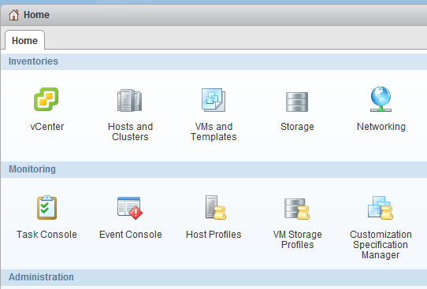
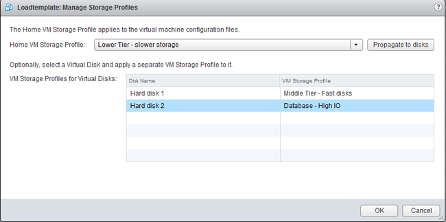

Virtual Machine Storage Profiles are used to identify the storage capabilities necessary in order to properly run the application within the virtual machine. VM Storage Profiles need to enabled first on the hosts and/or Cluster before you are able to assign them to a virtual machine. 1. Select VM Storage Profiles in the Home screen  2. Select the Icon in the middle to enable VM Storage profiles  3. Select the cluster or host that you want to enable  Check if the host has the appropriate license 4. Create Storage Profiles  A VM storage profile is attached to a Storage capability. In turn a Storage Capability profile is attached to a datastore. For more information about storage capabilities please read the article: [vSphere 5.0 Storage Features Part 11 – Profile Driven Storage](http://blogs.vmware.com/vsphere/2011/08/vsphere-50-storage-features-part-10-profile-driven-storage.html) by Cormac Hogan. 5. Go back to home 6. Select VM and Templates 7. Select Datacenter in the left pane 8. Select the menu option "Related Objects" in the right pane 9. Select the menu option "Virtual Machines"  10. Right click on a virtual machine 11. Select All vCenter Actions 12. Select Storage Profiles 13. Select Manage Storage Profiles  14. Apply the VM storage Profiles to the working directory and disk  Please note that you can assign different storage profiles to the virtual machine working directory and each single VMDK. The working directory is where the .vmx, .nvram, .log resides. This is listed in the UI as the Home VM location. Each VMDK can be assigned with a different storage profile to align it with your SLA’s.
