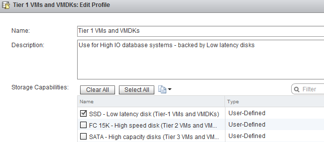
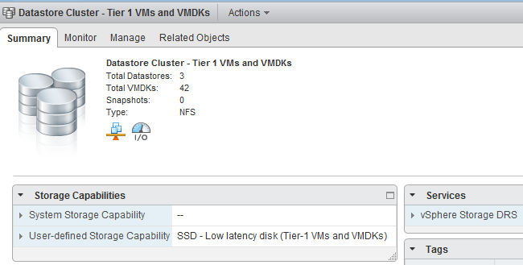

In my previous article about [how to configure storage profiles using the web client](http://frankdenneman.nl/2012/09/how-to-attach-vm-storage-profiles-to-a-virtual-machine-using-the-web-client/) I stated that different storage profiles could be assigned to a single virtual machine. Storage profiles can be used together with Storage DRS. Let’s take a closer look on how to use storage profiles with Storage DRS. **Architectural view** VM storage profiles need to be connected to a storage capability to function. The storage capability itself needs to be associated to one or more datastores. A virtual machine in its whole can be associated with a storage profile, or you can use a more granular configuration and associate different storage profiles to the VM working directory and / or VMDK files.  **Datastore cluster storage capabilities** You might have noticed that there isn’t a datastore cluster element depicted in the diagram. The storage capabilities of a datastore cluster are extracted from the associated storage capabilities of each datastore member. If all datastores are configured with the same storage capability, the datastore cluster surfaces this storage capability and becomes compliant with the connected VM storage profiles. For example, “Datastore cluster – Tier 1 VMs and VMDKs” contains 4 datastores. NFS-F-01, NFS-F-02, NFS-F-03 are associated with the storage capability “SSD low latency disk (Tier-1 VMs and VMDKs)” while datastore NFS-F-04 is associated with storage capability “FC 15K – High Speed disk (Tier 2 VMs and VMDKs)”.  When reviewing the Storage Capabilities of the datastore cluster, no Storage Capability is displayed:  The VM Storage Profile “Tier 1 VMs and VMDK” is connected to the Storage Capability “SSD low latency disk (Tier-1 VMs and VMDKs)”.  When selecting storage during the deployment of a virtual machine, the datastore cluster is considered incompatible with the selected VM Storage Profile.  **Incompatible, but there are three datastores available with the correct Storage capabilities?** Although this is true, Storage DRS does not incorporate storage profiles compliancy in its balancing algorithms. Storage DRS is designed with the assumption that all disks backing the datastores are “storage characteristics-alike”. Manually selecting a datastore in the datastore cluster is only possible if the option “Disable Storage DRS for this virtual machine” is selected. Placing the VM on the specific datastore and then enabling Storage DRS later on that VM is futile. Storage DRS will load balance the VM if necessary, but it doesn’t take the VM storage profile compatibility into account when load balancing. So if you have, please remove this “workaround” in your operation manuals :) After removing the datastore with the dissimilar storage capability (NFS-F-04), the Datastore cluster surfaces “SSD – Low Latency disk (Tier-1 VMs and VMDKs)” and becomes compatible with virtual machines associated with the Tier-1 VM storage Profile.  Part 2 will cover [distributing virtual machine across multiple datastores using Storage Profiles](http://frankdenneman.nl/2012/09/storage-drs-and-storage-profiles-part-2-distributed-vms/). Get notification of these blogs postings and more DRS and Storage DRS information by following me on Twitter: [@frankdenneman](https://twitter.com/FrankDenneman)
