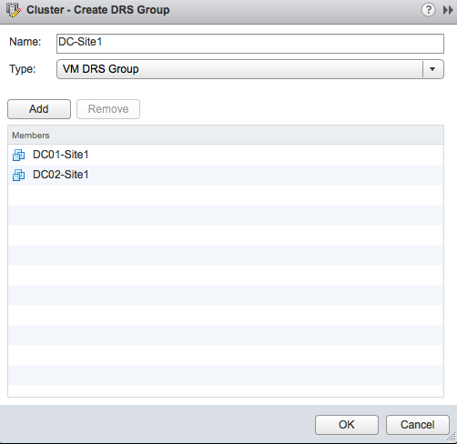
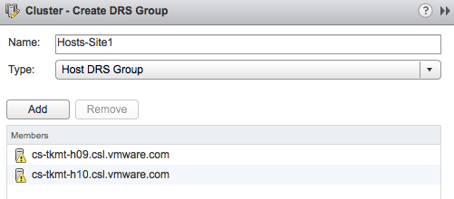
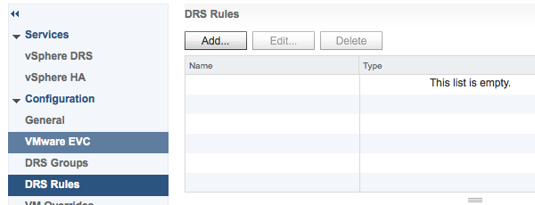
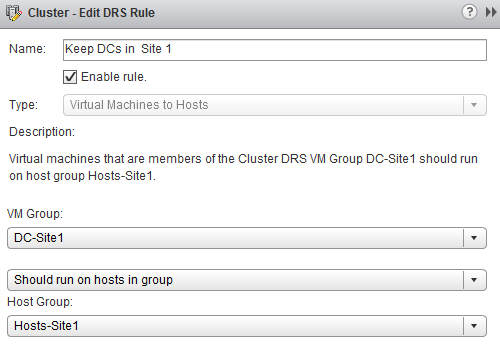

This article shows you how to create a VM to Host affinity rule using the new webclient. 1. Select host and clusters in the home screen. 2. Select the appropriate cluster. 3. Select the tab Manage and click on Settings.  4. Click on the >> to expand the Cluster setting menu.  5. Select DRS Groups. 6. Click on Add to create a DRS Group. The dropdown box provides the ability to create a VM DRS group and a Host DRS group. The behavior of this window is a little tricky. When you create a group, you need to click on OK to actually create the group. If you create a VM DRS group first and then select the Host DRS group in the dropdown box before you click OK, the VM DRS group configuration is discarded.  7. Create the VM DRS Group and provide the VM group a meaningful name. 8. Click on “Add” to select the virtual machines. 9. Click on OK to add the virtual machines to the group.  10. Review the configuration and click on OK to create the VM DRS Group. 11. Click on “Add” again to create the Host DRS Group. 12. Select Host DRS Group in the dropdown box and provide a name for the Host DRS Group. 13. Click on “Add” to select the hosts that participate in this group. 14. Click on OK to add the hosts to the group.  15. Review the configuration and click on OK to create the Host DRS Group. 16. The DRS Groups view displays the different DRS groups in a single view.  The groups are created, now it’s time to create the rules. 17. Select DRS Rules in the Cluster settings menu.  18. Click on “Add” to create the rule.  19. Provide a name for this rule and check if the rule is enabled (default enabled) 20. Select the “Virtual Machines to Hosts” rule in the Type dropbox. 21. Select the appropriate VM Group and the corresponding Host Group. 22. Select the type affinity rule. For more information about the difference between should and must rule, read the article: “[Should or Must VM-Host affinity rules?](http://frankdenneman.nl/2010/12/vm-host-affinity-rules-should-or-must/)”. In this example I’m selecting the should rule. 23. Click on Ok to create the rule. 24. Review your configuration in DRS rules screen.  Get notification of these blogs postings and more DRS and Storage DRS information by following me on Twitter: [@frankdenneman](https://twitter.com/FrankDenneman)
