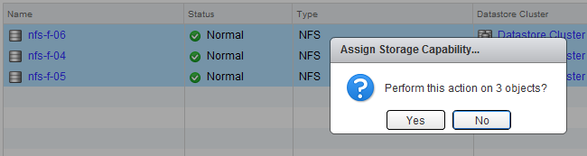
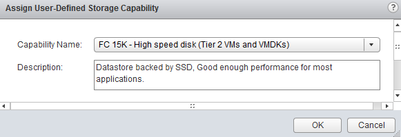

To get a datastore cluster to surface a (user-defined) storage capability, all datastores inside the datastore cluster must be configured with the same storage capability.  When creating Storage Capabilities, the UI does not contain a view where to associate a storage capability with multiple datastores. However that does not mean the web client does not provide you with the ability to do so. Just use the multi-select function of the webclient. Go to Storage, select the datastore cluster, select Related Objects and go to Datastores view. To select all datastores, click the first datastore, hold shift and select the last datastore. Right click and select assign storage capabilities.  Select the appropriate Storage capability and click on OK.  The Datastore Cluster summary tab now shows the user-defined Storage Capability.  Get notification of these blogs postings and more DRS and Storage DRS information by following me on Twitter: [@frankdenneman](https://twitter.com/FrankDenneman)
