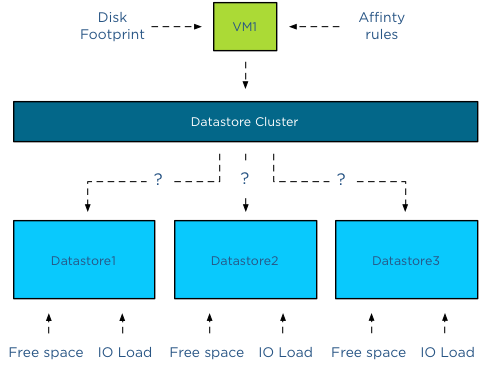
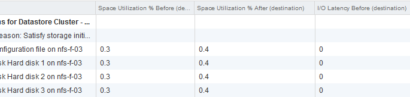
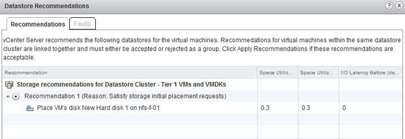

Recently I was asked why Storage DRS was missing a “Partially Automated mode”. Storage DRS has two automation levels, no automation (Manual Mode) and Fully Automated mode. When comparing this with DRS, we notice that Storage DRS is missing a “Partially Automated mode”. But in reality the modes of Storage DRS cannot be compared to DRS at all. This article explains the difference in behavior. **DRS automation modes:** There are three cluster automation levels: _Manual automation level:_ When a virtual machine is configured with the manual automation level, DRS generate both initial placement and load balancing migration recommendations, however the user needs to manual approve these recommendations. _Partially automation level:_ DRS automatically places a virtual machine with a partially automation level, however it will generate a migration recommendation which requires manual approval. _Fully automated level:_ DRS automatically places a virtual machine on a host and vCenter automatically applies migration recommendation generated by DRS **Storage DRS automation modes:** There are two datastore cluster automation levels: _No Automation (Manual mode):_ Storage DRS will make migration recommendations for virtual machine storage, but will not perform automatic migrations. _Fully Automated:_ Storage DRS will make migration recommendations for virtual machine storage, vCenter automatically confirms migration recommendations. **No automatic Initial placement in Storage DRS** Storage DRS does not provide placement recommendations for vCenter to automatically apply. (Remember that DRS and Storage DRS only generate recommendations, it is vCenter that actually approves these recommendations if set to Automatic). The automation level only applies to migration recommendation of exisiting virtual machines inside the datastore cluster. However, Storage DRS does analyze the current state of the datastore cluster and generates initial placement recommendations based on space utilization and I/O load of the datastore and disk footprint and affinity rule set of the virtual machine.  When provisioning a virtual machine, the summary screen provided in the user interface displays a datastore recommendation.  When clicking on the “more recommendations” less optimal recommendations are displayed.  This screen provides information about the Space Utilization % before placement, the Space Utilization % after the virtual machine is placed and the measured I/O Latency before placement. Please note that even when I/O load balancing is disabled, Storage DRS uses overall vCenter I/O statistics to determine the best placement for the virtual machine. In this case the I/O Latency metric is a secondary metric, which means that Storage DRS applies weighing to the space utilization and overall I/O latency. It will satisfy space utilization first before selecting a datastore with an overall lower I/O latency.  **Adding new hard-disks to a existing VM in a datastore cluster** As vCenter does not apply initial placement recommendations automatically, adding new disks to an existing virtual machine will also generate an initial placement recommendation. The placement of the disk is determined by the default affinity cluster rule. The datastore recommendation depicted below shows that the new hard disk is placed on datastore nfs-f-01, why? Because it needs to satisfy storage initial placement requests and in this case this means satisfying the datastore cluster default affinity rule.  If the datastore cluster were configured with a VMDK anti-affinity rule, the datastore recommendation would show any other datastore except datastore nfs-f-01. Get notification of these blogs postings and more DRS and Storage DRS information by following me on Twitter: [@frankdenneman](https://twitter.com/FrankDenneman)
