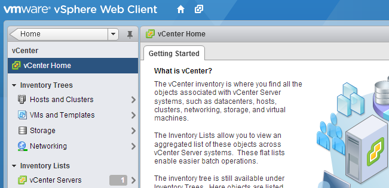

In order to monitor some load behavior I needed to increase the logging level of the vCenter server. The logging level still is included in the vCenter Server Settings, however it takes a few more clicks to get the Statistics option compared to the old vSphere client. 1. In the home screen click on vCenter. 2. click on the vCenter Servers link in the Inventory list.  3. Select the vCenter (probably Localhost). 4. Select the Manage tab in the right-pane. 5. Select Setting. 6. Click on the Edit button located on the far end right side of the screen. 7. Change the appropriate Statistic setting.  Get notification of these blogs postings and more DRS and Storage DRS information by following me on Twitter: [@frankdenneman](https://twitter.com/FrankDenneman)
