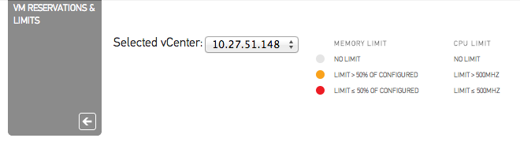

The VM Reservation and Limits card was released yesterday. CloudPhysics decided to create this card based on the popularity of this topic in the contest. So what does this card do? Let’s have a closer look.  This card provides you an easy overview of all the virtual machines configured with any reservation or limits for CPU and memory. Reservations are a great tool to guarantee the virtual machine continuous access to physical resources. When running business critical applications reservations could provide a constant performance baseline that helps you meet your SLA. However reservations can impact your environment as the VM reservations impacts the resource availability of other virtual machines in your virtual infrastructure. It can lower your consolidation ratio: [The Admission Control Family](http://frankdenneman.nl/2012/05/the-admission-control-family/) and it can even impact other vSphere features such as vSphere High Availability. The CloudPhysics HA Simulation card can help you understand the impact of reservations on HA. Besides reservations virtual machine limits are displayed. A limit restricts the use of physical access of the virtual machine. A limit could be helpful to test the application during various level of resource availability. However virtual machine limits are not visible to the Guest OS, therefor it cannot scale and size its own memory management (or even worse the application memory management) to reflect the availability of physical memory. For more information about memory limits, please read this post by Duncan: [Memory limits](http://www.yellow-bricks.com/2010/07/06/memory-limits/). As the VMkernel is forced to provide alternative memory resources limits can lead to the increased use of VM swap files. This can lead to performance problems of the application but can also impact other virtual machines and subsystems used in the virtual infrastructure. The following article zooms into one of the many problems when relying on swap files: [Impact of host local VM swap on HA and DRS](http://frankdenneman.nl/2010/02/impact-of-host-local-vm-swap-on-ha-and-drs/ ). **Color indicators**  As virtual machine level limits can impact the performance of the entire virtual infrastructure, the CloudPhysics engineers decided to add an additional indicator to help you easily detect limits. When a virtual machine is configured with a memory limit still greater than 50% of its configured size an Amber dot is displayed next to the configured limit size. If the limit is smaller or equal to 50% of its configured size than a red dot is displayed next to the limit size. Similar for CPU limits, an amber dot is displayed when the limit of a virtual machine is set but is more than 500MHz, a red dot indicates that the virtual machine is configured with a CPU limit of 500MHz or less. For example: Virtual Machine Load06 is configured with 16GB of memory. A limit is set to 8GB (8192MB), this limit is equal to 50% of the configured size. Therefore the VM reservation and Limits card displays the configured limit in red and presents an additional red dot.  **Flow of information** The indicators are also a natural divider between the memory resource controls and the CPU controls. As memory resource control impacts the virtual infrastructure more than the CPU resource controls, the card displays the memory resource controls at the left side of the screen. We are very interested in hearing feedback about this card, please leave a comment. Get notification of these blogs postings and more DRS and Storage DRS information by following me on Twitter: [@frankdenneman](https://twitter.com/FrankDenneman)
