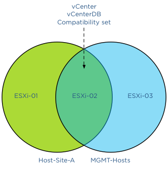

A question on the VMware community forum triggered me to validate DRS behavior of applying VM to Host group rules. The scenario describes a stretched HA cluster with overlapping DRS group rules, allowing to run particular VMs on hosts in a single site and a subset of hosts of both sides. How does DRS handle overlapping groups? **The architecture** In this scenario the stretched cluster contains four hosts; ESXi-01 and ESXi-02 are located in Site A, ESXi-03 and ESXi-04 are located in Site B.  A collection of virtual machines are run by the hosts in the cluster, two management virtual machines, vCenter and vCenterDB are a part of this group. Storage housing the virtual machines are available for all hosts. Storage architecture is not the focus of this article, for more information about storage configurations and stretched vSphere clusters, please read the white paper: [VMware vSphere Metro Storage Cluster Case Study](http://www.vmware.com/resources/techresources/10299 " VMware vSphere Metro Storage Cluster Case Study") **Site DRS VM-Host groups** ESXi-01 and ESXi-02 are grouped in Host DRS group Host-Site-A, ESXi-03 and ESXi-04 are grouped in Host DRS group Host-Site-B. All virtual machines running in Site-A are grouped in a VM DRS group VM-Site-A, all virtual machines running in Site-B are grouped in a VM DRS group VM-Site-B. All (Site) rules are configured as preferential rules (Should run on).  **Management DRS VM-Host group** In the scenario described on the community forum, the virtual machines vCenter and vCenterDB are placed in an additional VM DRS group; MGMT-VMs. This group should be run on a select set of hosts of both sides, to simulate similar behavior the Host DRS group configured in my environment contains ESXi-02 of Site-A and ESXi-03 of Site-B. The group is named MGMT-Hosts.  **Overlapping rule-set** Because the management virtual machines are a part of the VM-Site-A VM group an overlap of compatible hosts exists. Please note that DRS allows virtual machines to be a member of multiple VM groups. When reviewing the active affinity rules in a DRS cluster, DRS extracts a subset of compatible hosts for each virtual machine and uses this subset for placement and load balancing decisions. A Venn diagram shows the compatible host for the VMs vCenter and vCenterDB and specifically the host(s) listed in the compatibility set.  This means that under normal operation DRS will choose to run the virtual machines on ESXi-02 as it satisfies both rules. With normal condition I want to indicate that there is not excessive load on any of the host and all hosts are configured identically without any hardware failures. Back to the scenario, what if there is a host failure or ESXi-02 is placed into maintenance mode? **Maintenance mode** Now what happens if ESXi-02 is placed into maintenance mode? As previously mentioned, DRS determines the set of compatible hosts. As ESXi-02 is placed into maintenance mode, DRS mark this host as a source host for migration. This way DRS knows which virtual machine to select for migration and excludes ESXi-02 as a valid destination for migrations. DRS must select other hosts listed in the Host DRS group. As ESXi-02 is not a valid destination, DRS needs to select either ESXi-01 or ESXi-03. Which host will it select? This depends on the creation date of the DRS rules, in other words, the newer DRS VM-Host rule is selected first. This is important to understand when applying overlapping VM-Host affinity rules in your environment. The last rule you create is applied first, overruling all other existing rules. In my lab, I created the MGMT rule as last, therefor having the youngest timestamp.  There is no option of showing the timestamp in the user-interface of the web and vSphere client. I have provided this feedback to the engineering team. Hopefully they can include it in future releases. I placed ESXi-02 into maintenance mode and DRS migrated the virtual machines to ESXi-03, regulated by the MGMT VM-Host affinity rule. After placing ESXi-03 into maintenance mode, the virtual machines were moved to ESXi-01 as there were no compatible hosts available to satisfy the MGMT affinity rule. As ESXi-01 is listed in the Host-Site-A group of the Site-A affinity rule, DRS had no choice other than moving them to ESXi-01. After resetting the lab and destroying all the rules, I created the same set of host groups, VM groups and affinity rules, but I created the Site-A affinity rule as last. This resulted in the behavior that DRS moved the virtual machines to host ESXi-01 after placing ESXi-02 into maintenance mode, as DRS respected the Site-A affinity rule. **Alarms** As DRS supports non-contradicting overlapping affinity rules, no alarm was generated. During the scenario where both ESXi-02 and ESXi-03 were placed into maintenance mode, no alarm was triggered. It was expected to see an alarm that an affinity alarm is violated, however after digging through some code and contacting engineering this appears to be behavior by design. In the current release, the alarm is only triggered when mandatory rules (must run on) are violated. **HA behavior** All rules are configured with preferential rule sets (Should run on) and HA is not aware of DRS constructs. When a mandatory rule set (Must run on) is created, the hosts listed in the rule set are registered in the compatibility list of the virtual machine itself. Only those hosts registered in the compatibility list are viable destinations. During startup, HA checks the compatibility list and attempts to start up the virtual machine on any of these hosts listed. As the virtual machines are a part of a preferential affinity rule, all hosts are listed in the compatibility list and therefor HA could place them on a host outside the DRS Host Group. **Conclusion** If you want certain virtual machines to gravitate to specific hosts or a specific site, please take into account the way DRS sequence the active affinity rules.
