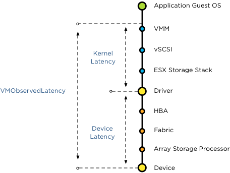

Duncan posted an article today in which he brings up the question: [Should I use many small LUNs or a couple large LUNs for Storage DRS?](http://www.yellow-bricks.com/2012/12/06/should-i-use-many-small-luns-or-a-couple-of-large-luns-for-storage-drs/) In this article he explains the differences between Storage I/O Control (SIOC) and Storage DRS and why they work well together, to re-emphasize, the goal of Storage DRS load balancing is to fix long term I/O imbalances, while SIOC addresses short term burst and loads. SIOC is all about managing the queue’s while Storage DRS is all about intelligent placement and avoiding bottlenecks. Julian Wood makes an interesting remark, and both Duncan and I hear this remark when discussing SIOC. Don’t get me wrong I’m not picking on Julian, I’m merely stating the fact he made a frequently used argument.

> “There is far less benefit in using Storage IO Control to load balance IO across LUNs ultimately backed by the same physical disks than load balancing across separate physical storage pools. “

Well when you look at the way SIOC works I tend to disagree with this statement. As stated before, SIOC manages queues, queues to the datastores used by the virtual machines in the virtual datacenter. Typically speaking these virtual machines differ from workload types, from peak moments and also they differ in importance to the organization. With the use of disk shares, important virtual machine can be assigned a higher priority within the disk queue. When contention occurs, and this is important to realize, when contention occurs these business critical virtual machine get prioritized over other virtual machines. Not all important virtual machines generate a constant stream of I/O, while other virtual machines, maybe with a lower priority do generate a constant stream of IO. The disk shares provide the high priority low IO virtual machines to get a foot between the door and get those I/Os to the datastore and back. Without SIOC and disk shares you need to start thinking of increasing the queue depth of each hosts and think about smart placement of these virtual machines (both high and low I/O load) to avoid those high I/O load getting on the same host. These placement adjustment might impact DRS load balancing operations, possibly affecting other virtual machines along the way. Investing time in creating and managing a matrix of possible vm to datastore placement is not the way to go in this time with rapidly expanding datacenters. Because SIOC is a datastore-wide scheduler, SIOC determines the queue-depth of the ESX hosts connected to the datastores running virtual machines on those datastores. Hosts with higher priority virtual machines get “deeper” queue depths to the datastore and hosts with lower priority virtual machines running on the datastore receive shorter queue-depths. To be more precise, SIOC calculates the datastore wide latency and each local host scheduler determines the queue depth for the queues of the datastore. But remember queue depth changes only occur when there is contention, when the datastore exceeds the SIOC latency threshold. For more info about SIOC latency read “[To which Host level latency statistic is the SIOC threshold related](http://frankdenneman.nl/sioc/to-which-host-level-latency-statistic-is-the-sioc-congestion-threshold-related/ )” Coming back to the argument, I firmly believe that SIOC has benefits in a shared diskpool structure, between the VMM and the datastore a lot of queue’s exists.  Because SIOC takes the avg device latency off all hosts connected to the datastore into account, it understands the overall picture when determining the correct queue depth for the virtual machines. Keep in mind, queue depth changes occur only during contention. Now the best part of SIOC in 5.1 is that it has the Automatic Latency Threshold Computation. By leveraging the SIOC injector it understands the peak value of a datastore and adjust the SIOC threshold. The SIOC threshold will be set to 90% of its peak value, therefor having an excellent understanding of the performance capability of the datastore. This is done on a regular basis so it keeps actual workload in mind. This dynamic system will give you far more performance benefit that statically setting the queue-depth and DNSRO for each host. One of the main reasons of creating multiple datastores that are backed by a single datapool is because of creating a multi-path environment. Together with advanced multi-pathing policies and LUN to controller port mappings, you can get the most out of your storage subsystem. With SIOC, you can manage your queue depths dynamically and automatically, by understanding actually performance levels, while having the ability to prioritize on virtual machine level.
