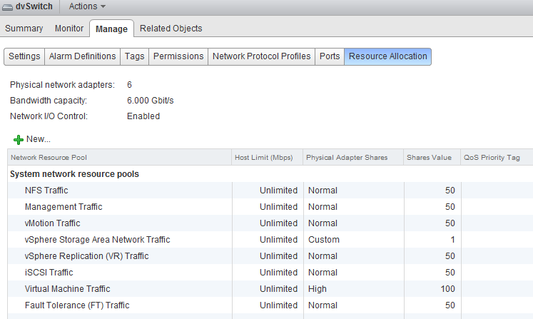
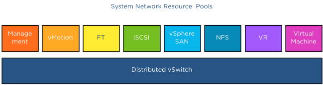
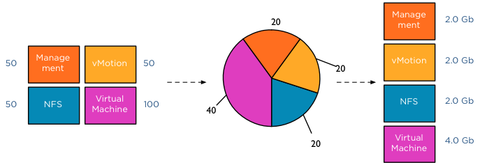
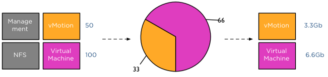

Network I/O Control (NetIOC) provides controls to partition network capacity during contention. NetIOC provides additional control over the usage of network bandwidth in the form of network isolation and limits. vMotion operations introduce temporary network traffic that tries to consume as much bandwidth as possible. In a converged network vMotion operations may have a disruptive effect on other network traffic streams. Due to way NetIOC operates, NetIOC provides control for predictable networking performance while different network traffic streams are contending for the same bandwidth. This article serves as an introduction on Network I/O Control resource control before we dive into specifics on how to use NetIOC on multi-NIC vMotion networks on distributed switches. Please note that this article covers NetIOC in vSphere 5.1 **Distributed Switch** NetIOC is only available on the vNetwork Distributed Switch (vDS). To enable it, in the vSphere web client go to Networking, Manage, Settings, click on the third icon from the left (Edit distributed switch settings) and enable Network I/O Control.  Once enabled go to the Resource Allocation tab there you will find an overview of the (predefined) Network Resource Pools, Host Limits and Physical Adapter Shares and the Shares value.  **Network Resource Pool** The NetIOC network resource pool (NRP) construct is quire similar in many ways to the compute resource pools already existing for CPU and Memory. Each resource pool is assigned shares to define the relative priority of its workload against other workloads active on the same resource. In the case of NetIOC, network resource pools are used to differentiate between network traffic classes. NetIOC predefines 7 different system network resource pools: 1. Management Traffic 2. vMotion Traffic 3. Fault Tolerance (FT) Traffic 4. iSCSI Traffic 5. vSphere Storage Area Network Traffic \* 6. NFS Traffic 7. vSphere Replication (VR) Traffic 8. Virtual Machine Traffic \* The vSphere client marks this as a User defined network resource pool, while the web client marks this (correctly) as system network resource pool.  NetIOC classifies incoming traffic and binds it automatically to the correct system network resource pool; therefor you do not have to assign the vMotion traffic network resource pool to the distributed port groups manually. Once a vMotion operation starts NetIOC “tags” it as vMotion traffic and assigns the appropriate share value to it. The user interface displays the term (default) in the Network resource pool settings screen.  vSphere 5.0 introduced User-defined network resource pools and these are only applicable to virtual machine network traffic. User defined network pools are excellent to partition your network when multiple customers are using a shared network infrastructure. **Physical adapter Shares** NetIOC shares are comparable to the traditional CPU and memory shares. In the case of NetIOC, shares assigned to a network resource pool determine the portion of the total available bandwidth if contention occurs. Similar to compute shares, shares are only relative to the other active shares using the same resource. NetIOC provides 3 predefined share levels and a custom share level. The predefined share levels; low, normal and high provide an easy method of assigning a number of shares to the network resource pool. Low assigns 25 shares to the network resource pool, Normal 50 shares and High 100 shares. Custom allows you to assign the number of shares yourself within the supported range of 1 – 100. By default every system network resource pool is assigned 50 shares with the exception of the virtual machine traffic resource pool, this NRP gets 100 shares.  The key to understand network resource pools and shares is that the shares apply on the physical adapter; hence the name physical adapter shares ;). This means that if the physical adapter of a host is saturated the shares of the network resource pools actively transmitting are in play. For example, your distributed switch is configured with a Management portgroup, a vMotion portgroup, NFS and virtual machine portgroup. All NRPs are configured with default shares and you use 2 uplinks. For the sake of simplicity, in this scenario both uplinks are configured as active uplinks  Although this environment is configured with 4 portgroups, the default system network pools remain to exist. The existences of the non-utilized system-NRPs have no effect on the distribution of bandwidth during contention. As mentioned before the when the physical adapter is saturated, then the shares apply. In the following scenario vmnic0 of host ESX02 is saturated, as there are only 4 portgroups active on the distributed switch, the shares of the network pools are applied:  This means that 50+50+50+100 (250) shares are active, in this scenario the virtual machine network resource pool gets to divide 40% (100/(50+50+50+100)) of the available physical network bandwidth. If vmnic0 was a 10GB NIC, the virtual machines network pool would receive 4GB to distribute amongst the actively transmitting virtual machines on that host.  This was a worst-case scenario because usually not all portgroups are transmitting, as the shares are relative to other network pools actively using the physical adapter it might happen that Virtual Machine and vMotion traffic is only active on this NIC. In that case only the shares of the vMotion NRP and VM NRP are compared against each other to determine the available bandwidth for both network resource pools.  The moment another traffic source transmits to the distributed switch a new calculation is made to determine the available bandwidth for the network resource pools. For example, HA is heart beating across the management LAN, using vmnic0, therefor the active transmitting network resource pools are Management, vMotion and virtual machines, generating a distribution of network bandwidth as follows:  **Host Limits** Up to vSphere 5.1 NetIOC applies a limit **per host**. This means that the host limit enforces a traffic bandwidth limit on the overall set of dvUplinks for that particular network resource pool. The limit is expressed in an absolute unit of Mbps. This means that if you set a 3000Mpbs limit on the vMotion network resource pool, the traffic stream of the vMotion network resource pool will never exceed the given limit of 3000Mpbs for a distributed switch out of a particular ESX host. vSphere 5.1 introduced a big adjustment to hosts limits, the host limits now applies to each individual uplink. This means that when setting a host limit on the network resource pool for vMotion of 3000Mbps, vMotion is limited to transmit a maximum of 3Gb per uplink. In the case of a Multi-NIC vMotion configuration (2NICs) the maximum traffic vMotion can issue to the vmnics is 6Gb. Please note that limits only apply on ingress traffic (incoming traffic from vm to vds) meaning that a limit only affects native traffic coming from the active virtual machine running on the host or the vMotion traffic initiated on the host itself. **Coming up next..** The next article in this series is how to use [NetIOC for predictable network performance when using a Multi-NIC vMotion configuration](http://frankdenneman.nl/2013/01/18/designing-your-vmotion-network-multi-nic-and-netioc/ "Designing your vMotion network – Multi-NIC vMotion and NetIOC") on a distributed vSwitch.
