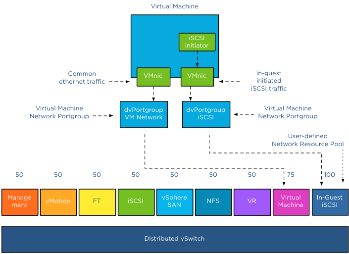
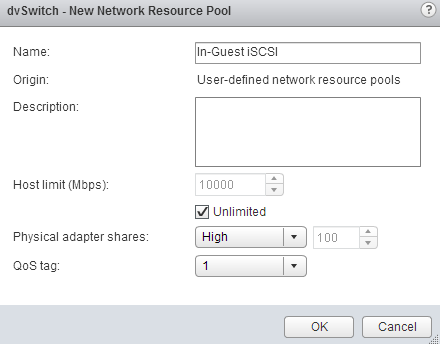

Some customers use iSCSI initiators inside the Guest OS to connect directly to a datastore on the array or using an NFS client inside the Guest OS to access remote NFS storage directly. Thereby circumventing the VMkernel storage stack of the ESX host. The virtual machine connects to the remote storage system via a VM network portgroup and therefore the VMkernel classifies this network traffic as virtual machine traffic. This “indifference” or non-discriminating behavior of the VMkernel might not suit you or might not help you to maintain service level agreements. **Isolate traffic** In the 1Gbe adapter world, having redundant and isolated uplinks assigned for different sorts of traffic is a simple way of not to worry about traffic congestion. However when using a small number of 10GbE adapters you need to be able to partition network bandwidth among the different types of network traffic flows. This is where NetIOC comes into play. Please read the “[Primer on Network I/O Control](http://frankdenneman.nl/2013/01/17/a-primer-on-network-io-control/ "A primer on Network I/O Control")” article to quickly brush up on your knowledge of NetIOC. **System network resource pools** By default NetIOC provides seven different system network resource pools. Six network pools are used to bind VMkernel traffic, such as NFS and iSCSI. One system network resource pool is used for virtual machine network traffic.  The network adapters you use to connect your IP-Storage from within the Guest OS connect to a virtual machine network portgroup. Therefor NetIOC binds this traffic to the virtual machine network resource pool. In result this traffic shares the bandwidth and prioritization with “common” virtual machine network traffic.  **User-defined network resource pool** Most customers tend to prioritize IP storage traffic over network traffic induced by applications and the guest-OS. To ensure the IP-Storage traffic created by the NFS client or iSCSI initiator inside the Guest OS create a user-defined network resource pool. User-defined network resource pools are available from vSphere 5.0 and upwards. Make sure your distributed switch is at least version 5.0. **Shares:** User-defined network resource pools are available to isolate and prioritize virtual machine network traffic. Configure the User-defined network resource pool with an appropriate number of shares. The number of shares will reflect the relative priority of this network pool compared to the other traffic streams using the same dvUplink. **QoS tag:** Another benefit of creating a separate User-defined network resource pool is the ability to set a QoS tag specifically for this traffic stream. If you are using IEEE 802.1p tagging end-to-end throughout your virtual infrastructure ecosystem, setting the QoS tag on the User-defined network resource pool helps you to maintain the service level for your storage traffic.  **Setup** In a greenfield scenario setup the User-defined resource pool first, that allows you to select the correct network pool during the creation of the dvPortgroups. If you already created dvPortgroups, you can assign the correct network resource pool once you create the network resource pool. Create a user defined network resource pool: 1. Open your vSphere web client and go to networking. 2. Select the dvSwitch 3. Go to Manage 4. Select Resource Allocation tab 5. Click on the new icon. 6. Configure the network resource pool and click on OK  I already made a User-defined network resource pool called dNFS, the overview of available network resource pools on the dvSwitch looks like this:  To map the network resource pool to the Distributed Port Group, create a new Distributed Port group, or edit an existing one and select the appropriate network resource pool: 
