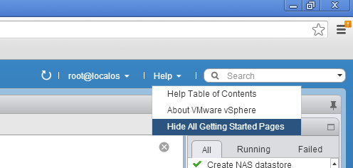

I'm rebuilding my lab and after I installed a new vCenter server I was confronted with those Getting Started tabs again. That reminded me that I promised someone at a VMUG to blog how to remove these tabs in one single operation.

1. Go to Help (located in the blue bar top right of your screen)
2. Click on the arrow
3. Select Hide All Getting Started Pages

