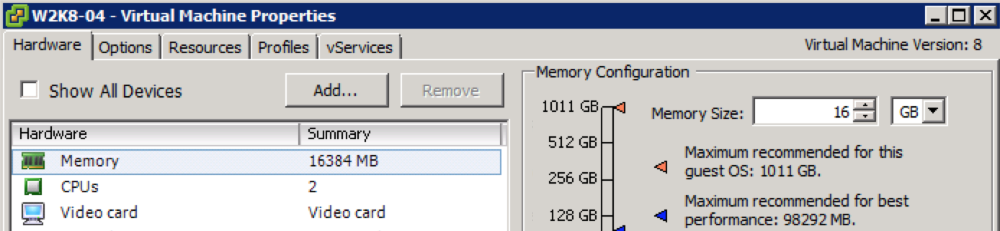

Some applications do not perform well when memory is reclaimed from the virtual machine. Most users set a virtual machine memory reservation to prevent memory reclamation and to ensure stable performance levels. Memory reservation settings are static, meaning that when you change the memory configuration of the virtual machine itself the memory reservation remains the same. If you want to keep the reservation equal to the virtual machine memory reservation, the UI (included in both the vSphere client and the web client) offers the setting: “Reserve all guest memory (all locked)”. This setting is linked to the virtual machine memory configuration. The memory reservation is immediately readjusted when the memory configuration changes. Increase the memory size and the memory reservation is automatically increased as well. Reduce the memory size of a virtual machine, and the reservation is immediately reduced. The behavior is extremely useful when using the vSphere client as management tool. Within the vSphere client the memory configuration and the memory reservation settings do not share the same screen. While changing the memory configuration one can easily forget to adjust the memory reservation.   The web client is redesigned and shows the memory configuration and reservation in a single screen. Yet having a setting that automates and controls alignment of memory configuration and reservation reduce the change for human error.   
