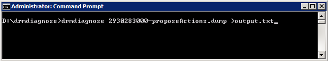

This week the [DRMdiagnose](http://labs.vmware.com/flings/drmdiagnose "http://labs.vmware.com/flings/drmdiagnose") fling is published. Produced by the resource management team and just in case you are wondering, DRM stands for Distributed Resource Manager; the internal code for DRS. Download DRMdiagnose at the VMware fling site. **Please note that this fling only works on vSphere 5.1 environments** **Purpose of DRMdiagnose** This tool is created to understand the impact on the virtual machines own performance and the impact on other virtual machines in the cluster if the resource allocation settings of a virtual machine are changed. DRMdiagnose compares the current resource demand of the virtual machine and suggest changes to the resource allocation settings to achieve the appropriate performance. This tool can assist you to meet service level agreements by providing feedback on desired resource entitlement. Although you might know what performance you want for a virtual machine, you might not be aware of the impact or consequences an adjustments might have on other parts of the resource environment or cluster policies. DRMdiagnose provides recommendations that provides the meets the resource allocation requirement of the virtual machines with the least amount of impact. A DRMdiagnose recommendation could look like this:

> Increase CPU size of VM Webserver by 1 Increase CPU shares of VM Webserver by 4000 Increase memory size of VM Database01 by 800 MB Increase memory shares of VM Database01 by 2000 Decrease CPU reservation of RP Silver by 340 MHz Decrease CPU reservation of VM AD01 by 214 MHz Increase CPU reservation of VM Database01 by 1000 MHz

**How does it work** DRMdiagnose reviews the DRS cluster snapshot. This snapshot contains the current cluster state and the resource demand of the virtual machines. The cluster snapshot is stored on the vCenter server. These snapshot files can be found:

- vCenter server appliance: /var/log/vmware/vpx/drmdump/cluster_X_/
- vCenter server Windows 2003: %ALLUSERSPROFILE%\\Application Data\\VMware\\VMware VirtualCenter\\Logs\\drmdump\\cluster_X_\\
- vCenter server Windows 2008: %ALLUSERSPROFILE%\\VMware\\VMware VirtualCenter\\Logs\\drmdump\\cluster_X_\\

The fling can be run in three modes:

1. **Default:** Given a link to a drmdump, it lists all the VMs in the cluster, and their current demands and entitlements.
2. **Guided:** Given a link to a drmdump, and a target allocation for the VM, generates a set of recommendations to achieve it.
3. **Auto:** Given a link to a drmdump, generates a recommendation to satisfy the demand of the most distressed VM (the VM for which the gap between demand and entitlement is the highest).

**Two things to note:** One: The fling does not have run on the vCenter server itself. Just install the fling on your local windows or linux system, copy over the latest drmdump file and run the fling. And second the drmdump file is zipped (GZ), unzip the file first to and run DRMdiagnose against the .dump file. A “normal” dumpfile should look like this:  **How to run:** Open a command prompt in windows:  This command will provide the default output and provide you a list with CPU and Memory demand as well as entitlement. Instead of showing it on screen I chose to port it to a file as the output contains a lot of data. A next article will expand on auto-mode and guided-mode use of DRMdiagnose. In the mean time, I would suggest to download [DRMdiagnose](http://labs.vmware.com/flings/drmdiagnose "DRMdiagnose") and review your current environment.
