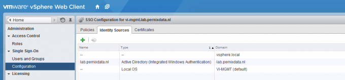
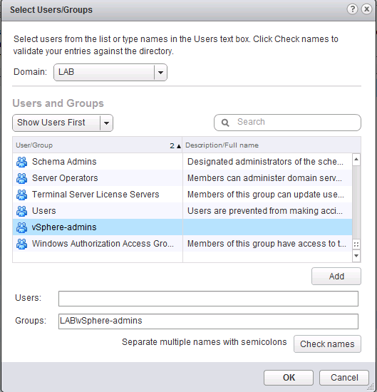
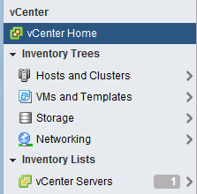

After logging into my brand spanking new vCenter 5.5 server I was treated with a vCenter server inventory count of 0. Interesting to say the least as I installed vCenter on a new windows 2008 R2 machine, connected to a fresh MS active directory domain. I installed vCenter with a user account that is domain admin, local admin and has all the appropriate local rights (M_ember of the Administrators group, Act as part of the operating system and Log on as a Service_). The install process went like a breeze, no error messages whatsoever and yet the vCenter server object was mysteriously missing after I logged in. A mindbender! Being able to log into the vCenter server and finding no trace of this object whatsoever, it felt like someone answering the door and saying he’s not home. I believed I did my due diligence, I read the topic “[Prerequisites for Installing vCenter Single Sign-On, Inventory Service, and vCenter Server](http://pubs.vmware.com/vsphere-55/topic/com.vmware.vsphere.install.doc/GUID-C6AF2766-1AD0-41FD-B591-75D37DDB281F.html "Prerequisites for Installing vCenter Single Sign-On, Inventory Service, and vCenter Server")” and followed every step, however it appeared I did not RTFM enough. **administrator@vsphere.local only** Apparently vSphere will only attach the permissions and assign the role of administrator to the default account administrator@vsphere.local and you have to logon with this account after the installation is complete. See “[How vCenter Single Sign-On Affects Log In Behavior](http://pubs.vmware.com/vsphere-55/topic/com.vmware.vsphere.install.doc/GUID-B472DA47-94DB-40EB-9F0C-48743FADB4A9.html "How vCenter Single Sign-On Affects Log In Behavior")” for the following quote:

> After installation on a Windows system, the user administrator@vsphere.local has administrator privileges to both the vCenter Single Sign-On server and to the vCenter Server system.

It threw my off balance by allowing me to log in with the account that I used to install vCenter, this made me assume the account automatically received the appropriate rights to manage the vCenter server. To gain access to the vCenter database you must manually assign the administrator role to the AD group or user account of your liking. As an improvement over 5.1 vCenter 5.5 adds the active directory as an identity source, but will not assign any administrator rights, ignoring the user account used for installing the product. Follow these steps to use your AD accounts to manage vCenter. **1\. Verify AD domain is listed as an Identity Source** Log in with administrator@vsphere.local and select Configuration in the home menu tree. Only when you are logged in with an SSO administrator vCenter will show the Single Sign-on menu option. Select Single Sign-on | Configuration and verify if AD domain is listed.  **2\. Add Permissions to top object vCenter** Go back to home, select menu option vCenter, vCenter Servers and then the vCenter server object. Select the menu option Manage, Permissions  **3\. Add User or Group to vCenter** Click on the green + icon to open the add permission screen. Click on the Add button located at the bottom. **4\. Select the AD domain** Select the AD domain and then the user or group. In my example I selected the AD group “vSphere-admins”. I’m using groups to keep the vCenter configuration as low-touch as possible. When I need grant additional users administrator rights I can simple do this in my AD Users and Computers tool. Traditionally auditing is of a higher level in AD then in vCenter.  **5\. Assign Administrator Role** In order to manage the vCenter server all privileges need to be assigned to that user, by selecting the administrator role all privileges are assigned and propagated to all the child objects in the database.  **6\. Log in with your AD account** Log out the user administrator@vsphere.local and enter your AD account. Click on vCenter to view the vCenter Inventory list. vCenter Servers should list the new vCenter server. 
