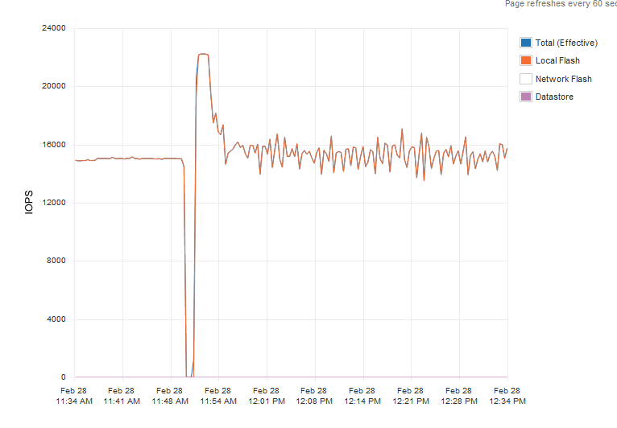
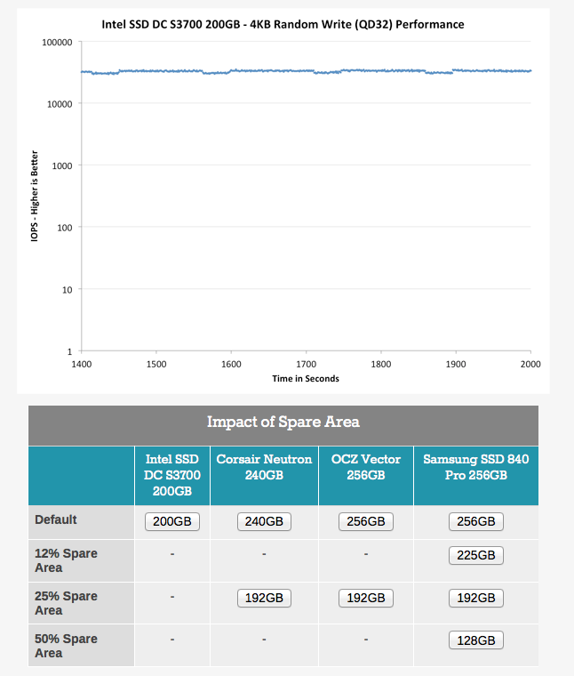
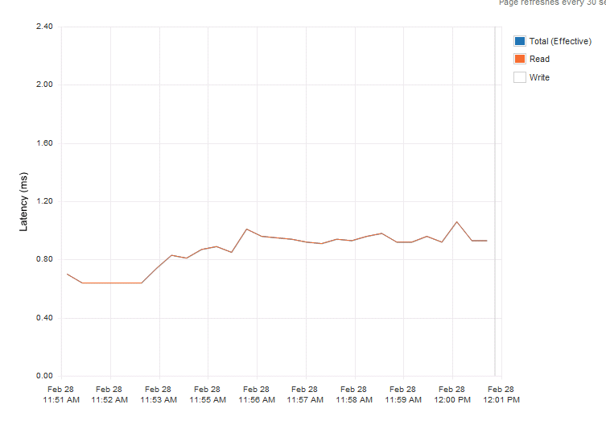

_Should I use consumer grade SSD drives or should I use enterprise grade SSD drives?_ This a very popular question and I receive it almost on a daily basis. Lab or production environment, my answer is always the same: Enterprise grade without a doubt! Why? Enterprise Grade drives have a higher endurance level, they contain power loss data protection features and they consistently provide high level of performance. All align with a strategy ensuring reliable and consistent performance. Lets expand on these three key features; **Endurance** Recently a lot of information is released about the [endurance levels](http://techreport.com/review/26058/the-ssd-endurance-experiment-data-retention-after-600tb) of consumer grade SSDs and tests show that they operate well beyond the claimed endurance levels. Exciting news as it shows how much progression is made during the last few years. But be aware that vendors test their consumer grade SSDs with client workloads while enterprise grade SSDs are tested with worst-case data center workload. The interesting question is whether the SSD vendor is list the rate a drive in DWPD or drive-writes per-day in a conservative manner or an aggressive manner? As I don’t want to gamble with customers’ data, I’m not planning to find out whether the consumer SSD wasn’t able to sustain high levels of continuous data center load. I believe vSphere architectures have high endurance requirements; therefore use enterprise drives as they are specifically designed and tested for this use. **Power loss data protection features** Not often highlighted but most enterprise SSDs contain power loss data protection features. These SSDs typically contains a small buffer or cache in which the data is stored before it’s written to disk. Enterprise SSD leverages various on-board capacitance solutions to provide enough energy for the SSD to move the data from the cache to the drive itself. Protecting the drive and the data. It protects the drive because if a sector is partially written it becomes unreadable. This can lead to performance problems, as the drive will perform time-consuming error recovery on that sector. Select Enterprise drives with power loss data protection features, it avoids erratic performance levels or even drive failure after a power-loss. **Consistent performance** Last but certainly not least is the fact that enterprise SSDs are designed to provide a consistent level of performance. SSD vendors expect their enterprise disks to be used intensively for an extended period of time. This means that possibility of a full disk increases dramatically when comparing it to a consumer grade SSD. As data can only be written to a cell that is in an erased state, high levels of write amplification is expected. Please read [this article](http://frankdenneman.nl/2013/07/02/basic-elements-of-fvp-part-2-using-own-platform-versus-in-place-file-system/ "Basic elements of the FVP platform") to learn more about write amplification (write amp). Write amp impacts the ratio of drive writes to host writes, that means that when write amp occurs the number of writes a drive needs to make increases considerably in order to execute those host writes. One way to reduce this strain is to “over-provision” the drive. Vendors, such as Intel, allocate a large amount of flash resource to allow the drive to absorb these write amp operations. This results in a more consistent rate of IOPS and predictable IOPS. **Impact on IOPS and Latency** I’ve done some testing in my lab, and used two enterprise flash drives, a Intel DC S3700 and a Kingston E-100. I also used two different consumer grade flash devices. I refrain from listing the type and vendor name of these disks. I ran the first test from 11:30 to 11:50 I ran the test an enterprise grade SSD drive, the rate of IOPS was consistent and predictable. The VM was migrated to the host with the consumer grade SSD and the same test was run again, not a single moment did the disk provide a steady rate of IOs.  [Anandtech.com](http://anandtech.com/ "http://anandtech.com/") performed similar tests and witnessed similar behaviour, the publish their results in the article “[Exploring the Relationship Between Spare Area and Performance Consistency in Modern SSDs](http://www.anandtech.com/show/6489/playing-with-op "Exploring the Relationship Between Spare Area and Performance Consistency in Modern SSDs")” An excellent read, highly recommended. \[caption id="attachment\_4262" align="aligncenter" width="646"\] Picture courtesy of Anandtech.com\[/caption\] _Click on the different drive sizes to view their default performance and the impact of spare flash resources on the ability to provide consistent performance._ Next step was to determine latency behaviour. Both Enterprise grade SSD provided an extreme case of predictable latency. To try to create an even playing field I ran read tests instead of write centric tests. The first graph was a read test on the Kingston e100.  Latency was consistent providing predictable and consistent application response time. The consumer grade drive performance charts were not as pretty. The virtual machine running the read test was the only workload hitting the drive and yet the drive had trouble providing steady response times.  Please note that the test were ran multiple times and the graphs shown are the most positive ones for the consumer grades. Multiple (enterprise-level) controllers were used to avoid any impact from that layer. As more and more SSD drive hit the market we decided to help to determine which drives fit in a strategy ensuring reliable and consistent performance. Therefor PernixData started the [PernixDrive](https://www.pernixdata.com/partners/pernixdrive/ "PernixDrive") initiative, in which we test and approve flash devices. **Conclusion** Providing consistent performance is key for predictable application behaviour. This applies to many levels of operation. First of all it benefits day-to-day customer satisfaction and helps you to reduce troubleshooting application performance. Power-loss data protection features help you to cope with short-term service loss, and avoid continuous performance loss as the drive can survive power-loss situations. Reverting applications to a non-accelerated state, due to complete loss of SSD drive can result in customer dissatisfaction or neglecting your SLA. Higher levels of drive-writes per-day help you to create and ensure high levels of consistent performance for longer terms. In short, use the correct tool for the job and go for enterprise SSD drives.
