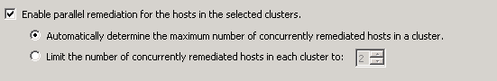

Yesterday a couple of tweets were in my timeline discussing DRS behavior mentioned in KB article [2104983](http://kb.vmware.com/selfservice/microsites/search.do?language=en_US&cmd=displayKC&externalId=2104983). The article is terse at best, therefor I thought lets discuss this a little bit more in-depth. During normal behavior DRS uses an upper limit of 100% utilization in its load-balancing algorithm. It will never migrate a virtual machine to a host if that migration results in a host utilization of 100% or more. However this behavior can prolong the time to upgrade all the hosts in the cluster when using the cluster maintenance mode feature in vCenter update manager (parallel remediation).  To reduce the overall remediation time, vSphere 5.5 contains an increased limit for cluster maintenance mode and uses a default setting of 150%. This can impact the performance of the virtual machine during the cluster upgrade. vCenter Server 5.5 Update 2d includes a fix that allows users to override the default and can specify the range between 40% and 200%. If no change is made to the setting, the default of 150% is used during cluster maintenance mode. Please note that normal load balancing behavior in vSphere 5.5 still uses a 100% upper limit for utilization calculation.
