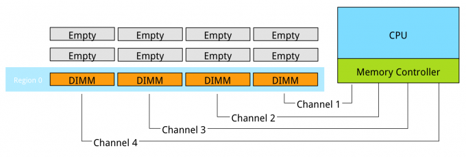
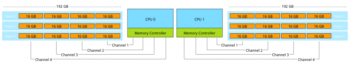

This is part 4 of the memory deep dive. This is a series of articles that I wrote to share what I learned while documenting memory internals for large memory server configurations. This topic amongst others will be covered in the upcoming FVP book. The memory deep dive series: Part 1: [Memory Deep Dive Intro](http://frankdenneman.nl/2015/02/18/memory-configuration-scalability-blog-series/ "Memory configuration scalability blog series") Part 2: [Memory subsystem Organisation](http://frankdenneman.nl/2015/02/18/memory-tech-primer-memory-subsystem-organization/ "Memory deep dive: Memory subsystem organisation") Part 3: [Memory Subsystem Bandwidth](http://frankdenneman.nl/2015/02/19/memory-deep-dive-memory-subsystem-bandwidth/ "Memory Deep Dive: Memory Subsystem Bandwidth") Part 4: [Optimizing for Performance](http://frankdenneman.nl/2015/02/20/memory-deep-dive/ "Memory Deep Dive - Optimizing for Performance") Part 5: [DDR4 Memory](http://frankdenneman.nl/2015/02/25/memory-deep-dive-ddr4/ "Memory Deep Dive - DDR4 Memory") Part 6: [NUMA Architecture and Data Locality](http://frankdenneman.nl/2015/02/27/memory-deep-dive-numa-data-locality/ "Memory Deep Dive: NUMA and Data Locality") Part 7: [Memory Deep Dive Summary](http://frankdenneman.nl/2015/03/02/memory-deep-dive-summary/) **Optimizing for Performance** The two primary measurements for performance in storage and memory are latency and throughput. [Part 2](http://frankdenneman.nl/2015/02/19/memory-deep-dive-memory-subsystem-bandwidth/ "Memory Deep Dive: Memory Subsystem Bandwidth") covered the relation between bandwidth and frequency. It is interesting to see how the memory components and the how the DIMMs are populated on the server board impact performance. Let’s use the same type of processor used in the previous example’s the Intel Xeon E5 2600 v2. The Haswell edition (v3) uses DDR4, which is covered in part 5. **Processor Memory Architecture** The Intel E5 2600 family contains 18 different processors. They differ in number of cores, core frequency, amount of cache memory and CPU instruction features. Besides the obvious CPU metrics, system bus speed, memory types, and maximum throughput can differ as well. Instead of listing all 18, I selected three CPUs to show the difference. To compare all 18 processors of the 2600 family, please go to [ark.intel.com](http://ark.intel.com/compare/76157,75787,75789,75790,75791,75792,75267,75268,75269,75270,75272,75273,75275,75277,76161,75279,75281,75283 "ark intel compare v2600 v2")

| Processor Model | System Bus speed | Max Memory Frequency | Max Memory Bandwidth |
| --- | --- | --- | --- |
| E5-2603 v2 | 6.4 GT/s | 1333 MHz | 42.6 GB/s |
| E5-2620 v2 | 7.2 GT/s | 1600 MHz | 51.2 GB/s |
| E5-2637 v2 | 8 GT/s | 1866 MHz | 59.7 GB/s |

Source: [Ark.Intel.com](http://ark.intel.com/compare/75792,75789,76157 "Ark of Intel") The system bus speed is important when communicating over the quick path interconnect (QPI) to the other CPU local memory resources. This is a crucial part of the performance of systems with a Non-Uniform Memory Access (NUMA). NUMA will be covered in part 6. Maximum memory frequency and maximum memory bandwidth are closely connected to each other (Review [Part 3](http://frankdenneman.nl/2015/02/19/memory-deep-dive-memory-subsystem-bandwidth/ "Memory Deep Dive: Memory Subsystem Bandwidth"), Table 2 for Peak Transfer rate calculation).

| Max Memory Frequency | Peak Transfer Rate | Channels | Max Memory Bandwidth |
| --- | --- | --- | --- |
| 1333 MHz | 10.6 GB/s | 4 | 42.6 GB/s |
| 1600 MHz | 12.8 GB/s | 4 | 51.2 GB/s |
| 1866 MHz | 14.9 GB/s | 4 | 59.7 GB/s |

**Interleaving across channels** Populating the memory channels equally allows the CPU to leverage its multiple memory controllers. When all four channels are populated the CPU interleaves memory access across the multiple memory channels. This configuration has the largest impact on performance and especially on throughput. To leverage interleaving optimally, the CPU creates regions. The memory controller groups memory across the channels as much as possible. When creating a 1 DIMM per Channel configuration, the CPU creates one region (Region 0) and interleaves the memory access.  Populating four channels provide the best performance, however sometimes extra capacity is required, but not as much as four channels can provide. Populate the DIMMs in groups of two. For example if 384 GB is required and 32 GB DIMMs are used, populate each CPU with 6 DIMMS. The CPU will create two Regions.  The CPU will interleave access to Region 2 across 2 channels. This will decrease the throughput of region 2. **Interleaving across Ranks** Interleaving is continued from interleaving across the channels to interleaving across the ranks in a channel. This only occurs when using dual or quad rank DIMMs. If a channel is populated with mixed ranking DIMMS and a single rank DIMM is present, rank interleaving will revert back to 1-way interleaving. 1-way rank interleaving results in storing bits in a single DRAM chip until it’s at capacity before moving to another DRAM chip. Rank interleaving provides performance benefits as it provides the memory controller to parallelize the memory request. Typically it results in a better improvement of latency. However the performance difference between dual ranking and quad ranking is minute and comes only into play when squeezing out the very last ounce of performance. Try to avoid single rank DIMMs. **Number of DIMMs per channel** When adding a single DIMM to each channel in the system, performance (read throughput) scales almost linearly until all eight channels are populated (4 channels per CPU x 2 CPU). \[caption id="attachment\_5020" align="aligncenter" width="438"\] Source: HP\[/caption\] However when adding more DIMMs per channel, due to capacity requirement, throughput per DIMM decreases. When adding more DIMMs to the channel, the memory controller consumes more bandwidth for control commands. Basically you are increasing management overhead by adding more DIMM, reducing available bandwidth for read and write data. The creates a challenge whether the capacity can be solved by using higher capacity DIMMs or taking the throughput hit as more capacity is only obtainable by populating all slots. Populating the channels with 2 DIMMs (2 DPC) does not drastically impact throughput. The system allows to DIMMs to run in native speed. However it becomes interesting when choosing between 2 DPC and 3 DPC configurations.

| Vendor | DIMM Type | 1 DPC | 2 DPC | 3 DPC |
| --- | --- | --- | --- | --- |
| HP | 1R RDIMM | 1866 MHz | 1866 MHz | 1333 MHz |
| HP | 2R RDIMM | 1866 MHz | 1866 MHz | 1333 MHz |
| Dell | 4R RDIMM | 1333 MHz | 1066 MHz | N/A |
| HP | 4R LRDIMM | 1866 MHz | 1866 MHz | 1333 MHz |

When creating a system with 384 GB of memory, each CPU has 12 slots, divided between 4 channels. Option 1 is to use 32GB LRDIMMs, populating 6 DIMM slots with a 32GB DIMM per CPU. The CPU will create two regions, region 0 interleaves across four channels, region 1 interleaves across 2 channels. Native speed remains the same. However some performance loss occurs due to some control management overhead and asymmetrical configuration. This configuration allows for future upgrade. If quad ranked RDIMMs were used, a total 128 GB ram could be added to the system, 32GB RDIMMs are quad ranked DIMMS, limiting the system to a 2 DPC configuration due to the maximum number or ranks. Quad Rank RDIMMs run at a lower clock cycle speed than LRDIMMs and reduce overal scale-up abilities due to the maximum rank limitation.  Option 2 is to use 16GB RDIMMs, all channels are populated achieving maximum interleaving, however the DIMMs are not able to run in native speed anymore and will be toggled to run at a lower speed. Instead of 1866 MHz they will run at 1333 MHz. 1866 MHz provides a maximum DIMM throughput of 14.9 GB/s, 1333 MHz a maximum throughput of 10.6 GB/s a drop of nearly 30%. This drop of performance is significant, therefor it should be taken into consideration when configuring the server memory.  Be cognisant of the scalability issues with ranking and the native speed drop off when moving towards a multi DPC configuration. The number of DIMM slots does not always mean that you can scale up to a certain capacity configuration. DDR3 LRDIMMs provide a great way to maximise capacity while retaining bandwidth. Begin 2014 DDR4 was released, providing higher density, better performance and decreased drop off rates when using multi DPC configurations. Up next, part 5: [DDR4 Memory](http://frankdenneman.nl/2015/02/25/memory-deep-dive-ddr4/ "Memory Deep Dive - DDR4 Memory") The memory deep dive series: Part 1: [Memory Deep Dive Intro](http://frankdenneman.nl/2015/02/18/memory-configuration-scalability-blog-series/ "Memory configuration scalability blog series") Part 2: [Memory subsystem Organisation](http://frankdenneman.nl/2015/02/18/memory-tech-primer-memory-subsystem-organization/ "Memory deep dive: Memory subsystem organisation") Part 3: [Memory Subsystem Bandwidth](http://frankdenneman.nl/2015/02/19/memory-deep-dive-memory-subsystem-bandwidth/ "Memory Deep Dive: Memory Subsystem Bandwidth") Part 4: [Optimizing for Performance](http://frankdenneman.nl/2015/02/20/memory-deep-dive/ "Memory Deep Dive - Optimizing for Performance") Part 5: [DDR4 Memory](http://frankdenneman.nl/2015/02/25/memory-deep-dive-ddr4/ "Memory Deep Dive - DDR4 Memory") Part 6: [NUMA Architecture and Data Locality](http://frankdenneman.nl/2015/02/27/memory-deep-dive-numa-data-locality/ "Memory Deep Dive: NUMA and Data Locality") Part 7: [Memory Deep Dive Summary](http://frankdenneman.nl/2015/03/02/memory-deep-dive-summary/)
