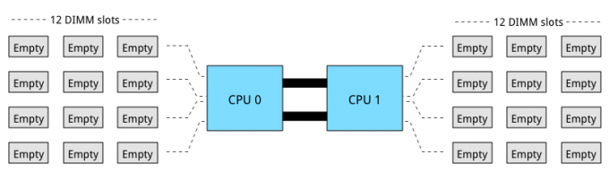
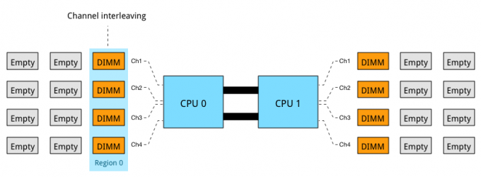
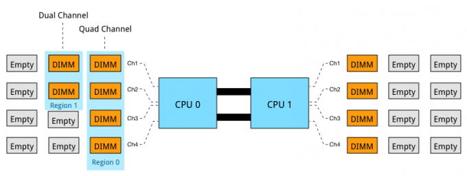
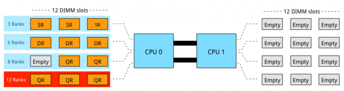

This is last part of the memory deep dive. As the total series count 7667 words, I thought it would be a good idea to create a summary of the previous 6 parts. The memory deep dive series: Part 1: [Memory Deep Dive Intro](http://frankdenneman.nl/2015/02/18/memory-configuration-scalability-blog-series/ "Memory configuration scalability blog series") Part 2: [Memory subsystem Organisation](http://frankdenneman.nl/2015/02/18/memory-tech-primer-memory-subsystem-organization/ "Memory deep dive: Memory subsystem organisation") Part 3: [Memory Subsystem Bandwidth](http://frankdenneman.nl/2015/02/19/memory-deep-dive-memory-subsystem-bandwidth/ "Memory Deep Dive: Memory Subsystem Bandwidth") Part 4: [Optimizing for Performance](http://frankdenneman.nl/2015/02/20/memory-deep-dive/ "Memory Deep Dive - Optimizing for Performance") Part 5: [DDR4 Memory](http://frankdenneman.nl/2015/02/25/memory-deep-dive-ddr4/ "Memory Deep Dive - DDR4 Memory") Part 6: [NUMA Architecture and Data Locality](http://frankdenneman.nl/2015/02/27/memory-deep-dive-numa-data-locality/ "Memory Deep Dive: NUMA and Data Locality") Part 7: [Memory Deep Dive Summary](http://frankdenneman.nl/2015/03/02/memory-deep-dive-summary/) The reason why I started this deep dive is to understand the scalability of server memory configurations and constrains certain memory type introduce. Having unpopulated DIMM slot does not always translate into future expandability of memory capacity. A great example is the DIMM layout of today’s most popular server hardware. The server boards of the [Cisco UCS B200 M4](http://www.cisco.com/c/en/us/products/servers-unified-computing/ucs-b200-m4-blade-server/index.html), [HP Proliant DL380 Gen 9](http://shopping1.hp.com/is-bin/INTERSHOP.enfinity/WFS/WW-USSMBPublicStore-Site/en_US/-/USD/ViewStandardCatalog-Browse?CatalogCategoryID=DSwQ7hacs9sAAAE3Do9ObFx_), and [Dell PowerEdge 730 Gen 13](http://www.dell.com/us/business/p/poweredge-r730/pd) come equipped with 2 CPU’s and 24 DIMM slots.  Processors used in the aforementioned systems are part of the new Intel Xeon 26xx v3 micro-architecture. It uses multiple onboard memory controllers to provide a multi-channel memory architecture. Multi-channel configurations, DIMM ranking and DIMM types must be considered when designing your new server platform. If these are not taken into account, future scalability might not be possible or the memory will not perform as advertised. **Multi-channel memory architecture** Modern CPU microarchitectures support triple or quadruple memory channels. This allows the memory controller to access the multiple DIMMs simultaneously. The key to high bandwidth and low latency is interleaving. Data is distributed in small chunks across multiple DIMMs. Smaller bits of data are retrieved from each DIMM across independent channels instead of accessing a single DIMM for the entire chunk of data across one channel. For in-depth information, please go to [part 2](http://frankdenneman.nl/2015/02/18/memory-tech-primer-memory-subsystem-organization/ "Memory Deep Dive: Memory Subsystem Organisation"). The Intel Xeon 26xx v3 micro-architecture offers a quad-channel memory architecture. To leverage all the available bandwidth each channel should be populated with at least one DIMM.  This configuration has the largest impact on performance and especially on throughput. [Part 4](http://frankdenneman.nl/2015/02/20/memory-deep-dive/ "Memory Deep Dive - Optimizing for Performance") dives into multi-channel configuration in depth. The configuration depicted above leverages all four channels and allows the CPU to interleave memory operations across all four channels. The memory controller groups memory across the channels in a region. When creating a 1 DIMM per Channel configuration, the CPU creates one region (Region 0) and interleaves the memory access. The CPU will use the available bandwidth if less than 4 DIMMs are used, for example when 3 DIMMs are used, the memory controller uses three channels to interleave memory. 2 DIMMs result in two usable channels, and one DIMM will use a single channel, disabling interleaving across channels. Populating four channels provide the best performance, however sometimes extra capacity is required, but less than DIMMS populating four channels provide. For example if 384 GB is required and 32 GB DIMMs are used, 6 DIMMS are used. The CPU will create two Regions. Region 0 will run in quad channel mode, while region 1 runs in dual channel mode:  This creates an unbalanced memory channel configuration, resulting in inconsistent performance. With Quad Channel configurations its recommended to add memory in groups of 4 DIMMS. Therefor use 4, 8 or 12 DIMMs per CPU to achieve the required memory capacity. **Memory Ranking** A DIMM groups the chips together in ranks. The memory controller can access ranks simultaneously and that allows interleaving to continue from channel to rank interleaving. Rank interleaving provides performance benefits as it provides the memory controller to parallelize the memory request. Typically it results in a better improvement of latency. DIMMs come in three rank configurations; single-rank, dual-rank or quad-rank configuration, ranks are denoted as (xR). To increase capacity, combine the ranks with the largest DRAM chips. A quad-ranked DIMM with 4Gb chips equals 32GB DIMM (4Gb x 8bits x 4 ranks). As server boards have a finite amount of DIMM slots, quad-ranked DIMMs are the most effective way to achieve the highest memory capacity. Unfortunately current systems allow up to 8 ranks per channel. Therefor limiting the total capacity and future expandability of the system.  3 DIMMs of QR provide the most capacity however it is not a supported configuration as 12 ranks exceeds the allowable 8 ranks. Ranking impacts the maximum number of DIMMs used per channel. If current memory capacity of your servers needs to be increased, verify the ranking configuration of the current memory modules. Although there might be enough unpopulated DIMM slots, quad rank memory modules might prevent you from utilizing these empty DIMM slots. LRDIMMs allow large capacity configurations by using a memory buffer to obscure the number of ranks on the memory module. Although LRDIMMs are quad ranked, the memory controller only communicates to the memory buffer reducing the electrical load on the memory controller. **DIMMs per Channel** A maximum of 3 DIMMs per channel are allowed. If one DIMM is used per channel, this configuration is commonly referred to as 1 DIMM Per Channel (1 DPC). 2 DIMMs per channel (2 DPC) and if 3 DIMMs are used per channel, this configuration is referred to as 3 DPC. When multiple DIMMs are used per channel they operate at a slower frequency.

| DIMM Type | 1 DPC | 2 DPC | 3 DPC |
| --- | --- | --- | --- |
| SR RDIMM | 2133 MHz | 1866 MHz | 1600 MHz |
| DR RDIMM | 2133 MHz | 1866 MHz | 1600 MHz |
| QR RDIMM | 2133 MHz | 1866 MHz | N/A |
| QR LRDIMM | 2133 MHz | 2133 MHz | 1600 MHz |

The frequency of DDR4 LRDIMMs remains the same whether it is used in 1 DPC or 2 DPC configurations. It drops to RDIMM frequency levels when using it in a 3-DPC configuration. Multiple tests published online show that LRDIMM frequency drop-off is less than the proposed standard. Most tests witnessed a drop from 2133 MHz to 1866 MHz, retaining high levels of performance. Memory frequency impact both available bandwidth and latency. **Performance** As mentioned in [part 5](http://frankdenneman.nl/2015/02/25/memory-deep-dive-ddr4/ "Memory Deep Dive - DDR4 Memory"), the two primary measurements for performance in storage and memory are latency and throughput. Interestingly enough, memory bandwidth increases with every generation, however latency does not always improve immediately. Actually every generation of memory moves the performance dial backwards when comparing latency with its predecessor. The interesting part is that memory bandwidth is a factor of latency. Latency is a generic term, when reviewing the latency and bandwidth relationship, one has to review unloaded and loaded latencies. Memory latency is measured from the moment the CPU issues a read request to the moment the memory supplies it to the core. This is referred to as load to use. However, the load to use latencies differ when the memory system is idle or when it’s saturated. Unloaded latency is a measurement of an idle system and it represents the lowest latency that the system can achieve. A well-known indicator of memory latency is the CAS timings (Column Address Strobe) and it represents the unloaded latency. Basically it demonstrates the most optimal scenario. CAS timings is a good way to understand the relative latency between two memory DIMMS, however, it does not always indicate the real world performance of a system. Loaded latency is the latency when the memory subsystem is saturated with memory request and that’s where bandwidth has a positive impact on real world latency. Under loaded conditions memory requests spend time in the queue, the more bandwidth speed the memory has, the more quickly the memory controller can process the queued commands. For example, memory running at 1600 MHz has about 20% lower loaded latency than memory running at 1333 MHz. Loaded latency is the real world measurement of performance applications will experience, having bandwidth speed to reduce loaded latency is important when reviewing the DPC configuration ([part 4](http://frankdenneman.nl/2015/02/20/memory-deep-dive/ "Memory Deep Dive - Optimizing for Performance")) of your server configuration. Ranks will also have a positive impact on the loaded latency (lower latency). Having more ranks allows the memory controller to empty out its queue’s by parallelizing the process of memory requests. Parallelization is covered in [part 4](http://frankdenneman.nl/2015/02/20/memory-deep-dive/ "Memory Deep Dive - Optimizing for Performance") of this series. Please visit the individual parts of the series for more in-depth information. I hope you enjoyed reading this series as much as I have been writing it. The memory deep dive series: Part 1: [Memory Deep Dive Intro](http://frankdenneman.nl/2015/02/18/memory-configuration-scalability-blog-series/ "Memory configuration scalability blog series") Part 2: [Memory subsystem Organisation](http://frankdenneman.nl/2015/02/18/memory-tech-primer-memory-subsystem-organization/ "Memory deep dive: Memory subsystem organisation") Part 3: [Memory Subsystem Bandwidth](http://frankdenneman.nl/2015/02/19/memory-deep-dive-memory-subsystem-bandwidth/ "Memory Deep Dive: Memory Subsystem Bandwidth") Part 4: [Optimizing for Performance](http://frankdenneman.nl/2015/02/20/memory-deep-dive/ "Memory Deep Dive - Optimizing for Performance") Part 5: [DDR4 Memory](http://frankdenneman.nl/2015/02/25/memory-deep-dive-ddr4/ "Memory Deep Dive - DDR4 Memory") Part 6: [NUMA Architecture and Data Locality](http://frankdenneman.nl/2015/02/27/memory-deep-dive-numa-data-locality/ "Memory Deep Dive: NUMA and Data Locality") Part 7: [Memory Deep Dive Summary](http://frankdenneman.nl/2015/03/02/memory-deep-dive-summary/)
