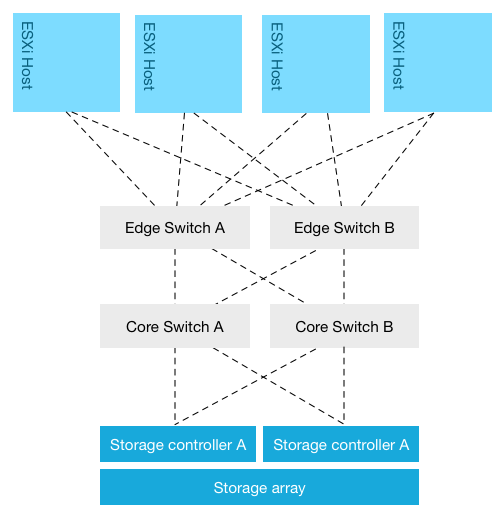
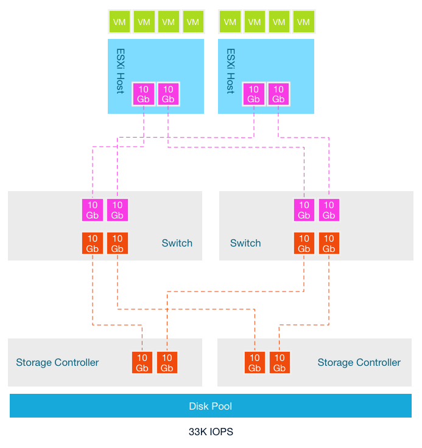

**Oversubscription Ratios** The most common virtual datacenter architecture consists of a group of ESXi hosts connected via a network to a centralized storage array. The storage area network design typically follows the core-to-edge topology. In this topology a few high-capacity core switches are placed in the middle this topology. ESXi hosts are sometimes connected directly to this core switch but usually to a switch at the edge. An inter-switch link connects the edge switch to the core switch. Same design applies to the storage array; it’s either connected directly to the core switch or to an edge switch.  This network topology allows scaling out easily from a network perspective. Edge switches (sometimes called distribution switches) are used to extend the port count. Although core switches are beefy, there is however a limitation on the number of ports. And each layer in the network topology has its inherent roles in the design. One of the drawbacks is that Edge-to-Core topologies introduce oversubscription ratios, where a number of edge ports use a single connection to connect to a core port. Placement of systems begins to matter in this design as multiple hops increase latency. To reduce latency the number of hops should be reduced, but this impacts port count (and thus number of connected hosts) which impacts bandwidth availability, as there are a finite amounts of ports per switch. Adding switches to increase port count brings you back to device placement problems again. As latency play a key role in application performance, most storage area network aim to be as flat as possible. Some use a single switch layer to connect the host layer to the storage layer. Let’s take a closer look on how scale out compute and this network topology impacts storage performance: **Storage Area Network topology** This architecture starts of with two hosts, connected with 2 x 10GB to a storage array that can deliver 33K IOPS. The storage area network is 10GB and each storage controller has two 10GB ports. To reduce latency as much as possible, a single redundant switch layer is used that connects the ESXi hosts to the storage controller ports. It looks like this:  In this scenario the oversubscription ratio of links between the switch and the storage controller is 1:1. The ratio of consumer network connectivity to resource network connectivity is equal. New workload is introduced which requires more compute resources. The storage team increases the spindle count to increase more capacity and performance at the storage array level.  Although both the compute resources and the storage resources are increased, no additional links between the storage controllers are added. The oversubscription ratio is increased and now a single 10Gb link of an ESXi host has to share this link with potentially 5 other hosts. The answer is obviously increasing the number of links between the switch and the storage controllers. However most storage controllers don’t allow scaling the network ports. This design stems from the era where storage arrays where connected to a small number of hosts running a single application. On top of that, it took the non-concurrent activity into account. Not every application is active at the same time and with the same intensity. The premise of grouping intermitted workloads led to virtualization, allowing multiple applications using powerful server hardware. Consolidation ratios are ever expanding, normalizing intermittent workload into a steady stream of I/O operations. Workloads have changed, more and more data is processed every day, pushing these IO’s of all these applications through a single pipe. Bandwidth requirements are shooting through the roof, however many storage area network designs are based of best practices prior to the virtualization era. And although many vendors stress to aim for a low oversubscription ratio, the limitation of storage controller ports prevents removing this constraint. In the scenario above I only used 6 ESXi hosts, typically you will see a lot more ESXi hosts connected to the same-shared storage array, stressing the oversubscription ratio. In essence you have too squeeze more IO through a smaller funnel, this will impact latency and bandwidth performance. Frequently scale-out problems with traditional storage architecture are explained by calculating the average number of IOPS per host by dividing the number of host by the total number of IOPS provided by the array. In my scenario, the average number of IOPS is 16.5K IOPS remained the same due to the expansion of storage resources at the same time the compute resources were added (33/2 or 100/6). Due to the way storage is procured (mentioned in part 1) storage arrays are configured for expected peak performance at the end of its life cycle. When the first hosts are connected, bandwidth and performance are (hopefully) not a problem. New workloads lead to higher consolidation ratio’s, which typically result in expansion of compute cycles to keep the consolidation ratio at a certain level to satisfy performance and availability requirements. This generally leads to reduction of bandwidth and IOPS per hosts. Arguably this should not pose a problem if sizing was done correctly. Problem is, workload increase and workload behavior typically do not align with expectations, catching the architects off-guard or simply new application landscape turn up unexpectedly when business needs change. A lack of proper analytics impacts consumption of the storage resources and avoiding hitting limits. It’s not unusually for organizations to experience performance problems due to lack of proper visibility in workload behavior. To counteract this, more capacity is added to the storage array to satisfy capacity and performance requirements. However this does not solve the problem that exists right in the middle of these two layers. It ignores the funnel created by the oversubscription ratio of the links connected to the storage controller ports. The storage controller port count impact the ability to solve this problem, another problem is that the way total bandwidth is consumed. The activity of the applications and the distribution of the virtual machines across the compute layer affect the storage performance, as workload might not be distributed equally across the links to the storage controllers. Part 3 of this series will focus on this problem.
