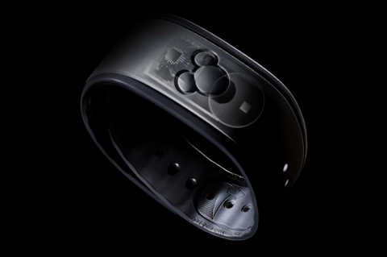

One of my favorite business books is the famous book of Michael Hammer “[Reengineering the Corporation](http://www.amazon.com/Reengineering-Corporation-Manifesto-Revolution-Essentials/dp/0060559535/ref=sr_1_1?ie=UTF8&qid=1429789242&sr=8-1&keywords=Reengineering+the+Corporation)”. The theme is the book is to take a hard look at business processes and radically change these old and existing processes. Hammer states that typically companies sped up their processes by implementing a newer iteration of existing technology. Many processes are dated before the advent of the computers and just by automating the process it can only optimizes performance marginally. Embedding computers in the archaic processes cannot address their fundamental performance challenges. By understanding what the process is trying to achieve one can break away from the existing design principles of the process. One great example is one of my favorite technologies is the Disney’s MagicBand and the way it’s used to radically change processes. \[caption id="attachment\_5292" align="aligncenter" width="480"\] Photo by Adam Voorhes / wired.com\[/caption\] **Disney’s MagicBand** The MagicBand is what is commonly referred to as a wearable. Inside the bracelet are a RFID chip and a radio. The parks have long range and short-range scanners along with sensors to interact with the MagicBand bracelet. One of the perks of my job is to speak to people who deliver cutting edge technology and as you can imagine I was very thrilled to speak to some of the team members who worked on the MagicBand platform. In essence the Disney MagicBand replaces every transaction between the customer and cast members or Disney parks and resorts. The MagicBand becomes your key to anything. It allows access to the park, access to the resorts and automatic payment. Its goal is to create a frictionless experience for the customer, increasing the satisfaction, which of course will increase spending. Instead of tinkering with existing processes Disney overhauled a lot of processes and many more are to follow. A great example is the overhaul of the check-in process and how it’s completely inline with the Hammer doctrine. Instead of buying newer faster desktop computers to speed up the check-in process, customers can go directly to their hotel room, bypassing the check in process all together. Disney’s sends the MagicBand to your home and prior to your visit the resort informs you via email which room is yours for your stay. Just walk up to your room and unlock the door by taping your MagicBand against the sensor on the door. MagicBands allows Disney to get rid of the ancient turnstiles that is the first port of anxiety of new parents and their strollers, instead of being funnelled into narrow cramped isles the entrance is now in the shape of a inviting V shape form with incredible process speeds. Just hold your MagicBand to the access point and wait to be greeted by an welcoming green glow, from then on its off to your favorite experience.  The MagicBand platform allows for new experiences as well. What about having a more personalized interaction with cast members? What if Cinderella greets your daughter by name and tells her that she knows she is her favorite princess or that she wishes her a happy birthday? Just mind-blowing and an experience she will never forget. Range scanners, sensors, WIFI, smart phones apps, user profiles and an insane amount of data crunching make this happen. Customers use the smart phone app to access their schedules and their user profiles. Countless short and long-range sensors scattered across the park pick up the signals of the bracelets. These systems are connected to each other, they collect data, and they use the captured data to optimize the experience of the customers. Data on visitors traffic flow, food orders and waiting times can be used to realign internal resources. Ever heard about Internet of things? This is the poster child of Internet of things. **Stop! Hammer Time** Circling back to the opening statement, using newer iteration of existing technology only provide marginally performance increases. Advances like the MagicBand require new technologies and new ways to operationalize these technologies in datacenters. Not every company is of the same size as Disney, but one thing is certain, most companies face the same challenge Disney has. How to reduce cost, increase efficiency and provide a new experience that makes them unique in a highly competitive market? A lot of brilliant people are trying to solve these problems by creating technical solutions and it’s up to the IT team to understand if these suit their operation models. How can you reengineer your corporation and create a new service offering while your IT is stuck in the past? Stuck using systems that are designed to work in infrastructures dating back to the early ‘70’s? Where they just found out that the market was bigger than 5 computers? Everything has to align, when the business changes it models, the IT team should not take anything for granted, they too need to aim for quantum leaps of performance. Markets shift rapidly; IT needs to be able to respond almost in a way that anticipates their needs. Maybe even in a way that it doesn’t feel remarkable at all, high service standards are the norm! Within the realm of virtualized datacenters two technology advancements can create an experience that might provide a ubiquitous experience to the business but provide the magic to the IT team; Scale out storage and object based storage. **Scale out storage and object based storage** Proper Scale out storage systems allows you to operationalize new advancement in storage technology as soon as they are available. They allow virtual datacenters to cater to any performance requirement possible any time. While, and this is very important, without impact current workloads that are using the same platform. Many application vendors move away from a monolithic application architecture, why keep holding on to the relics of the past by using a monolithic storage architecture for performance requirements? Object based storage, such as VMware VVOLs, allows you to fundamentally change how to provide data services to systems (virtual machines). Instead of creating management constructs and aligning data services to these logical layers (LUNs and datastores), data services can be directly applied to the specific machine. Virtual machines become first class citizens on storage systems, allowing IT teams to cater to requirements that both affect the business as well as the IT team requirements. **Challenge status quo** Hammer stated don’t ask, “How can we do what we do faster?” But ask; Why do we do it the way we do?” In essence, challenge status quo if you want to keep on moving forward in a time that introduces new technologies and application landscapes on a daily basis!
