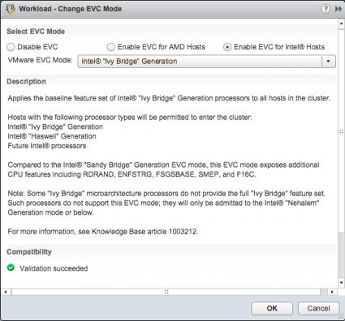
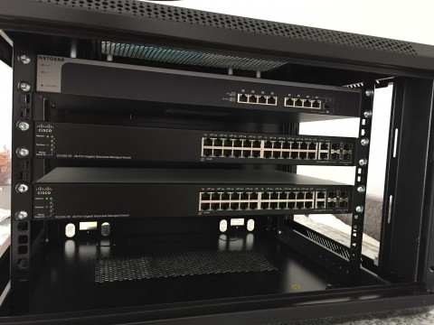

A little bit over a year ago I decide to [update my lab](http://frankdenneman.nl/2014/03/27/vsphere-5-5-home-lab/) and build two servers. My old lab had plenty of compute power, however they were lacking bandwidth, 3 Gbit/s SATA and 1 Gb network bandwidth. I turned to one of the masters of building a home lab, [Erik Bussink](https://twitter.com/erikbussink), and we thought that the following configuration was sufficient to handle my needs. **Overview**

| Component | Type | Cost |
| --- | --- | --- |
| CPU | [Intel Xeon E5 1650 v2](http://ark.intel.com/products/75780/Intel-Xeon-Processor-E5-1650-v2-12M-Cache-3_50-GHz?q=Intel%20Xeon%20E5%201650%20v2 "Intel Xeon E5 1650 v2 product information") | 540 EUR |
| CPU Cooler | [Noctua NH-U9DX i4](http://www.noctua.at/main.php?show=productview&products_id=67&lng=en&set=1 "Noctua NH-U9DX i4") | 67 EUR |
| Motherboard | [SuperMicro X9SRH-7TF](http://www.supermicro.com/products/motherboard/Xeon/C600/X9SRH-7TF.cfm "SuperMicro X9SRH-7TF") | 482 EUR |
| Memory | [Kingston ValueRAM KVR16R11D4/16HA](http://www.kingston.com/en/memory/search/Default.aspx?DeviceType=7&Mfr=SMI&Line=X9SRH-7TF&Model=80742&Description=Kingston_ValueRam_Memory_Server_Premier_Memory_for_SMI_X9SRH-7TF_Supermicro_-_X9SRH-7TF_Motherboard "Kingston module for Supermicro X9SRH-7TF") | 569 EUR |
| SSD | [Intel DC 3700 100GB](http://www.intel.com/content/www/us/en/solid-state-drives/solid-state-drives-dc-s3700-series.html "Intel® Solid-State Drive DC S3700 Series product information") | 203 EUR |
| Power Supply | [Corsair RM550](http://www.corsair.com/en-us/rm-series-rm550-80-plus-gold-certified-power-supply "Corsair rm 550 product information") | 90 EUR |
| Case | [Fractal Design Define R4](http://www.fractal-design.com/home/product/cases/define-series/define-r4-titanium-grey "Fractal Design Define R4 product information") | 95 EUR |
| Price per Server | (without disks) | 1843 EUR |

The systems are great, but really quickly I started to hit some limitations. Limitations that I have addressed in the last year, and that are interesting enough to share. **Adding a third host** As FVP is a scale out clustered platform, having two hosts to test with simply just don’t cut it. For big scale out testing I use nested ESXi but to do simple tests I just needed one more host. The challenged I faced was the dilemma of investing in “old” tech or going with new hardware. Intel updated their Xeon line to version 3, the Intel Xeon v3 has more cache (from 12MB to 15MB) more memory bandwidth, increased max memory support up to 768GB and uses DDR4 memory. [(Intel ark comparison)](http://ark.intel.com/compare/82765,75780) New shiny hardware might be better, but the main goal is to expand my cluster and one of the things I believe in is a uniform host configuration within a cluster. Time is a precious resource and the last thing I want to spend time on is to troubleshoot behavior that is caused by using non-uniform hardware. You might win some time by having a little bit more cache, more memory bandwidth but once you need to troubleshoot weird behavior you lose a lot more. A dilemma is not a dilemma if you go back and forth between the options, thus I researched if it was possible. The most predominant one is the change in CPU microarchitecture. The v3 is part of the new Intel Haswell microarchitecture. The Xeon v2 is build upon the Ivy Bridge. That means that the cluster has to run in EVC mode Ivy Bridge. The EVC dialog box of the cluster indicates that Haswell chips are supported in this EVC mode, thus DRS functionality remains available if I go for the Haswell chip  The Haswell chip uses DDR4 memory and that means different memory timings and different memory bandwidth. FVP can use memory as a storage I/O acceleration resource and a lot of testing will be done with memory. That means that applications can behave differently when FVP decides to replicate fault tolerant writes to the DDR4 host or vice versa. In itself it’s a very interesting test, thus again another dilemma is faced. However, these tests are quite unique and I rather have uniform performance across the cluster and avoid any troubleshooting behavior due to hardware disparity. Due to the difference in memory type, a new Motherboard is required too. That meant that I have to find a motherboard that contains the same chipsets and network configuration. The SuperMicro X9SRH-7TF rocks. Onboard 10 GbE is excellent. Some other users in the community have reported overheating problems, Erik Bussink was hit hard by the overheat problem and bought another board just to get rid of weird errors caused by the overheating. That by itself made me wonder if I would buy another X9SRH-7TF or go for a new Supermicro board and buy a separate Intel X540-T2 dual port 10GbE NIC to get the same connectivity levels. After weighing the pros and cons I decided to go for the uniform cluster configuration. Primarily because testing and understanding software behavior is hard enough. Second-guessing whether behavior is caused by the hardware disparity is a time sucking beast and even worse, it typically kills a lot of joy in your work. Contrary to popular belief, prices of older hardware does not decline forever, due to availability of newer hardware and remaining stock, prices go up. The third host was almost 500 Euro’s, more expensive than the previous price I had to pay. **Networking** Networking is interesting as I changed a lot during the last year. The hosts are now equipped with an Intel PRO 1000 PT dual ports with the 82571 chip. Contrary to my initial post these are [supported by vSphere 5.5](http://kb.vmware.com/selfservice/microsites/search.do?language=en_US&cmd=displayKC&externalId=2056935). However network behavior is a large part of understanding scale out architectures, thus more NIC ports are needed. An additional HP NC365T Quad-port Ethernet Server Adapter was placed in each server. The HP NIC is based on the Intel 82580 chipset but is a lot cheaper than buying Intel branded cards. Each host has one NIC dedicated to IPMI, 2 10GbE ports and 6 1GbE. In hindsight, I would rather go for two Quad NIC cards as it allows me to setup different network configurations without having to tear them down each time. With the introduction of the third host I had to buy a 10GbE switch. The two host were directly connected to each other, however this configuration is not possible with three hosts. Thus I had to look for a nice cheap 10GbE switch that doesn’t break the bank and is quiet. Most 10GbE switches are made for the data center where noise isn’t really a big issue. My home lab is located in my home office, spending most of my day with something that sounds like a jet plane is not my idea of fun. The NETGEAR ProSafe Plus XS708E 8-port 10-Gigabit fit most of my needs. 8 ports for less than 900 euro’s, it’s kind of a steal compared to the alternatives. However I wasn’t really impressed by the noise levels (and spending 900 euro’s but that’s a different story). Again my main go-to-guy for all hardware related questions Erik Bussink provided the solution, the [Noctua NF-A4-x10 FLX](http://www.noctua.at/main.php?show=productview&products_id=47&lng=en) coolers. Designed to fit into 1U boxes they were perfect.  But as you can see the design of the Netgear is a bit weird. The coolers are positioned at the far end of the PCB with all the heatsinks. When the switch is properly loaded, the thing emits a lot of heat. Regardless of what type of internal fan is used. To avoid heat buildup in the switch I used simple physics, but I will come to that later. Now having three hosts with seven 1 GbE connections, two storage systems eating up 3 ports and an uplink to the rest of the network I needed a proper switch. Lessons learned in that area, research thoroughly before pressing the buy button. I started of with buying an HP 1810-24G v2 switch. Silent, 24 ports, VLAN support. Awesome! No not awesome because it couldn’t route VLANs. And to the observant reader, 25 ports required, 24 ports offered. A VCDX’esque-like constraint. To work around the 24 ports limitation I changed my network design and wrote some scripts to build and tear down different network configurations. Not optimal, but dealing with home labs is almost like the real world. While testing network behavior and hitting the VMkernel network stack routing problem I decided it was time to upgrade my network with some proper equipment. I asked around in the community and a lot where using the Cisco SG300 series switch. [Craig Kilborn on twitter](https://twitter.com/Craig_Kilborn) [blogged](http://vmfocus.com/?s=hp+24) about his HP v1910 24G and told me that it was quite noisy. A Noctua hack might do the trick, but I actually wanted some more ports than 24. Erik pointed out the Cisco SG500-28-K9-G5 switches that are stackable and fanless. Perfect! I could finally use all the NICs in my servers and have room for some expansion.  **Time for a new rack** So from this point on I have three 19” sized switches, the IKEA lack hack table was nice, but these babies deserved better. The third host didn’t fit the table therefor new furniture had to be bought anyways. After spending countless of hours looking at 19” racks I came across a 6U Patch case.  This case had a lockable glass door (kids) and removable side panels, perfect for my little physics experiment. Just place the case in an upright position, remove the side panels and let the heat escape from the top. The fans will suck in "cold" air from the bottom. The dimensions of the patch case were perfect as it fitted exactly in my setup. The case is an Alfaco 19-6406. But with this networking equipment I’m feeling that my home lab is slowly turning into a #HomeDC.  With all this compute and network power I wanted to see what you can do when you have enterprise grade flash devices. I’m already using the Intel DC S3700 SSD’s and I’m very impressed by their consistent high performance. However Intel has released the [Intel SSD DC p3700 PCIe card](http://www.anandtech.com/show/8104/intel-ssd-dc-p3700-review-the-pcie-ssd-transition-begins-with-nvme) that use NVMe. I turned to Intel and they were so generous of loaning me three of these beasts for a couple of months. The results are extremely impressive, soon I will post some cool test results, but imagine seeing more than 500.000 IOPS in your homeDC on a daily basis. Management server To keep the power bill as low as possible, all three hosts are shutdown after testing, but I would like to have the basic management VMs running. In order to do this, I used a Mac Mini. William wrote extensively about how to install ESXi on a Mac, if you are interested I would recommend to check out his work: [http://www.virtuallyghetto.com/apple](http://www.virtuallyghetto.com/apple). Unfortunately 16Gb is quite limited when you are running three windows VMs with SQL DB's, therefor I might expand my management cluster by adding another Mac Mini. Time to find me some additional sponsors. :)
