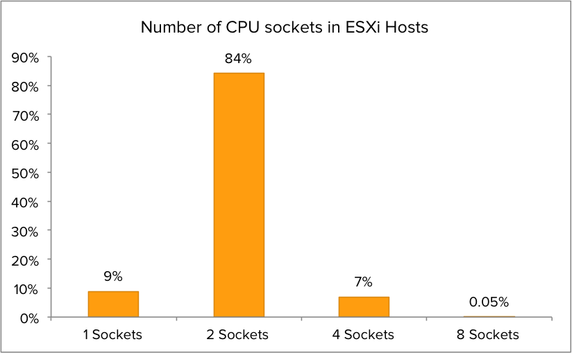
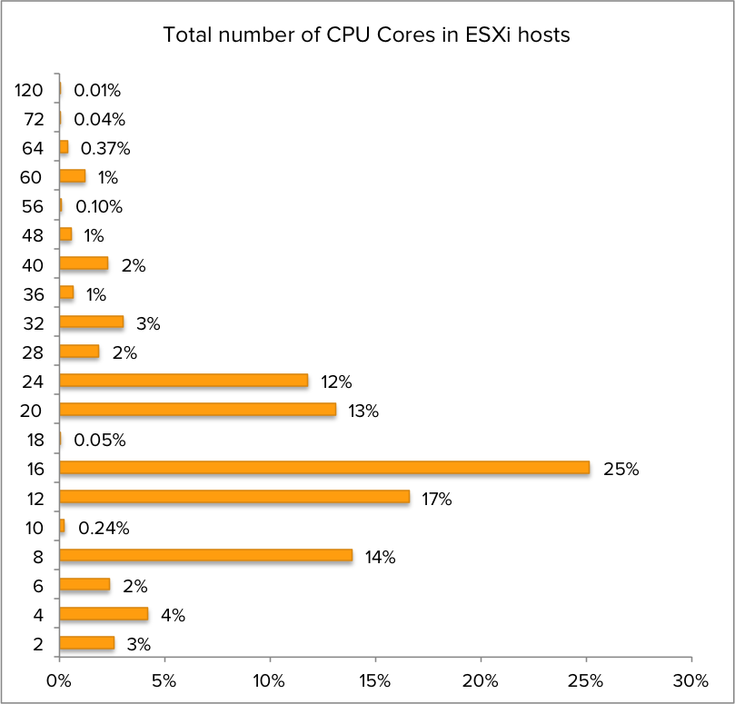
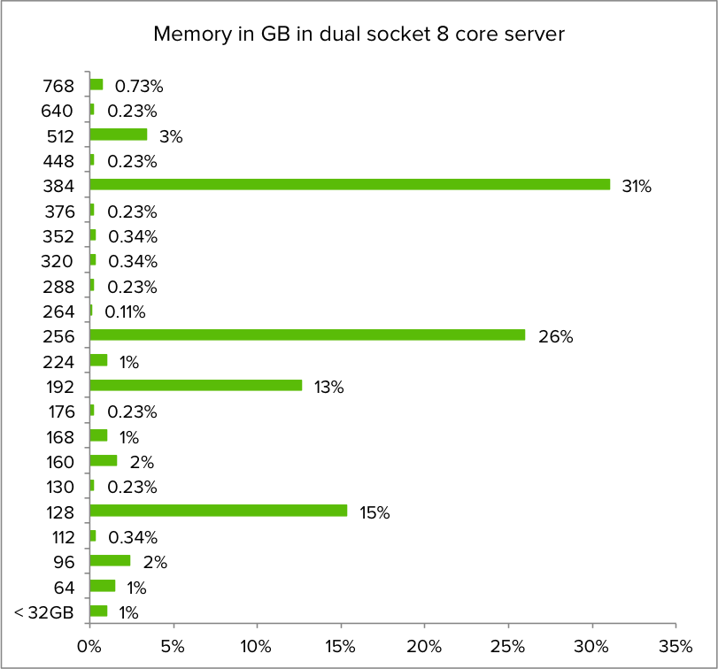
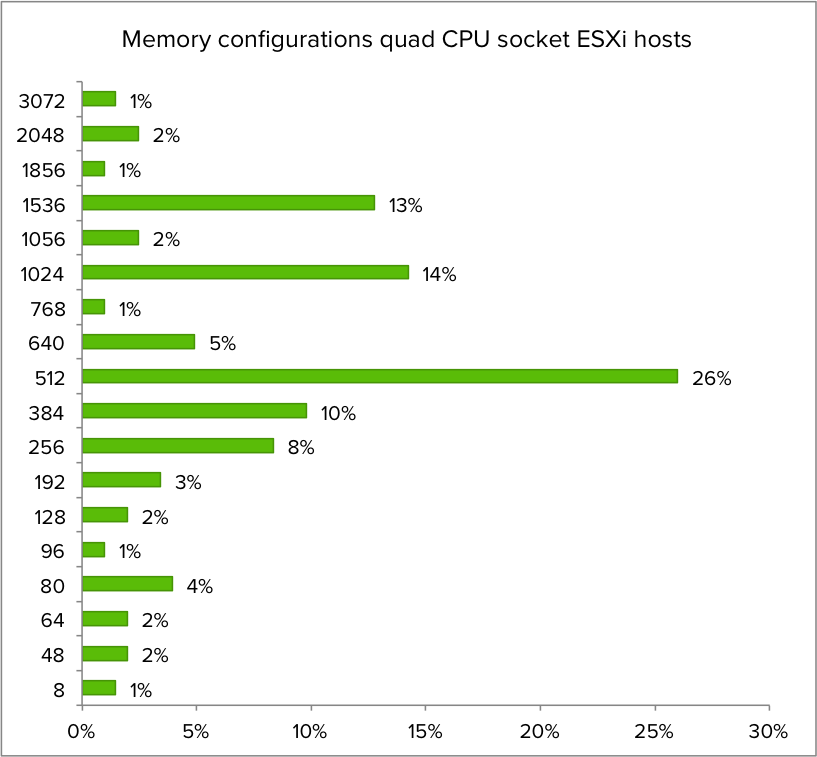

Recently [Satyam Vaghani](https://twitter.com/SatyamVaghani) [wrote about PernixData cloud](http://www.pernixdata.com/blog/portal-planets-virtualized-datacenters). In short PernixData Cloud is the next logical progression of PernixData Architect and provide visibility and analytics around virtual datacenters, it’s infrastructure and applications. As a former architect I love it. The most common question asked by customers around the world was how other companies are running and designing their virtual datacenters. Which systems do they use and how do these system perform with similar workload? Many architects struggle with justifying their bill of materials list when designing their virtual infrastructure. Or even worse getting the budget. Who hasn’t heard the reply when suggesting their hardware configuration: "you want to build a Ferrari, a Mercedes is good enough". With PernixData Cloud you will be able to show trends in the datacenter, popularity of particular hardware and application details. It let you start ahead of the curve, aligned with the current datacenter trends instead of trailing. Of course I can’t go into detail as we are still developing the solution, but I can occasionally provide a glimpse of what we are seeing so far. For the last couple of days I’ve been using a part of the dataset and queried 8000 hosts on their CPU, memory and ESXi build configuration to get insight in popularity of particular host configurations. **CPU socket configuration** I was curious about the distribution of CPU socket configurations. After analyzing the dataset it is clear that dual socket CPU configurations are the most popular setup. Although single CPU socket configuration are more common than quad CPU socket in the dataset, quad core are more geared towards running real world workload while single CPU configurations are typically test/dev/lab servers. Therefor the focus will primarily on dual CPU socket systems and partially quad CPU sockets systems. The outlier of this dataset is the 8 socket servers. Interesting enough some of these are chuck-full with options. Some of them were equipped with 15 core CPU’s. 120 CPU cores per host, talk about CPU power!  **CPU core distribution** What about the CPU core popularity? The most popular configuration is 16 cores per ESXi host, but without the context of CPU sockets one can only guess which CPU configuration is the most popular.  **Core distribution of dual CPU socket ESXi hosts** When zooming in to the dataset of dual CPU socket ESXi host, it becomes clear that 8 Core CPU’s are the most popular. I compared it with an earlier dataset and quad and six core systems are slowly reducing popularity. Six core CPU’s were introduced in 2010, assumable most will be up for a refresh in 2016. I intend to track the CPU configurations to provide trend analysis on popular CPU configurations in 2016.  **Core count quad socket CPU systems** What about quad socket CPU systems? Which CPU configuration is the most populair? It turns out that CPU’s containing 10 cores are the sweetspot when it comes to configuring a Quad core CPU system.  **Memory configuration** Getting insights into memory configuration of the servers provides us a clear picture of the compute power of these systems. What is the most popular memory configuration of dual socket server? As it turns out 256 and 384 GB are the most memory popular configuration. Today’s servers are getting beefy!  Zooming into the dataset quering the memory configuration of dual socket 8 core servers, the memory configuration distribution is as follows:  What about the memory configuration of quad CPU servers?  **NUMA** 512 GB is the most popular memory configuration for quad CPU socket ESXi host. Assuming the servers are configured properly, this configuration is providing the same amount of memory to each NUMA node of the systems. The most popular NUMA node is configured with 128 GB in both dual and quad CPU socket systems. **ESXi version distribution** I was also curious about the distribution of ESXi versions amongst the dual and quad CPU socket systems. It turns out that 5.1.0 is the most popular ESXi version for dual CPU systems, while most Quad CPU socket machines have ESXi version 5.5 installed  **More To Come** Satyam and I hope to publish more results from our dataset in the coming months. The dataset is expanding rapidly, increasing the insights of the datacenters around the globe. And we hope to cover other dimensions like applications and the virtualization layer itself. Please feel free to send me interesting questions you might have for the planet’s datacenters and we’ll see what we can do. Follow me on twitter [@frankdenneman](https://twitter.com/frankdenneman)
