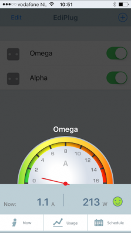
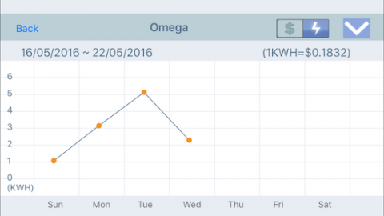
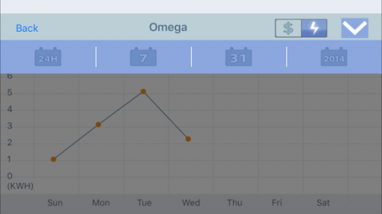

Home labs are interesting beasts, at one hand you would love to have all the compute, storage and network power available, on the other hand you do not want to have a power bill similar to a Google data center. I have a [decent setup](http://frankdenneman.nl/2015/06/04/when-your-home-lab-turns-into-a-home-dc/), with 4 Xeon servers, two cisco 1GB switches, a 10Gb switch and 3 Synology's, but I don't keep everything on all the time. One server acts as the management server, running a Windows DC, vCenter appliance, the PernixMS server and some other stuff. These machines are always on, not only to save time when I want to use my lab but increased stability as well. Due to this, my network gear and storage systems are also on. Which made me wonder how much the need for availability and stability will cost me on a yearly basis. The big Xeon rigs equipped with multiple PCIe devices are usually shut down after tests because I expect them to consume lots of power. Time to stop guessing and start monitoring. As always Home Lab Sensei [Erik Bussink](https://twitter.com/ErikBussink) pointed me out to a simple solution the Smart Plug [Edimax SP-2101W](http://us.edimax.com/edimax/merchandise/merchandise_detail/data/edimax/us/home_automation_smart_plug/sp-2101w/) Smart Plug Switch. Please leave a comment if you are using a different solution that is a better alternative to this device. **The device** Nothing much to add about the device itself, it is sleek enough so it will not eat up multiple power outlets.  The device is managed via an apple or android app, the following screenshots are taken from an Apple device, you can monitor it with both your iPhone or iPad. You can manage multiple smart plugs from one device. As I've spread my lab over two power-groups I've installed two power-plugs to monitor my home lab.  Unfortunately, the app doesn't allow displaying two smart plugs simultaneously, you have to open each individually. The monitor page shows the real time power consumption registered by the plug. It displays Amps and Watts. Quite cool to see what happens when you power-on devices or even a virtual machine, this monitored server generates a spike of 30 watts when powering on a VM, it quickly returns to a steady state though. Fun to see that ESXi hosts do not consume a steady high state of power.  The Now button shows the real-time power consumption and the total power consumption registered of today, this week and this month. By providing the price of energy, it calculates the total cost additionally. Unfortunately I haven't found the option to change the currency sign, so you are stuck with the dollar sign.  By selecting the Usage button provides you a chart to view the power consumption of that day.  The app allows you to analyze power consumption trends of your home lab by provides an overview based on 24 hours of data, a week, a month and a full year.  **Conclusion** The smart plugs are a great addition to my home lab, it provides me insights in the consumption and it for me personally have removed the reluctancy of leaving my full lab on. The answer to the question whether you need a smart plug if you run a home lab is in my opinion a straight and simple no. You can estimate cost or you can just ignore it and pay the bill when it arrives. I'm just curious about these things and it helps to clear my conscious.
