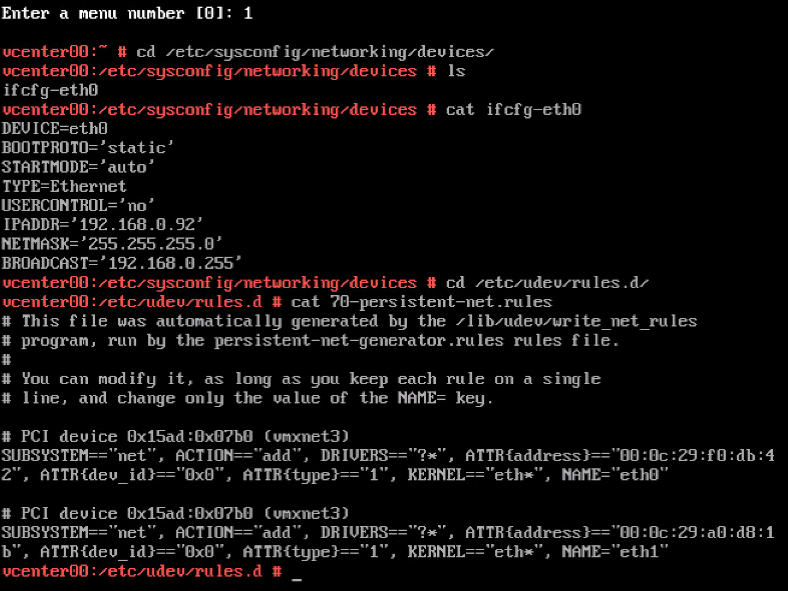
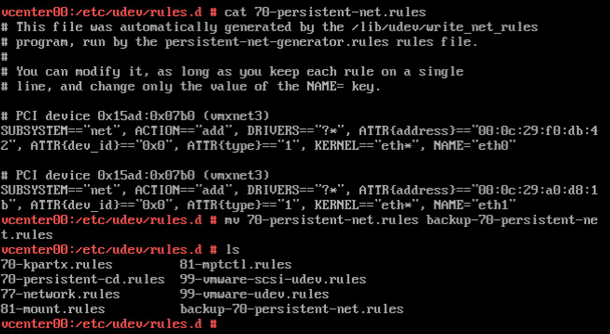

Paulo Coelho once stated "_Life moves very fast. It rushes from Heaven to Hell in a matter of seconds_" Well I think he perfectly described a day working in the lab and rushing through a migration. I'm upgrading the lab and I moved the vCenter Server Appliance (VCSA) to its new home. While trying to do a million things all at once, I didn't pay attention to the question whether I moved the virtual machine or whether I copied it. I selected the option "I copied it". And that's when the fun started, vCenter down. **TL;DR:** Selecting "I copied it" implies that this machine is a duplicate and that a new identity should be generated. This means that the VM is getting a new UUID and a new MAC address. SUSE Linux Enterprise Server 11 detects this new MAC address and views this as a new Ethernet Device. The VCSA does not allow the creation of a new ethernet controller. Rename 70-persistent-net.rules file and reboot to have SUSE auto-generate a new 70-persistent-net.rules file with the correct MAC Address that allows you restore network connectivity via the console. **Troubleshooting the problem** Both the web client and the VCSA config web page are unreachable, time to open up the VM console (Alt-F1). When logging in and pinging the gateway the error, the system returns the error message "Network is unreachable"  Before tinkering with the configuration files, I like to restart the services and see if the status report exposes interesting information.  "No configuration found for eth1". The VCSA is configured with a single NIC and SUSE Linux Enterprise Server 11, which is the OS for the appliance, assigns the label eth0 to the first Ethernet adapter. VCSA networking is configured through the Virtual Appliance Management Interface (VAMI). Executing the command "/opt/vmware/share/vami/vami\_config\_net allows you to retrieve the current network configuration  When selecting option 6 "IP Address Allocation for eth1" VAMI reveals that it cannot read the interface files for 'eth1'  The networking interface files are stored in the directory /etc/sysconfig/networking/devices. When listing the files (ls) only ifcfg-eth0 shows up. Reviewing the ifcfg-eth0 file with cat shows that the correct networking configuration is still applied to eth0.  It looks like the problem occurs due to the way SUSE handles devices. The following text is copied directly from the SUSE documentation:

> When the Kernel detects a network card and creates a corresponding network interface, it assigns the device a name depending on the order of device discovery, or order of the loading of the Kernel modules. The default Kernel device names are only predictable in very simple or tightly controlled hardware environments. Systems which allow adding or removing hardware during runtime or support automatic configuration of devices cannot expect stable network device names assigned by the Kernel across reboots. However, all system configuration tools rely on persistent interface names. This problem is solved by udev. The udev persistent net generator (/lib/udev/rules.d/75-persistent-net-generator.rules) generates a rule matching the hardware (using its hardware address by default) and assigns a persistently unique interface for the hardware. The udev database of network interfaces is stored in the file/etc/udev/rules.d/70-persistent-net.rules. Every line in the file describes one network interface and specifies its persistent name

Source: [https://www.suse.com/documentation/sled11/book\_sle\_admin/data/sec\_basicnet\_manconf.html](https://www.suse.com/documentation/sled11/book_sle_admin/data/sec_basicnet_manconf.html) When the ESXi host assigns the VM a new MAC Address, SUSE assigns a new unique interface to this MAC address and stores this in the file etc/udev/rules.d/70-persistent-net.rules.  It shows two Ethernet adapters, eth1 is using the MAC address currently assigned to the VM.  We are now entering a twilight zone, where there is one ethernet interface configured with an IP-address (ifcfg-eth0) while SUSE is applying all rules to a device it created and using the MAC Address assigned to the only NIC attached to the VM (Network Adapter 1). Time to clean up. Luckily udev rules are automatically generated during boot. To solve the mac address assignment fast, rename the file 70-persistent-net.rules  After rebooting the VCSA, review the 70-persistent-net.rules file to verify that SUSE assigned the MAC address to eth0.  You can now safely customize the system (Press F2 in the console) and configure the management network  A reboot of the VCSA is necessary as it appears that a restart of the management services is not enough to restore all services. Funny how times change, nowadays you get really happy seeing a blue screen. 
