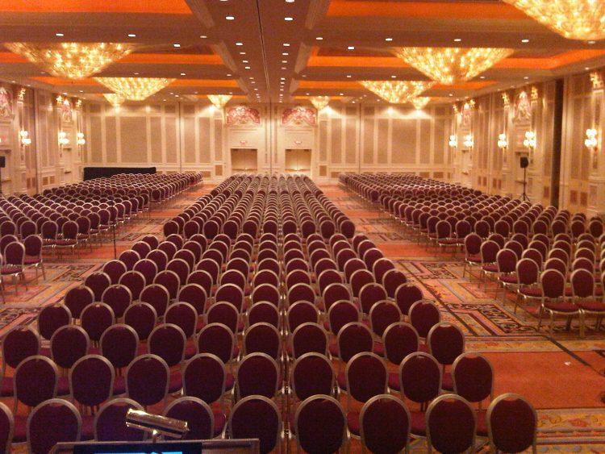

Yesterday both [Niels](https://twitter.com/NHagoort) and I received the congratulatory message from the [VMworld](https://www.vmworld.com/en/index.html) team, informing us that our session is accepted for both VMworld US and Europe. We are both very excited that our session was selected and we are looking forward at presenting to the VMworld audience. Our session is called the **vSphere 6.x host resource deep dive** (session ID 8430) and is an abstract of our similar titled book (publish date will be disclosed soon). **Session Outline** Today’s focus is on upper levels/overlay’s (SDDC stack, NSX, Cloud) but proper host design and management still remains the foundation of success. With the introduction of these new 'overlay' services, we are presented with a new consumer of host resources. Ironically it's the attention to these abstraction layers that returns us to focusing on individual host components. Correct selection and configuration of these physical components leads to creating a stable high performing platform, that lays the foundation for the higher services and increased consolidating ratios. Topics we will address in this presentation are: The introduction of NUMA (Non-Uniform Memory Access) required changes in memory management. Host physical memory is now split into local and remote memory structures for CPUs that can impact virtual machine performance. We will discuss how to right size your VMs CPU and memory configuration in regards to NUMA and vNUMA VMkernel CPU scheduler characteristics. Processor speed and core counts are important factors when designing a new server platform. However with virtualization platforms the memory subsystem can have equal or sometimes even have a greater impact on application performance than the processor speed. In this talk we focus on physical memory configurations. Providing consistent performance is key to predictable application behavior. It benefits day-to-day customer satisfaction and helps reduce application performance troubleshooting. This talk covers flash architecture and highlights the differences between the predominant types of local storage technologies. We look closer into recurring questions about virtual networking. For example, how many resources does the VMkernel claim for networking, what impact does a vNIC type has on resource consumption. Such info allows you to get better grips on sizing your virtual datacenter for NFV workloads. **Key Takeaway 1:** Identifying how proper NUMA and physical memory configuration allows for increased VM performance **Key Takeaway 2:** What is the impact of virtual network services on consumption of host compute resources? **Key Takeaway 3:** How next-gen storage components lead to low latency, higher bandwidth and increased scalability. **Key dates:** VMworld US takes place at Mandalay Bay Hotel & Convention Center in Las Vegas, NV from August 28 -  September 1, 2016 VMworld Europe takes place at Fira Barcelona Gran Via in Barcelona, Spain from 17 - 20 October, 2016 **Repeat the feat** Five years ago Duncan and I got this room completely full with our vSphere Clustering Deepdive Q&A, I would love to repeat that feat doing a Host deep dive session. I hope to see you all in our session! 
