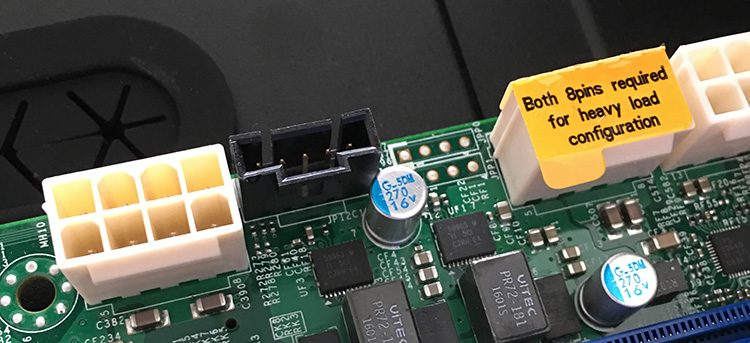
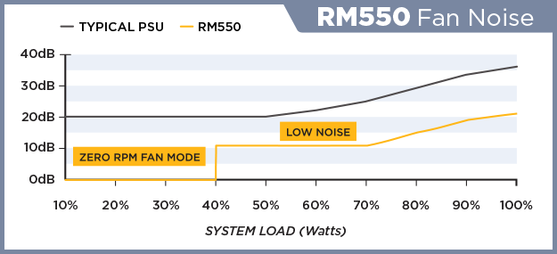
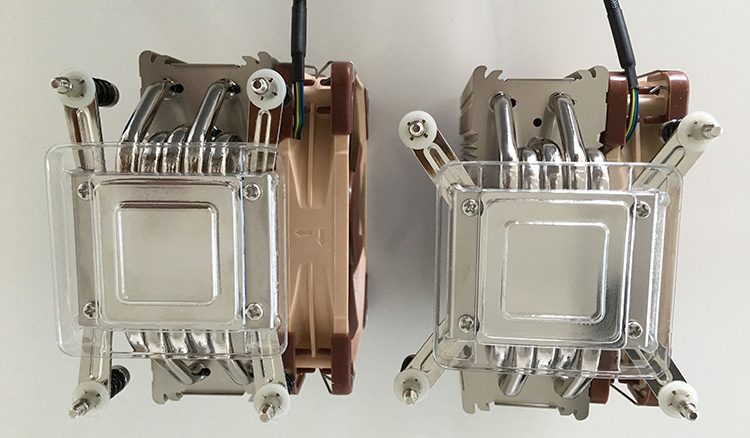

 

## A new challenge - a new system for the home lab

About one year ago my home lab was expanded with a third server and a fresh coat of networking. During this upgrade, which you can read at "[When your Home Lab turns into a Home DC](http://frankdenneman.nl/2015/06/04/when-your-home-lab-turns-into-a-home-dc/)" I faced the dilemma of adding new a new generation of CPU (Haswell) or expanding the hosts with another Ivy Bridge system. This year I've proceeded to expand my home lab with a dual Xeon system, and decided to invest in the latest and greatest hardware available. Like most good tools, you buy them for the next upcoming job, but in the end, you will use it for countless other projects. I expect the same thing with this year's home lab 'augmentation'. Initially, the dual socket system will be used to test and verify the theory published in the upcoming book "vSphere 6 Host resource deep dive" and the accompanying VMworld presentation ([session id 8430](http://www.vmworld.com/uscatalog.jspa?search=8430)), but I have a feeling that it's going to become my default test platform. Besides the dual socket system, the Intel Xeon 1650 v2 servers are expanded with more memory and a Micron 9100 PCIe NVMe SSD 1.2 TB flash device. Listed below is the bill of materials of the dual socket system:

| Amount | Component | Type | Cost in Euro |
| --- | --- | --- | --- |
| 2 | CPU | [Intel Xeon E5 2630 v4](http://ark.intel.com/products/92981/Intel-Xeon-Processor-E5-2630-v4-25M-Cache-2_20-GHz) | 1484 (742) |
| 2 | CPU Cooler | [Noctua NH-U12DX i4 CPU Cooler](http://noctua.at/en/products/cpu-cooler-workstation-server/nh-u12dx-i4) | 118 (59) |
| 1 | Motherboard | [Supermicro X10DRi-T](http://www.supermicro.com/products/motherboard/xeon/c600/x10dri-t.cfm) | 623 |
| 8 | Memory | [Kingston KVR24R17D8/16MA - 16 GB 2400 MHz CL17](http://www.kingston.com/dataSheets/KVR24R17D8_16MA.pdf) | 760 (95) |
| 1 | Flash Device | [Micron 9100 PCIe NVMe SSD 1.2 TB](https://www.micron.com/~/media/documents/products/product-flyer/9100_ssd_product_brief.pdf) | Sample |
| 1 | Flash Device | [Intel PC P3700 PCIe NVMe SSD 400 GB](http://ark.intel.com/products/79624/Intel-SSD-DC-P3700-Series-400GB-12-Height-PCIe-3_0-20nm-MLC) | Sample |
| 1 | Flash Device | [Intel SSD PC S3700 100 GB](http://ark.intel.com/products/71913/Intel-SSD-DC-S3700-Series-100GB-2_5in-SATA-6Gbs-25nm-MLC) | 170 |
| 1 | Ethernet Controller | [HP NC365T 4-port Ethernet Server Adapter](http://www8.hp.com/emea_africa/en/products/oas/product-detail.html?oid=4189876) | 182 |
| 1 | Case Fan | [Noctua NF-A14 FLX FAN 140 MM](http://noctua.at/en/products/fan/nf-a14-flx/specification) | 25 |
| 1 | Case | [Fractal Design Define XL R2 - Titanium](http://www.fractal-design.com/home/product/cases/discontinued-products/define-xl-usb-30-titanium-grey) | 135 |
|  |  | **Total Cost** | **3497 EUR** |

Update: I received a lot of questions about the cost of this system, I've listed the price in EURO's. With todays exchange rate Euro to USD 1.1369 it's about 3976 U.S. Dollar.

 

## Dual socket configuration

Building a dual socket system is still interesting, for me it brought back the feeling of the times when I built a dual Celeron system. Some might remember the fantastic [Abit BP6 motherboard](http://archive.arstechnica.com/reviews/3q99/bp6/bp6-1.html) with the Intel BX440 chip. Do you know today's virtual machines still use a virtualized BX440 chipset? But I digress. Building a dual socket system is less difficult than in those days when you had to drill a hole in CPU to attach it to a specific voltage, but it still has some minor challenges. **Form Factor** A dual-socket design requires more motherboard real estate than a single socket system. However there are some dual socket motherboards that are offered in the popular ATX form factor format, however, concessions are made by omitting some components. Typically this results in a reduced number of PCIe slots or the absolute minimum number of DIMM slots supported by the CPUs. Typically, you end up with selecting an E-ATX motherboard or if you really feel adventures EE-ATX or a proprietary format of the motherboard manufacturer. I wanted to have a decent amount of PCI-E slots as it needs to fit both the Intel and the Micron NVMe devices as well as the Quad 1 GB NIC. On the plus side, there seems to be a decent amount of PC cases available that support this E-ATX format. One of them is the [Fractal Design Define R4](http://www.fractal-design.com/home/product/cases/define-series/define-xl-r2-titanium-grey), but there are many others. I selected the Fractal R4 as it’s the same case design all the other servers use, only slightly bigger to fit the motherboard. The build quality of this case is some of the best I've seen. Due to all the noise-reducing material its quite heavy. Although it states it supports E-ATX on their spec sheet I assume they've only focused on the size of the motherboard. Unfortunately, the chassis does not contain the necessary mounting holes to secure the motherboard properly. In total 4 mounting points cannot be used, as the E-ATX uses in total 10 mounting points it should not be a big problem, however, it is missing a crucial one, the one in the top left corner. This might lead to problems when installing the DIMMs or the CPUs. I solved this by drilling a hole in the chassis to mount a brass grommet, but next time I would rather go for a different case. The red circles indicate the missing grommets.  **Power Supply** Dual Socket systems are considered heavy load configurations and require the dual 8 Pin EPS 12V connectors to be populated. Make sure that your power supply kit contains these connectors. Pictured below are the 12v 8-pin power connectors located on the motherboard.  When researching power supplies, I noticed that other people prefer to use 700 or 1000 watt power supplies. I don't believe you need to go that extreme. The amount of watts required all depends on what configuration you want to run.  In my design I'm not going to run dual SLI video card, it will 'only' contain the Intel Xeon 2640 v4 CPUs, 3 PCIe devices and 8 DDR4 2400 MHz Modules. Although it sounds like an extreme configuration already, it's actually not that bad. Let's do the math. With a TDP value of 85 watts each, the CPU's consume a maximum of 170 W. The PCIe devices increases the power requirement to 207 W. According to Intel the DC P3700 NVMe device consumes 12 W on write, 9 of read. The quad NIC Ethernet controller is reported to consume 5 W. Micron states that the active power consumption of the P9100 1.2TB PCIe device is between 7 and 21 W. [DDR4 DIMM voltage is set to 1.2V](http://frankdenneman.nl/2015/02/25/memory-deep-dive-ddr4/), compared to the 1.5V DDR3 requires, the reduce voltage which likely translate in a lower power consumption than similar DDR3 configurations. Unfortunately, Memory vendors do not provide exact power consumption specs. [Toms Hardware](http://www.tomshardware.com/reviews/intel-core-i7-5960x-haswell-e-cpu,3918-13.html) measured the power consumption of 4 DDR4 modules and discovered the consumption ranged from 6 to 12 W depending on the manufacturer. Worst case scenario, my 8 DIMMS consume 24 W. As the motherboard is quite large I assume it consumes a great deal of power as well, build computer states motherboard power consumption of high-end motherboards is between 45 to 80 Watts. As the board features two X540 10 G NICS, I will add the 12.5 W of power consumption stated by Intel to the overall motherboard consumption. In my calculation I assume a consumption of a 100 W . The Intel SSD DC3700 100 GB acting as base OS disk is rated to consume 2.9. This totals to a power consumption of roughly 330 W. There are some assumptions made therefore I'm playing it safe by using the Corsair RM 550 power supply which provides an output of 550W at 12 Volt. The cooling solutions don't move the needle that much, but for completeness sake, I've included them in the table.

| Component | Estimated Active Power Consumption | Vendor Spec |
| --- | --- | --- |
| Intel Xeon E5 2630 v4 | 85 \* 2 = 170 W | [ark.intel.com](http://ark.intel.com/products/92981/Intel-Xeon-Processor-E5-2630-v4-25M-Cache-2_20-GHz) |
| Micron P9100 1.2 TB | 21 W | [Micron Product Brief (PDF)](https://www.micron.com/~/media/documents/products/product-flyer/9100_ssd_product_brief.pdf) |
| Kingston KVR24R17D8/16MA | ~24 W | [Toms Hardware review](http://www.tomshardware.com/reviews/intel-core-i7-5960x-haswell-e-cpu,3918-13.html) |
| Intel SSD PC P3700 400 GB | 12 W | [ark.intel.com](http://ark.intel.com/products/79624/Intel-SSD-DC-P3700-Series-400GB-12-Height-PCIe-3_0-20nm-MLC) |
| HP NC365T 4-port Ethernet Server Adapter | 5 W | [HP.com](http://www8.hp.com/emea_africa/en/products/oas/product-detail.html?oid=4189876) |
| Intel SSD PC S3700 100 GB | 2.9 W | [ark.intel.com](http://ark.intel.com/products/71913/Intel-SSD-DC-S3700-Series-100GB-2_5in-SATA-6Gbs-25nm-MLC) |
| Noctua NF-A14 FLX FAN 140 MM | 0.96 W | [Noctua.at](http://noctua.at/en/products/fan/nf-a14-flx/specification) |
| Noctua NH-U12DX i4 CPU Cooler | 2 \* 0.6 = 1.2 W | [Noctua.at](http://noctua.at/en/products/cpu-cooler-workstation-server/nh-u12dx-i4) |
| Supermicro X10DRi-T | ~80 W | [Buildcomputers.net](http://www.buildcomputers.net/power-consumption-of-pc-components.html) |
| Intel X540-AT2 Dual 10 Gb Ethernet Controller | 12.5 W | [ark.intel.com](http://ark.intel.com/products/60020/Intel-Ethernet-Controller-X540-AT2) |
| **Total Power Consumption** | ˜330 W |  |

One thing you might want to consider is the fan noise when buying "Zero RPM Fan Mode" power supply. Typically these power supplies can operate without using the fan up to an _X_ percentage of system load. It will increase the use of the fan when the system loads go up. With my calculation I operate in the 60% system load range, above the threshold of the Zero RPM Fan Mode nut still in the Low Noise mode, while benefiting from the maximum efficiency of the power supply.  **Cooling** With more power consumptions comes the great need of cooling. And as we all know power consumption is the path to the dark side, power consumption leads to heat, heat leads to active cooling. Active cooling leads to noise. Noise leads to suffering. Or something like that. To reduce the noise generated by the home lab, I use Noctua cooling. High-quality low noise, it cost a pretty penny, but as always, quality products cost more.  In the UP (Uni-Processor) servers, I use the Noctua NH-U9DX-I4, which is an absolute behemoth. Due to the dual CPU setup, I selected the Noctua NH-U12DX i4 CPU Cooler which is specified as a slim design. In retrospect, I could have gone with the U9DX-I4 as well. Detailed information on both CPU coolers: [https://www.quietpc.com/nh-udxi4](https://www.quietpc.com/nh-udxi4)  Please ensure that your choice of cooler supports the 2011-3 socket configuration. According to Wikipedia: The 2011-3 socket use the so-called Independent Loading Mechanism (ILM) retention device that holds the CPU in place on the motherboard. 2011-3. Two types of ILM exist, with different shapes and heatsink mounting hole patterns. The  square ILM (80×80 mm mounting pattern), and narrow ILM (56×94 mm mounting pattern). Square ILM is the standard type, while the narrow one is alternatively available for space-constrained applications. It's not a surprise to see the Supermicro X10DRi-T features the arrow ILM configuration. Noctua ships the coolers with mounting kits for both ILM configuration, check your motherboard specs and the supported ILM configuration of your cooling solution before ordering.   

## Micron 9100 PCIe NVMe SSD 1.2 TB

Recently Micron supplied me with three engineering samples of their soon to be released PCIe NVMe SSD device. According to the product brief the 1.2 TB version provides 2.8/1.3 GB/s sequential write speed at a steady state when using a 128KB transfer size, impressive to say the least. The random read/write performance of the device of 4 KB blocks are 700.000 IOPS/180.000 IOPS. Remember the times where you were figuring out if you had to 150 IOPS or 180 IOPS when using a 15K spindle disk. :)  I'm planning to use the devices to create a EMC ScaleIO 2.0 architecture. Paired together with [DFTM](http://frankdenneman.nl/2014/10/02/whats-new-pernixdata-fvp-2-0-distributed-fault-tolerant-memory/) and a 10Gb network, this will be a very interesting setup. [Mark Brookfield](https://twitter.com/virtualhobbit) published an [extensive write up](https://virtualhobbit.com/2016/05/31/installing-and-configuring-emc-scaleio-2-0-and-pernixdata-fvp-part-1-scaleio/) of the ScaleIO 2.0 installation. Expect a couple of blog posts about the performance insights on Scale IO soon.

## RAM for Intel Xeon 1650 V2 servers

I've purchased some additional RAM to further test the in-memory I/O acceleration of FVP ([DFTM](http://frankdenneman.nl/2014/10/02/whats-new-pernixdata-fvp-2-0-distributed-fault-tolerant-memory/)) and the impact of various [DIMM Per Channel configuration](http://frankdenneman.nl/2015/02/20/memory-deep-dive/) on memory bandwidth. One server will have a configuration of 2 DPC, containing 128 GB of DDR3 1600MHz RAM, the second UP server is also 2 DPC configuration, equipped with 128GB of DDR3 1866 MHz and the Dual Xeon system runs a 1 DPC configuration with DDR4 2400 MHz RAM. The attentive reader will notice that I've over-specced the memory for the Intel Xeon v4 as this CPU supports memory up to 2133 MHz. Apparently 2400 MHz memory is produced more than the 2133 MHz equivalent, resulting in cheaper 2400 MHz memory. The mainboard adjusts the memory to the supported frequency accordingly.  The various memory configurations will also aid in the development of the FVP and Architect coverage. We recently released [FVP 3.5 and Architect 1.1](http://pernixdata.com/pernixdata-products-overview) and this release provided the long awaited management virtual appliance. Couple that with the [FVP freedom edition](http://pernixdata.com/blog/fvp-freedom-edition-launch) (RAM acceleration) and you can speed up your home lab with just a couple of clicks. I will publish an article on this soon.
