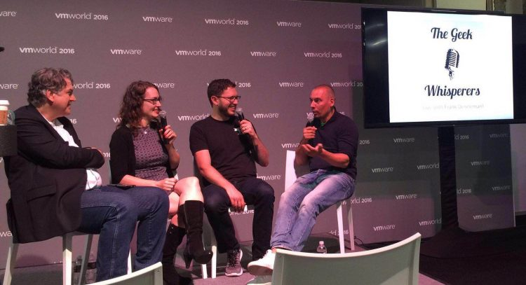

[Amy Lewis](https://twitter.com/commsninja) asked me to appear on the Geek Whisperers Live podcast at VMworld 2016 in Las Vegas. And as always I had a blast discussing various topics with [Amy](https://twitter.com/commsninja), [Matt](https://twitter.com/mjbrender), and [John](https://twitter.com/jtroyer). In this talk, we spoke about becoming an evangelist, what the challenges are as an evangelist and why you won't want to pick the title of evangelist yourself.  Of course, while interacting with this magnificent group of people you tend to talk about a lot more things. So go on and check it out, I had a blast doing it. [http://geek-whisperers.com/2016/09/choosing-titles-you-want-to-have-wfrank-denneman-at-vmworld-2016-episode-120/](http://geek-whisperers.com/2016/09/choosing-titles-you-want-to-have-wfrank-denneman-at-vmworld-2016-episode-120/)
