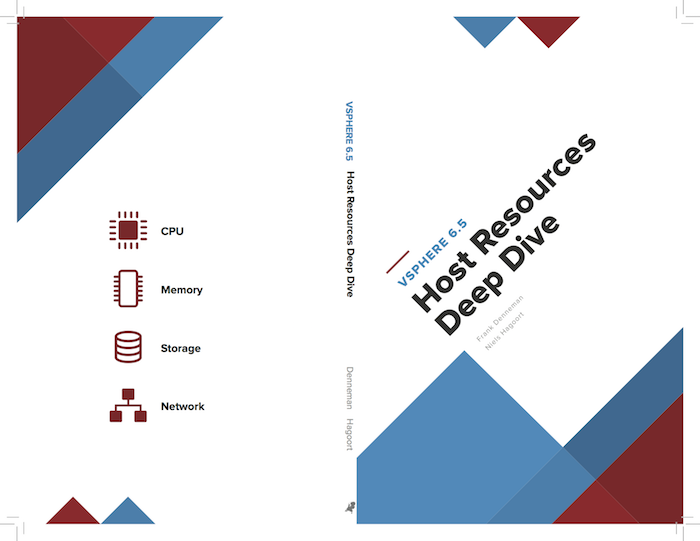

Maybe you have noticed that no new content has appeared on the site for a while. And the upcoming book “[vSphere 6.5 Host Resources Deep Dive](https://twitter.com/HostDeepDive)” is to blame for this situation. Last year, [Niels Hagoort](https://twitter.com/NHagoort) and I started working on the companion book of the highly successful [vSphere Clustering Deep Dive book](https://www.facebook.com/clusterindeepdive/). We set out writing this book to refocus on the fundament component of the virtual data center, the ESXi host. Today’s focal point is on upper levels/overlay’s (SDDC stack, NSX, Cloud). These topics are exciting and take IT services to the next level, but we also understand that proper host design and management fabricates the foundation for success. As a result, this book explores the host resources, CPU, memory, storage, and network in depth. Our goal is to provide you with an in-depth view of the four major host resources. Instead of showing you where to click to achieve a certain configuration, we explain the inner-workings of these components and how various physical and virtual constructs interact with each other.  We believe that this method provides a basis – a foundation on its own - that helps you to design and build the best possible architecture that aligns with the customer requirements each and every time. As you can imagine, trying to write a fitting companion to the cluster deep dive is no small feat. Research, reverse engineering and reading through a lot of academic papers consume most of our time besides our day-time job, hence the progress is not as fast as we would like. Expect the book to be released between April and May this year. Working on this book reminds me of the African Proverb “If you want to go quickly, go alone. If you want to go far, go together”. Although Niels and I generate the content, a lot of people are involved ensuring the quality is up to par. Both Niels and I would like to acknowledge the following persons: [Jane Rimmer](https://twitter.com/rimmergram) (has the challenging task of restructure our content into proper English). Chris Gianos (Lead Engineer of Intel Xeon microarchitecture), Haoqiang Zheng (Principal Engineer CPU Scheduler VMkernel) Valentin Bondzio (All-Star Badass GSS VMware) [Duncan Epping](https://twitter.com/DuncanYB) (Chief Technologist Storage BU VMware) [Marco van Baggum](https://twitter.com/vMBaggum) (Architect ITQ) [Myles Gray](https://twitter.com/mylesagray) (Infrastructure Engineer Novosco) [Rutger Kosters](https://twitter.com/RutgerKosters) (Solution Architect Rubrik) [Anthony Spiteri](https://twitter.com/anthonyspiteri) (Technical Evanglist Veeam Software) [Joop Carels](https://twitter.com/jjjcarels) (Sr. Solution Integrator Ericsson) We expect to publish the book in print in the April/May timeframe. An ebook version will be scheduled to appear at the end of this year. Throughout the writing process, we update the books’ [twitter account (@HostDeepDive)](https://twitter.com/HostDeepDive) and [Facebook page](https://www.facebook.com/HostDeepDive/) with sneak peeks and interesting reference material such as academic papers. Please subscribe to these channels to receive updates.
