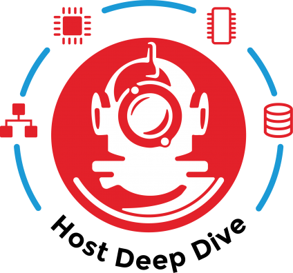
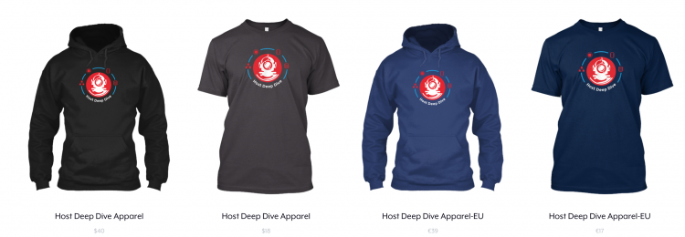

Last week we released the [VMware vSphere 6.5 Host Resources Deep Dive](https://www.amazon.com/gp/product/1540873064/ref=as_li_tl?ie=UTF8&camp=1789&creative=9325&creativeASIN=1540873064&linkCode=as2&tag=frankdennem0f-20&linkId=5afdf9e22610abeca733b5bd747d04d0) book and [Twitter](https://twitter.com/hostdeepdive) and [Facebook](https://www.facebook.com/HostDeepDive/) exploded. We've seen some pretty bad-ass pictures on our Twitter feeds such as this one by Jamie Girdwood ([@creamcookie](https://twitter.com/creamcookie))  It's always nice to hear some praise after spending more than 800 hours on something. (When writing and self-publish a book, expect to spend over 90 minutes on one page). Thanks! The top three most often heard questions were:

1. When will you release an ebook version?
2. Do you have any stickers?
3. When is Niels joining VMware?

**When will you release an ebook version?** We hope to get the ebook finalized after VMworld. Vacation time is coming up, and we also need to prep for VMworld (vSphere 6.5 Host Resources Deep Dive: Part 2 \[SER1872BU\]). It might happen sooner, but that depends on the process of creating an eBook itself. Unfortunately, it's not as easy as sharing a PDF online. Please stay tuned. **Do you have any stickers?** We got you covered. We met up with our designer over at [digitalmaterial.nl](http://digitalmaterial.nl/) and explained our wishes. We received a lot of comments on the depth of the book. Such as the one from Duncan's article [Must have book: Host Resources Deep Dive](http://www.yellow-bricks.com/2017/06/20/must-have-book-host-resources-deep-dive/):

> As most of you know, I wrote the Clustering Deepdive series together with Frank, which means I kinda knew what to expect in terms of level of depth. Kinda, as this is a whole new level of depth. I don’t think I have ever seen (for example) topics like NUMA or NIC drivers explained at this level of depth. If you ask me, it is fair to say that Frank and Niels redefined the term “deep dive”.

So instead of snorkeling and hovering a bit below sea-level, we help you get into the depths of the material. What better way to express this than a divers helmet. We will bring 250 stickers to VMworld. First come first serve. If you can't wait, download the 800 DPI PNG here and create one for yourself. [White Background](http://frankdenneman.nl/wp-content/uploads/2017/07/HRDD-white.png) [Transparent Background](http://frankdenneman.nl/wp-content/uploads/2017/07/HRDD-transparent.png) I think the design rocks, so much that Niels and I decided to put it on some t-shirts as well. We are not backed by a vendor, so we can't give away shirts. Similar to the book, we kept the price low. We created two campaigns, one for the US and one for EU.This allows you to get the order as fast as possible. The shirts and hoodies come in various colors.  **When is Niels joining VMware?** I don't know, he should though!
