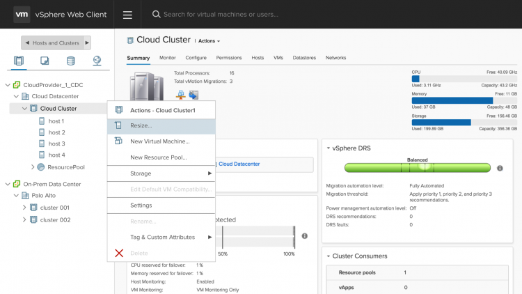

In preparation for the VMworld Session LHC2971BU - Managing Your Hybrid Cloud with VMware Cloud on AWS which I'm co-presenting with [Emad Younis](https://twitter.com/emad_younis), I asked the following question on Twitter: https://twitter.com/FrankDenneman/status/889841095768776704 And the number of answers were overwhelming. The stories were a bit underwhelming. Funny to see that we strive to automate every single step in the process. Guys like Alan, Luc, and William help the community to create scripted installs and configuration of the ESXi host. Creating a consistent, human-error free, rapid process. Shaving off valuable time of the time-consuming server provisioning process. Some organizations incorporate the vRealize suite to create a consistent user experience for the entire IT services portfolio. Interestingly enough, the overall lead time seems mostly impacted by internal acquisition processes. To give a few examples: https://twitter.com/j0sema/status/889945617312735232 https://twitter.com/tx\_drewdad/status/889849858701524992 https://twitter.com/VTsnowboarder42/status/889995588669984772 https://twitter.com/PvdBree/status/889863788983455744 And the list goes on and on. In most organizations, the procurement process is rigid, well-defined process. However, the lead time of the acquisition process is either unpredictable and inconsistent. The overall message is that it cripples the agility of the IT organization. IT organizations need to react fast to the business needs. Resource management of current workload is difficult enough, figuring out what to expect in the upcoming months is challenging. Unfortunately, the introduction of new workload does not follow a linear demand curve. To cater the (possible) future needs of the customer, the order is either doubled in size, or onboarding of new workloads is gated. Either impacting the bottom-line of the company or the ability to facilitate IT services properly. https://twitter.com/BobbyFantast1c/status/889845274805448704 In essence, the CAPEX element of server resource acquisition massively impacts or hinders the execution ability of the IT organization. Strategizing CAPEX\\OPEX is not a part of the core focus of many admins and architects, it does affect their means of execution. As demonstrated by the many tweets. With VMware Cloud on AWS, the host resource acquisition process shifts from CAPEX to OPEX. Removing the inconsistent and unpredictable procurement process, allowing for a faster, consistent and predictable method of providing compute, storage and networking resources. VMware Cloud on AWS (VMC) makes my resource-management heart beat faster. By leveraging the AWS operation model, the SDDC cluster running on the AWS infrastructure is resizable by a click of a button. Right-click on the cluster and select resize.  Just select the number of hosts you want to add and within moments you will get new dedicated physical hardware added to your cluster. Ready to provide the resources your new workloads require. Resize means you can remove the resources as well, which in result your costs will go down as well. Due to the combined fleet management of AWS and VMC, the new ESXi hosts are fully configured and ready to welcome new workload. All VMkernel and logical networks are automatically configured and made available. The vSAN datastore is automatically expanded with the host-local NVMe flash devices provided by the new hosts. DRS detects the new physical resources and automatically rebalances the cluster, provided the most optimal resource availability. Elastic DRS and Autoremedation HA allows for an automatize method or adding and removing dedicated hardware resources, but these topics will be covered in a different article. From a resource management perspective, a mindset shift will happen. VMC allows you to reduce the time spent on infrastructure configuration and management and allows you to focus more on resource consumption. What cluster configuration is required in the upcoming months? What is my burst strategy? Unfortunately, I can't go into detail as the service is not released yet. VMworld [boasts an exciting line up of VMware Cloud on AWS sessions](https://blogs.vmware.com/vsphere/2017/07/vmcsessions-vmworld2017.html). I will be hosting a meet the expert on resource management at both VMworlds, sign up if you want to talk more about this exciting new technology
