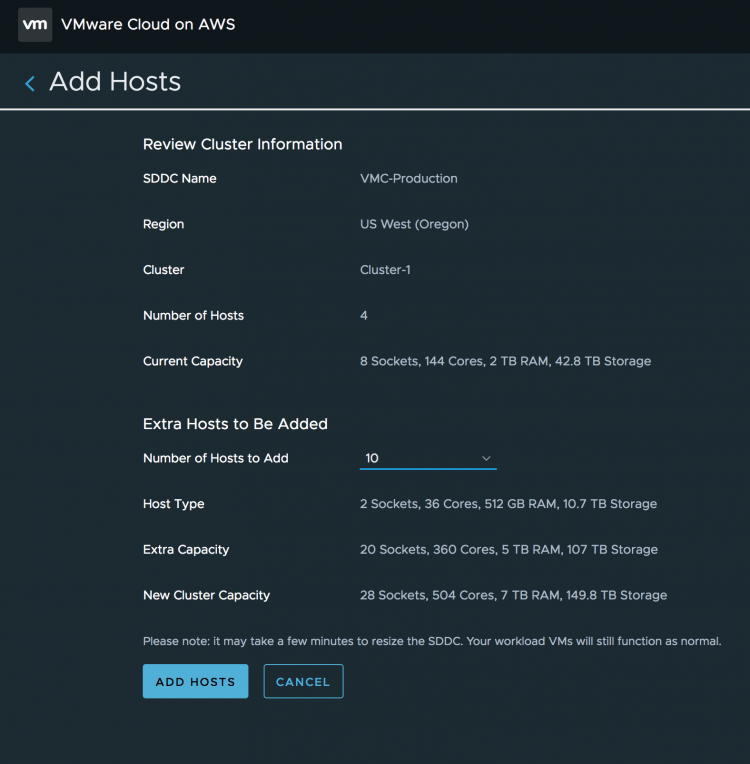

One of the more persistent misconceptions is that the components of VMware's Software Defined Data Center (SDDC) on VMware Cloud on AWS are virtualized or that the deployed VMs run natively on Amazon. And to be honest, it's not even weird that most people think this way. After all, Amazon Web Services launched in March 2006, 12 years ago. AWS and Elastic Compute Cloud (EC2) and Amazon Simple Storage Service (S3) are synonymous with each other. All of a sudden, you can know "run vSphere on AWS".

> To be short and sweet, VMware Cloud on AWS runs on physical hardware, it is not virtualized and running inside EC2 instances!

VMware Cloud is consuming the AWS infrastructure and using a bare-metal service offered by AWS. Of course, it is not as simple as installing vSphere on a bare-metal server and you got yourself a fully elastic cloud service. More than that needs to happen. VMware Cloud on AWS is a partnership between the two companies and both have done some extensive R&D work to make this happen. If you want to know more, Chris Wagner - Principle Architect of the service presented an excellent session ([LHC3174BU](https://youtu.be/nQwchswYXYk)) at VMworld on how we built it. Back to the service offering, when deploying an SDDC, by default a four node cluster is erected. Four physical hosts are assigned to a single customer account, and the service installs, patches and rolls out the full SDDC stack of vSphere, vSAN, and NSX. You just have to log on to vCenter and start deploying workloads.  Each ESXi host provides 36 CPU cores of 2.3 GHz (72 threads), 512 GB of RAM and 10.7 TB of raw storage capacity for the virtual machines to consume. As a result, a default vSphere cluster provides 144 CPU cores (288 threads), 2 TB of RAM and 42.8 TB of raw storage capacity. All physical resources! Due to leveraging the scale of AWS data centers and its operational framework, the VMware Cloud on AWS fleet management service can deploy physical resources on demand! By logging into the console ([vmc.vmware.com](http://vmc.vmware.com)) you can add and remove physical host to the cluster.  This allows you add physical hardware to the cluster, whenever you need it. No more long procurement process, no more waiting for the vendor to ship the goods. No more racking, stacking in a cold dark datacenter. Just with a few clicks, you get fresh new hardware added to your cluster, fully installed, configured, patched and ready to go. Typically this takes about 10 minutes for VMware Cloud on AWS to add a single physical host to your vSphere cluster. I've been to data centers that it took me more than 10 minutes to arrive at the correct cabinet.  If one is not enough, you can add up to 28 ESXi hosts in the cluster. In the example above, I added 10 additional hosts. The console list the host type, the extra capacity added by this action (10 ESXi hosts = 360 Cores, 5 TB RAM and 107 TB of Storage and sums the new cluster capacity. If you want to isolate specific workloads and add a separate cluster, just go right ahead and select the add cluster option in the console.  In total, a VMware Cloud on AWS customer can deploy up to 10 clusters of each 32 ESXi hosts in a single SDDC. In total two SDDCs can be erected. That means that a customer can have 23040 of physical CPU cores, 327 TB of memory and 6.8 Petabyte of storage. All physical hardware. You can imagine all this is done by firing off a collection of API-calls to get this process orchestrated. The beauty of having this functionality capacity-by-code is that you can incorporate it into software features, such as vSphere HA and DRS. An upcoming new feature is Elastic DRS. In short, the ability to scale out and scale the cluster with physical hardware whenever workload demand requires it. I will provide a more in-depth view once we release this new feature.
