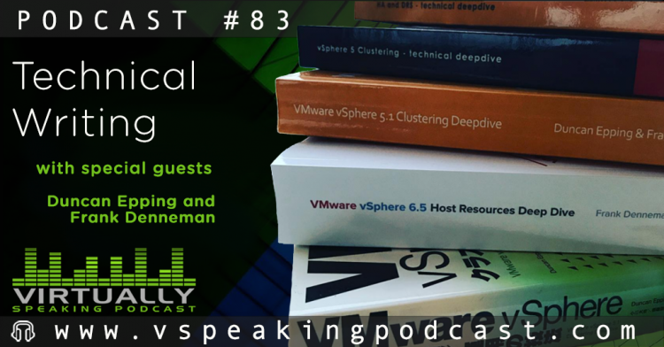

Last week [Duncan](https://twitter.com/DuncanYB) and I were guests on the ever popular Virtually Speaking Podcast. In this show we discussed the difference in technical writing, i.e., writing a blog post versus writing a book. We spoke a lot about the challenges of writing a book and the importance of a supporting cast. We received a lot of great feedback on social media, and [Pete](https://twitter.com/vPedroArrow) told me the episode was downloaded more than a 1000 times in the first 24 hours. I think this is especially impressive as he published the podcast on a Saturday Afternoon. Due to this popularity, I thought it might be cool to share the episode in case you missed the announcement. Pete and [John](https://twitter.com/Lost_Signal) shared the links to our [VMworld sessions on this page](http://www.vspeakingpodcast.com/episodes/83). During the show, I mentioned the [VMworld session](https://my.vmworld.com/widget/vmware/vmworld18us/uscatalog?search=%20Wagnerova) of [Katarina Wagnerova](https://twitter.com/_KatkaW_) and [Mark Brookfield](https://twitter.com/virtualhobbit). If you go to VMworld, I would recommend attending [this session](https://my.vmworld.com/widget/vmware/vmworld18us/uscatalog?search=%20Wagnerova). It's always interesting to hear people talk about how they designed an environment and dealt with problems in a very isolated place on earth. Enjoy listening to the show. 

<iframe frameborder="0" height="55px" width="100%" scrolling="no" seamless="" src="https://media.zencast.fm/embed/virtually-speaking-podcast/83.mp3"></iframe>
