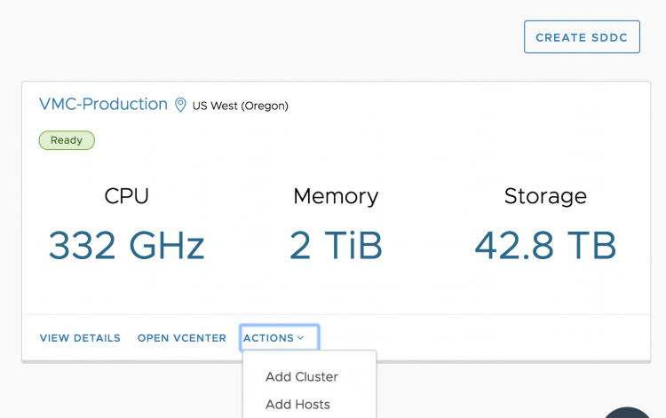
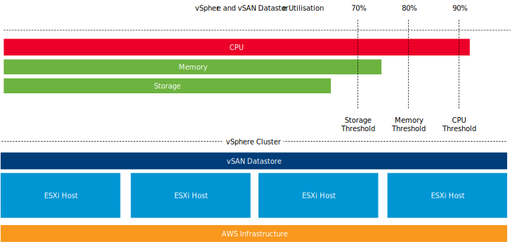
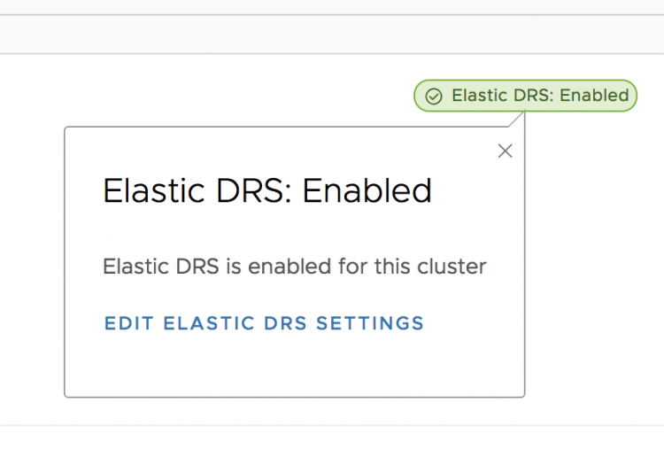
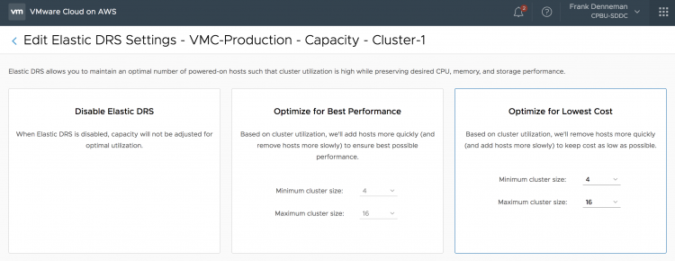
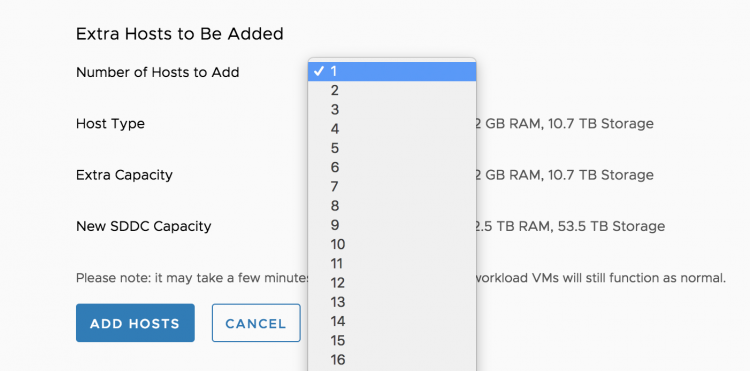

[VMware Cloud on AWS](https://cloud.vmware.com/vmc-aws) allows you to [deploy physical ESXi hosts on demand](http://frankdenneman.nl/2018/05/03/dedicated-hardware-public-cloud-world/). You can scale in and scale out your cluster by logging into the console.  This elasticity allows you to right-size your SDDC environment for the current workload demand. No more long procurement process, no more waiting for the vendor to ship the goods. No more racking, stacking in a cold dark datacenter. Just with a few clicks, you get new physical resources added to your cluster, ESXi and vSAN fully installed, configured, patched and ready to go! Having physical resources available on demand is fantastic, but it still requires manual monitoring and manual operations to scale out or scale in the vSphere cluster. Wouldn’t it be more comfortable if the cluster automatically responds to the dynamic nature of the workloads? As of today, you can enable Elastic DRS. **Introducing Elastic DRS** Elastic Distributed Resources Scheduler (EDRS) is a policy-based solution that automatically scales a vSphere Cluster in VMware Cloud on AWS based on utilization. EDRS monitors CPU, memory, and storage resources for scaling operations. EDRS monitors the vSphere cluster continuously, and each 5 minutes EDRS runs the algorithm to determine if scale-out or scale-in operations is necessary.  **Algorithm Behavior** EDRS is configured with thresholds for each resource and generates scaling recommendations if utilization consistently remains above or below their respective thresholds. EDRS algorithm takes spikes and randomness of utilization into consideration when generating these scaling recommendations. **Scaling Operations** Thresholds are defined for scale up operations and scale down operations. To avoid generating recommendations by spikes, EDRS generates a scale operation if the resource utilization shows consistent progress towards a threshold. To generate a scale out operation, a single threshold must be exceeded. That means that if CPU utilization shows consistent progress towards the threshold and at one point exceeds the threshold, EDRS triggers an event and adds an ESXi host to the vSphere cluster.  Similar to adding an ESXi host manually, the ESXi host is installed with the same ESXi version, patch level and is configured with the appropriate logical networks and adds the capacity to the vSAN datastore.  To automatically scale down the cluster, utilization across **ALL** three resources must be consistently below the specified scale-in thresholds. **Minimum and Maximum Number of ESXi hosts** You can restrict the bounds of a minimum and a maximum number of ESXi hosts. EDRS can be enabled if the cluster consists of four ESXi hosts, EDRS does not scale in beyond the four ESXi host minimum. When setting a maximum number of ESXi hosts, all ESXi hosts in the vSphere cluster, including those in maintenance mode are included in the count. Only active ESXi hosts are counted towards the minimum. As a result, the VMware cloud on AWS SDDC ignores EDRS recommendations during maintenance and hardware remediation operations. Currently, the maximum number of host in an Elastic-DRS enabled cluster is 16. **Scaling Policies** EDRS provides policies to adjust the behavior of scaling operations. EDRS provides two scaling policy that optimizes for cost or performance. Both policies have the same scale-out threshold. They only differ on scale-in thresholds.

| Scale Out Threshold | Performance Optimized | Cost Optimized |
| --- | --- | --- |
| CPU | 90% | 90% |
| Memory | 80% | 80% |
| Storage | 70% | 70% |

As a result, if the cluster consistently utilizes memory over 80%, EDRS triggers a scale out operation that adds a new host to the vSphere cluster. Please note that the load is tracked at the host level and then aggregated. EDRS aggregates the [CPU and memory load per fault-domain](http://frankdenneman.nl/2018/05/16/stretched-clusters-vmware-cloud-aws-really-big-thing/), for storage it is aggregated at the vSAN datastore level.

| Scale In Threshold | Performance Optimized | Cost Optimized |
| --- | --- | --- |
| CPU | 50% | 60% |
| Memory | 50% | 60% |
| Storage | 20% | 20% |

In essence, the performance policy is more eager to keep the resources than the cost-optimized policy. If you set the EDRS cluster to cost-optimized, an ESXi host is removed from the vSphere cluster if CPU and memory utilization is consistently below 60% and storage utilization is consistently below 20%. **How to Configure Elastic DRS** Log into your VMware Cloud on AWS console and select the cluster. A message box will show Elastic DRS is enabled on the cluster.  To further fine-tune Elastic DRS, you have the choice of clicking on the green message box at the top right of your screen or select the option "Edit EDRS settings" in the bottom of your screen.  The next step is to select the Scaling Policy. As mentioned, EDRS provides two scaling policy that optimizes for cost or performance. In this screen, you can fine-tune the behavior of Elastic DRS or disable it if you want to keep the host count of your cluster at a static level.  Please note that if you would select the default settings, you give EDRS the permission to scale up to 16 physical ESXi nodes. If this number of ESXi hosts is too high for you, please adjust the maximum cluster size. **EDRS scales up per single node and evaluates the current workload, it uses a time window of 1 hour for evaluation. It does not add multiple hosts at once.** Elastic DRS is designed to adjust to your workload dynamically, it responds to the current demand and scales in and out in a more fluid way. If you are aware of a high volume of incoming workload, you can add multiple hosts to the cluster swiftly by logging into the console, select the cluster to scale out and select add hosts.  You can finetune EDRS by using PowerCLI. Kyle Ruddy will publish an article containing the PowerCLI commands shortly.
