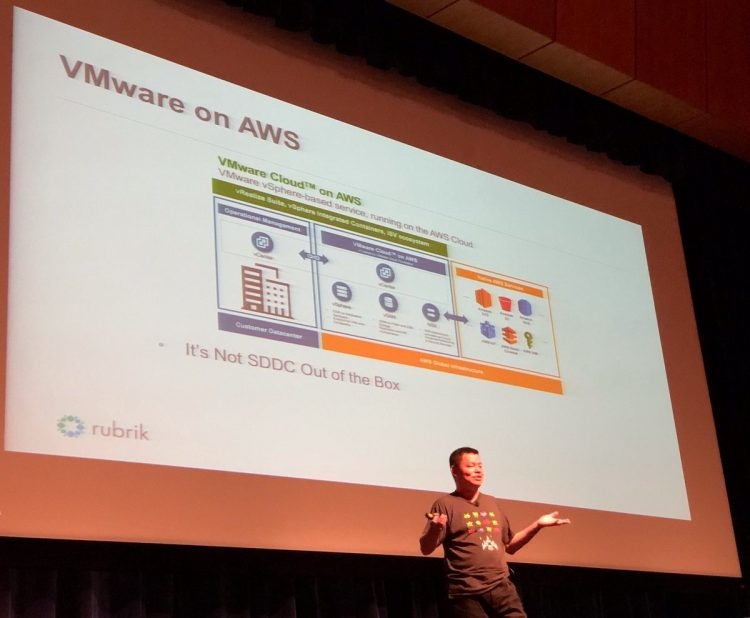
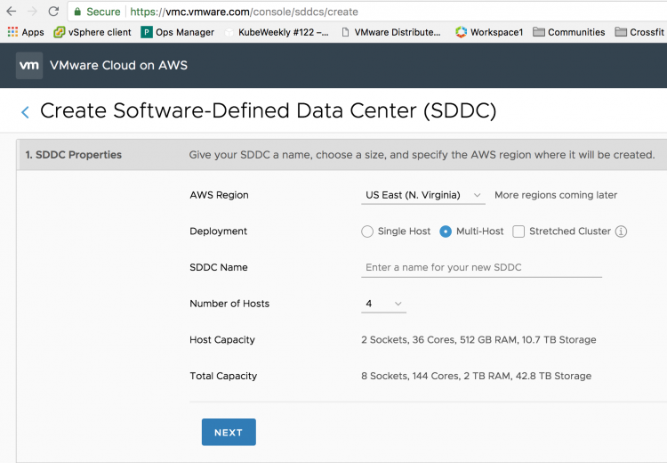
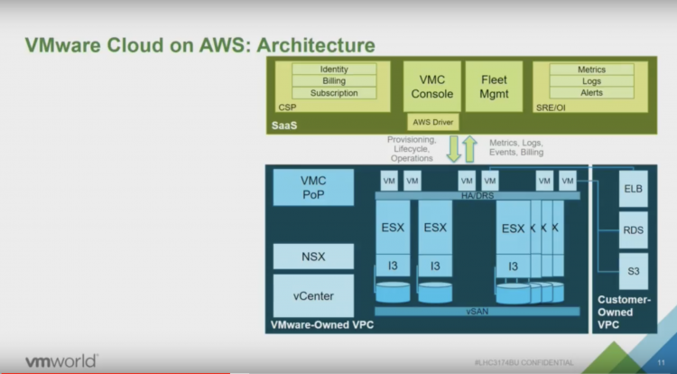
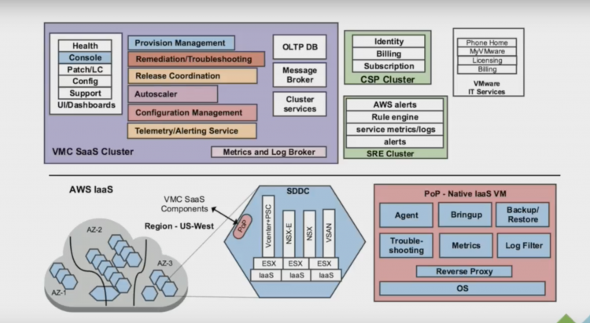

Yesterday, Kenneth Hui was on stage at the VTUG providing his personal opinion about VMware Cloud on AWS. The reason I say personal is that he forgot to remove the Rubrik Logo's from his slide (I checked with Rubrik).  On one slide he mentions that the SDDC, that is the Software Defined Data Center provided by VMware Cloud on AWS (VMC) is not an SDDC out of the box. And to me, that sounds a bit weird. Let's go over the process of spinning up an SDDC. First, you log onto [vmc.vmware.com](http://vmc.vmware.com) and you sign up for the service. In the console you define the number of hosts for deployment, click apply.  If you select a multi-host deployment, by default an SDDC cluster contains 4 hosts, that means that VMC deploys four physical hosts (for more info: [Dedicated Hardware in a Public Cloud World](http://frankdenneman.nl/2018/05/03/dedicated-hardware-public-cloud-world/)) on the AWS infrastructure. It installs and configures vSphere, vSAN, and NSX for you automatically. After roughly two hours you are the sole-owner of dedicated hardware with a fully software-defined data center running on top of that. Just log into your in-cloud vCenter and start to deploy your workload. So to reiterate, you just clicked a button on a website and a fully functional data center is deployed for you. https://twitter.com/kenhuiny/status/1019995175735758848 Ok so what about day 2 operations, let's define this a bit clearer because there are multiple definitions available. [Dzone](https://dzone.com/articles/defining-day-2-operations) provides the following definition: _Once "something" goes into operations, "day 2 operations" is the remaining time period until this "something" isn't killed or replaced with "something else."_ We build a cloud management platform in AWS in order to deal with day-2 operations. VMware provides the service, we will keep the lights on for you, troubleshoot and maintain your environment. This CMP plaform allows us to provide services like automated hardware remediation. If a component inside the ESXi hosts fails, such as a NIC, or an NVMe device, the backend will detect this and it will initiate a process to replace the faulty host with a fully operational one. The customer won't have to do a thing.  [Elastic DRS](http://frankdenneman.nl/2018/07/17/introduction-elastic-drs/) allows the cluster to respond to workload utilization automatically. It allows for automatic scale-out and scale-in, without the need for human intervention. [Stretched Clusters](http://frankdenneman.nl/2018/05/16/stretched-clusters-vmware-cloud-aws-really-big-thing/) protects the workload in the Cloud SDDC from AZ outages. If something happens, HA detects the failed VMs and restarts them on different physical servers in the remaining AZ without manual human involvement. Content library, allows the customer to subscribe the in-cloud SDDC to a template repository that automatically provides VM templates to the in-cloud SDDC. Read [Williams post](https://www.virtuallyghetto.com/2018/07/automating-vm-template-management-using-content-library-in-vmc.html) for more info Disaster Recovery as a Service, just go to the console, enable the add-on and the in-cloud components for SRM and vSphere Replication are automatically deployed and configured. Connect it to your on-prem components and you can build your DR runbooks. And there are many more functions that cover the lights-on, maintenance, housekeeping and optimize tasks of day 2. Now with that explained, the stories continue and a debate broke out on twitter. Some said it needs a form of CMP (eg. vRealize) for operating the SDDC. https://twitter.com/KenNalbone/status/1020106642287886337 This is an interesting observation, for which operation? Not for life-cycle or infrastructure management. We will take care of that for you. VMC is a fully managed service by VMware. It is responsible for the uptime and the lifecycle of the SDDC. we have built a CMP platform on the AWS infrastructure that allows us to deal with VMC. In a presentation of Chris Wegner (one of the principal engineers of VMC) the architecture is explained.  The blue box is the actual SDDC, The green box is a custom-built CMP that allows VMware to identify customers, billing customers, providing support for customers (as a VMC customer, you only deal with VMware) but most importantly for this story, it allows VMware to deploy hardware and software (Fleet management). The next image provides a more detailed view of the green box.  This is what you need to support hundreds of SDDCs across multiple regions (Oregon, N. Virginia, London, Frankfurt). Here you can see the bits for provisioning management, dealing with AWS services, acquiring hardware, configuring all the software and of course the ability to troubleshoot. You as a customer, do not need to worry again about ripping and replacing hardware because it failed, or because it's nearing the end of support. You only need to care about deploying your workload. And because we took the conscious decision of using vCenter as the management structure, you can use your on-prem vRealize suite and deploy your workload on-prem or in-cloud. Using vRealize to deploy workload is the way to go forward because 80% of our customers have a hybrid cloud strategy a on-prem deployment is expected. It makes sense to run your tooling on-premises. With VMware Cloud on AWS, your responsibility shift from managing hardware to managing the consumption of resources.
