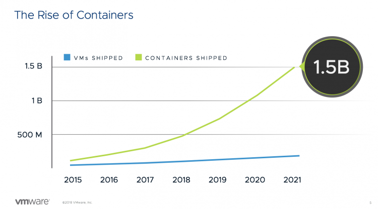
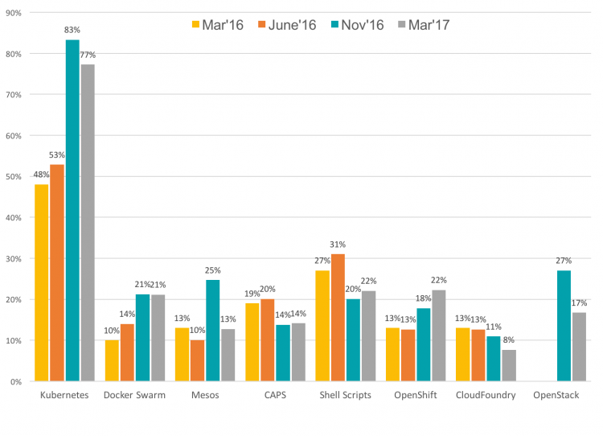
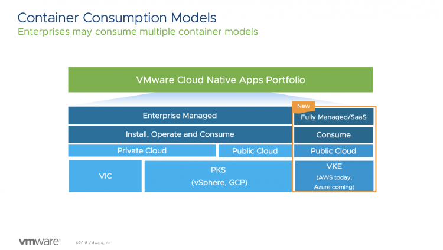
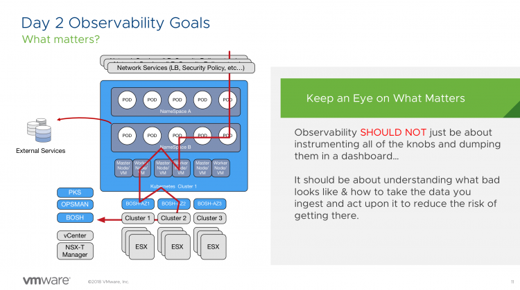

This year VMworld provided a broad selection of talks focusing on various forms of Kubernetes. Which is not surprising at all. Many organizations move away from buying and installing shrink-wrapped software and move towards in-house built custom applications. And what is the modern developer tool of choice? For many, it is the container. It's expected to have 1.5 Billion containers shipped by the end of 2021.  Containers are nothing more than a new format of virtualized workload. [Michael Gasch](https://twitter.com/embano1) explains it very well in our session [Deep Dive: The Value of Running Kubernetes on vSphere (CNA1553BU)](https://videos.vmworld.com/searchsite/2018/videoplayer/18528), where containers are task structs in the Linux kernel, not very different than executing an LS command. Well, a bit more than that as containers require CPU, memory, network, storage, and security. Containers satisfy the developers' need for speed, and they remove dependencies on underlying operating systems. When deploying massive amounts of containers, you need a container management platform, and Kubernetes is clearly the defacto standard in the industry.  Source: [Cloud Native Computing Foundation](source: https://www.cncf.io/blog/2017/06/28/survey-shows-kubernetes-leading-orchestration-platform/) For the infrastructure team, running Kubernetes can provide a way to create an infrastructure agnostic platform. That is, it can run on any cloud. VMware is fully vested in making this happen; you can run containers natively (VIC), containers and Kubernetes in Linux VMs on vSphere. [Pivotal Container Service](https://pivotal.io/platform/pivotal-container-service) (PKS) on-prem or in-cloud that helps customer deploy and operationalize day 1 and day 2 kubernetes solution and [VMware Kubernetes Engine](https://cloud.vmware.com/vmware-kubernetes-engine) (VKE) (Kubernetes as a Service) for organizations who want to consume Kubernetes without owning, building or operationalizing any infrastructure.  I've selected a few VMworld sessions that cover these container consumption models. There are many more, and please check them out at the [VMworld On-Demand Video Library](https://videos.vmworld.com/searchsite/2018?reset=false&searchTXT=kubernetes&=&=true&sessions_search_result_limit=10&sessions_counter=10&stypes_filter=&tracks_filter=&subtracks_filter=&marketsegment_filter=&audience_filter=&prodtopics_filter=&techlevel_filter=&popular_filter=&poster_filter=US,EUROPE&search=kubernetes).  
**Container and Kubernetes 101 for vSphere Admins (CNA1564BU)** A very popular session at VMworld was the 101 session for vSphere Admins. Nathan Ness and Sachin Thatte go over the basics of Container, Kubernetes and Pivotal Container Services. A very helpful primer for the rest of the listed videos. ([Watch here](https://videos.vmworld.com/searchsite/2018/videoplayer/18478))   
**Running Kubernetes on vSphere Deep Dive: The Value of Running Kubernetes on vSphere (CNA1553BU)** Michael Gasch (Resident Kubernetes Expert at VMware) and I go over the reasons why vSphere and Kubernetes are better together. We provide guidelines on how to successfully run your Kubernetes environment. ([Watch Here](https://videos.vmworld.com/searchsite/2018/videoplayer/18528))   
**A Deep Dive on Why Storage Matters in a Cloud-Native World (HCI1813BU)** 7 out of 10 applications that run in containers are stateful applications (source: Datadog), you want to provide persistent storage. Myles and Tushar talk about project Hatchway and provide a preview of the upcoming Cloud Native Storage (CNS) Control plane. ([Watch Here](https://videos.vmworld.com/searchsite/2018/videoplayer/22205))   
**Operating and Managing Kubernetes on Day 2 with PKS (CNA1075BU)** If you are planning to run large-scale kubernetes deployments on-prem, you should consider Pivotal Container Service (PKS). PKS allows you to deploy multiple kubernetes clusters quite easily. Thomas Kraus and Merlin Glynn show how to tackle day 2 operations and review SDDC products, such as vRealize and Wavefront, that integrates with PKS. ([Watch Here](https://videos.vmworld.com/searchsite/2018/videoplayer/22744))   
**VMware Kubernetes Engine** [VMware Kubernetes Engine](https://cloud.vmware.com/vmware-kubernetes-engine) (VKE) offers a turn-key solution of managed Kubernetes clusters that run natively on AWS. Not in VMware Cloud on AWS, not on vSphere, pure native EC2! Plans are to run VKE at multiple cloud providers, allowing you to create environments that no-other cloud provider themselves can provide. Think about an HA cluster spanning both AWS and Azure. However, we are not that far right now, but it is interesting to take a look at what VKE is and how Smart Clusters will change the way you will operate Kubernetes. **Intro to VMware Kubernetes Engine-Managed K8s Service on Public Cloud (CNA2084BU)** Tom and Valentina go over the concepts and customer value of VKE, including a nice demo. ([Watch Here](https://videos.vmworld.com/searchsite/2018/videoplayer/20186))   
**Deep Dive: VMware Kubernetes Engine-K8s as a Service on Public Cloud (CNA3124BU)** After getting familiar with VKE, I recommend to watch the session of Tom and Alain. They dive deeper into the concept of Smart Clusters. ([Watch Here](https://videos.vmworld.com/searchsite/2018/videoplayer/22386))  I hope you enjoy watching these sessions, please leave a comment about sessions you think are worth watching.
