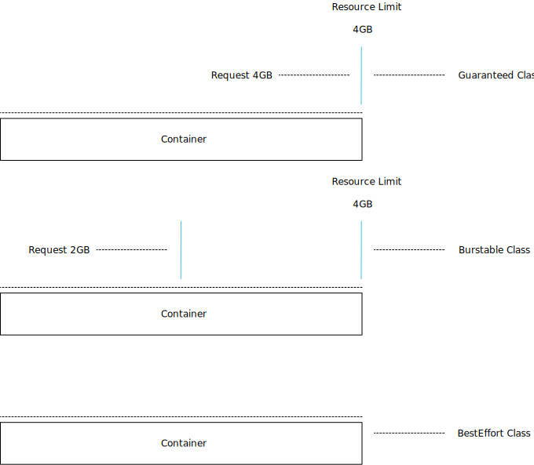
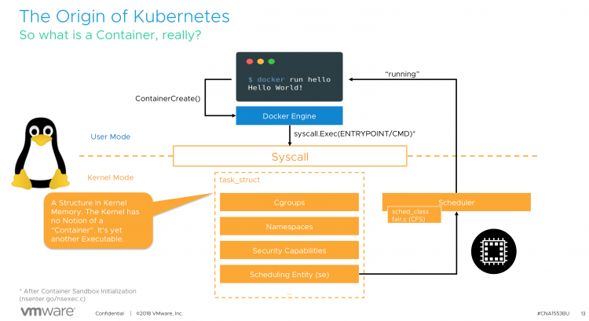
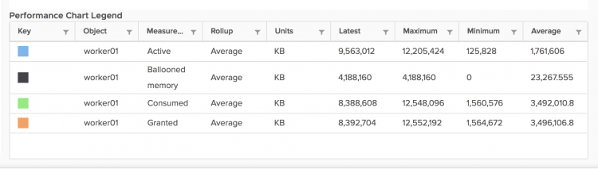

Kubernetes requires to disable the swap file at the OS level. As stated in the [1.8 release changelog](https://github.com/kubernetes/kubernetes/blob/master/CHANGELOG-1.8.md#before-upgrading): _The kubelet now fails if swap is enabled on a node_.

**Why disable swap?**  
Turning off swap doesn't mean you are unable to create memory pressure. Why disable such a benevolent tool? Disable swap doesn't make any sense if you look at it from a single workload, single system perspective.  
However, Kubernetes is a distributed system that is designed to operate at scale. When running a large number of containers on a vast fleet of machines, you want predictability and consistency. Disabling swap is the right approach. It's better to kill a single container than to have multiple containers run on a machine at unpredictable, probably slow, rate.

Therefore the [kubelet](https://kubernetes.io/docs/reference/command-line-tools-reference/kubelet/) is not designed to handle swap situations. It's expected that workload demand should fit within the memory of the host. On top of that, it is recommended to apply quality of service (QoS) settings to workloads that matter. Kubernetes provides three QoS classes to [pods](https://kubernetes.io/docs/concepts/workloads/pods/pod-overview/); [Guaranteed, Burstable, and BestEffort](https://kubernetes.io/docs/tasks/configure-pod-container/quality-service-pod/#create-a-pod-that-gets-assigned-a-qos-class-of-guaranteed) .  
  
Kubernetes provides the construct _request_ to ensure the availability of resources. Similar to reservations at the vSphere level. Guaranteed pods have a request configuration that's equal to the CPU and memory limit. All memory the container can consume is guaranteed, and therefore it should never need swap. With Burstable a portion of the CPU and memory is protected by a request setting, while a BestEffort pod does not have a CPU and memory request and limit setting specified.

**Multi-level Resource Management**  
Resource management is difficult, mainly when you deal with virtualized infrastructure. You have to ensure the workloads receive the resources they require. Furthermore, you want to drive the utilization of the infrastructure in an economically sound manner. Sometimes resources are limited, and not all workloads are equal, thus adding another level of complexity of prioritization. Once you solved that problem, you need to think about availability and serviceability.

Now the good news is that this is relatively easy with boundaries introduced by virtual machine configuration. I.e., you specify the size of the VM by assigning it CPU and memory resources. And this becomes a bin packing problem. _Given n items of different weights and bins each of capacity c, assign each item to a bin such that the number of total used bins is minimized._

A virtual machine is, in essence, a virtual hardware representation. You define the size of the box, with the number of CPUs and the amount of memory. This is a mandatory step in the virtual machine creation process.

With containers it's a little bit different. In its default state, the most minimal configuration, a container inherits the attributes of the system it runs on. It is possible to consume the entire system, depending on a workload. (a single threaded application, might detect all CPU cores available in the system, but its nature won't allow it to run on more than a single core. In essence, a container is a process running in the Linux OS.

  

  
For a detailed explanation, please (re)view our [VMworld session, CNA1553BE](http://videos.vmworld.com/global/2018/vi…).

This means that if you do not specify any limit, the container has no restriction of how much resources such a pod can use. Similar to vSphere admission control, you cannot [overcommit reserved resources](http://frankdenneman.nl/2009/12/08/impact-of-memory-reservation/). Thus, if you commit to an IT policy that only allows configuration of Guaranteed pods, you leverage Kubernetes admission control to avoid overcommitment of resources.

One of the questions to solve either on a technical level or organization level is, how you are going to control pod configuration? From a technical level, you can solve this by using [Kubernetes admission control](https://kubernetes.io/docs/reference/access-authn-authz/admission-controllers/), but that is out of scope for this article.

Pod utilization is ultimately limited by the resources provided by the virtual machine, but you still want to provide predictability and consistency service to all workloads deployed in containers. Guarantees are only as good as the underlying foundation they are built upon. So how do you make sure behavior remains consistent for pods?

**Leveraging vSphere Resource Management Constructs**  
When running Kubernetes within virtual machines (like the majority of the global cloud providers), you have to control the allocation of resources on multiple levels.

From the top-down, the container is scheduled by Kubernetes on a worker node, predominantly Linux is used in the Kubernetes world, so let's use that as an example. The guest OS allocates the resources and schedules the container. Please remember that a container is just a set of processes that are isolated from the rest of the system. Containers share the same operating system kernel and thus it's the OS responsibility to manage and maintain resources. Lastly, the virtual machine runs on the hypervisor and the VMkernel manages resource allocation.

**VM-Level Reservation**  
To ensure resources to the virtual machine, two constructs can be used. VM-level reservations or Resource Pool reservations. With VM-level reservations, the (ESXi host) physical resources are dedicated to the virtual machine, once allocated by the guest OS, it's not shared with other virtual machines running on that ESXi host. This is the most deterministic way to allocate physical resources. However, this method impacts the virtual machine consolidation ratio. When using the vSphere HA admission control policy of Slot Policy it can impact the VM consolidation ratio at cluster level as well.

**Resource Pool Reservation**  
A resource pool reservation is dynamic in nature. The resources backed by a reservation are distributed amongst the child-objects of the resource pool by usage and priority. If a Kubernetes worker node is inactive or running at a lower utilization-rate, these resources are allocated to other (active) Kubernetes worker nodes within the same resource pool. Resource Pools and Kubernetes are a great fit together, however, resource pool sizing must be adjusted when the Kubernetes cluster is scaled out with new workers. If the resource pool reservation is not adjusted, resources are allocated in an opportunistic manner from the cluster, possibly impacting predictability and consistency of resource behavior.

**Non-overcommitted Physical Resources**  
Some vSphere customers design and size their vSphere clusters to fully back virtual machine memory with physical memory. This can be quite costly, but it does reduce operational overhead tremendously. The challenge is the keep the growth of the physical cluster aligned with the deployment of workload.

**Overcommited Resources**  
But what if this strategy does not go the way as planned? What if for some reason resources are constrained within a host and the VMkernel applies one of its resource reclamation techniques? One of the feature that is in the first line of defense is the balloon driver. Designed to be as non-intrusive as possible to the applications running inside the VMs.

**Balloon Driver**  
The balloon driver is installed within the guest VM as part of the VMware-Tools package. When memory is over-committed the ESXi server reclaims memory by instructing the balloon driver to inflate by allocating pinned physical pages inside the guest OS. This causes memory pressure within the guest OS which invokes its own native memory management techniques to reclaim memory. Balloon driver then communicates these physical pages to the VMkernel which can then reclaim the corresponding machine page. Deflating the balloon driver releases the pinned pages and frees up memory for general use by the guest OS.

The interesting part is the dependencies of guest OS native memory management techniques. As a requirement, the swap file inside the guest OS needs to be set to disabled when you install Kubernetes. Otherwise, the kubelet won't start. The swap file is the main reason why the balloon driver is so non-intrusive. It allows the guest OS to select memory page it deems fit. Typically these are idle pages and thus the working set of the application is not affected. What happens if the swap file is disabled. Is the balloon driver disabled? The answer is no.

Let's verify if the swap file is disabled, by using the command _cat /proc/swaps_. Just to be sure I used another command _swapon -s_. Both outputs shows no swap file.  
  
The command _vmware-toolbox-cmd stat balloon_ shows the balloon driver size. Just to be sure I used another command _lsmod | grep -E 'vmmemctl|vmware\_balloon_ to show if the balloon driver is loaded  
I created an overcommit scenario on the host and soon enough the balloon driver kicked into action.  
  
The command _vmware-toolbox-cmd stat balloon_ confirmed the output of the stats showed by vCenter. The balloon driver pinned 4GB of memory within the guest.

  
4GB memory pinnned, but _top_ showed nothing in swap.  
  
_dmesg_ shows the kernel messages, one of them is the activity of the OOM Killer. OOM stands for out of memory.  
  
According to online description: _The Out-Of-Memory Killer process that It is the task of the OOM Killer to continue killing processes until enough memory is freed for the smooth functioning of the rest of the process that the Kernel is attempting to run.  
_

_The OOM Killer has to select the best process(es) to kill. Best here refers to that process which will free up the maximum memory upon killing and is also the least important to the system.  
_

_The primary goal is to kill the least number of processes that minimizes the damage done and at the same time maximizing the amount of memory freed._

Beauty is in the eye of the beholder, but I wouldn't call killing CoreDNS the best process to kill in a Kubernetes system.

**Guaranteed Scheduling For Critical Add-On Pods**  
In the (must-watch) [presentation](https://www.youtube.com/watch?v=8-apJyr2gi0) at Kubecon 2018, [Michael Gasch](https://twitter.com/embano1) provided some best practices from the field. One of them is to protect critical system pods, like DaemonSets, Controllers and Master Components.

In addition to Kubernetes core components like api-server, scheduler, controller-manager running on a control plane (master) nodes there are a number of add-ons which run on a worker node . Some of these add-ons are critical to a fully functional cluster, such as CoreDNS. A cluster may stop working properly if a critical add-on is evicted. Please take a look at the settings and recommendations listed in "[Reserve Compute Resources for System Daemons](https://kubernetes.io/docs/tasks/administer-cluster/reserve-compute-resources/)".

Please keep in mind that the guest OS, the Linux kernel, is a shared resource. Kubernetes runs a lot of its services as containers, however, not everything is managed by Kubernetes. For these services, it is best to monitor these important Linux resources in order that you don't run out of them if you are using the QoS classes other than guaranteed.

**Exploring the Kubernetes Landscape**  
For the vSphere admin who is just beginning to explore Kubernetes, we recommend keeping the resource management constructs aligned. Use reservations at the vSphere level and use guaranteed QoS class for your pods at the Kubernetes level. Solely using Guaranteed QoS class won't allow for overcommitment, possibly impacting cluster utilization, but it gives you a nice safety net to learn Kubernetes without chasing weird behavior due to processes such as the OOM killer.

_Thanks to [Michael Gasch](https://twitter.com/embano1) for the invaluable feedback_
