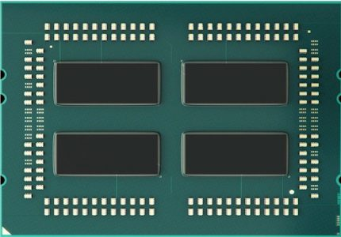
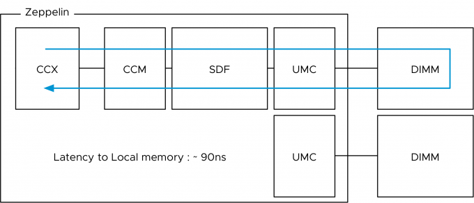
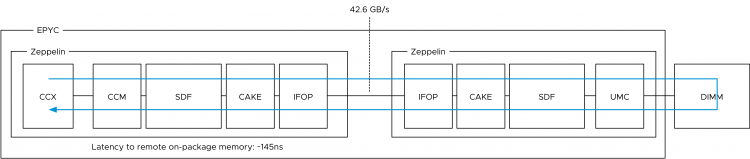
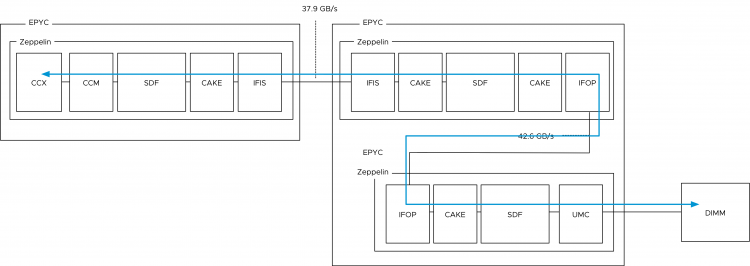
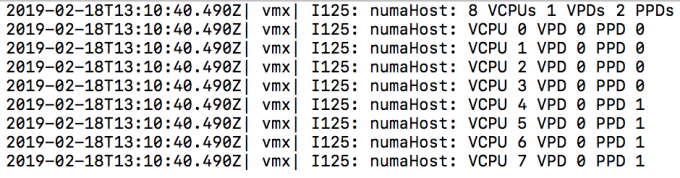

AMD is gaining popularity in the server market with the [EPYC](https://www.amd.com/en/products/epyc-server) CPU platform. The EPYC CPU platform provides a high core count and a large memory capacity. If you are familiar with previous AMD generations, you know AMD's method of operation is different than Intel's. For reference, take a look at the article I wrote in 2011 about the [12-core 6100 Opteron](http://frankdenneman.nl/2011/01/05/amd-magny-cours-and-esx/) code name Magny-Cours. EPYC provides an increase of scale but builds on the previously introduced principles. Let's review the EPYC architecture and see how it can impact your VM sizing and ESXi configuration. (Please note that this article is NOT intended as a good/bad comparison between AMD and Intel, I'm just describing the architectural differences).

**EPYC Architecture**  
The EPYC processor architecture is what AMD refers to as a Multi-Chip-Module (MCM). EPYC is designed to provide a high core count platform by combining multiple silicon dies within a CPU Package. A silicon die (named Zeppelin) is a wafer that contains the circuitry. In simple terms, it's the component that contains CPU cores, memory cache, and various controllers. Regardless of the core-count, an EPYC CPU package always contains four Zeppelin dies. Comparing this to [Intel Xeon](https://www.intel.com/content/www/us/en/processors/xeon/scalable/xeon-scalable-platform.html), a Xeon CPU package is a single-chip-design which consist of a single silicon die containing all components. The reason why the difference in chip design is interesting is that impacts the logical grouping of compute resources. The size of the logical group, better known as a NUMA node, impacts scheduling decisions made by the CPU scheduler of the operating system (both the hypervisor kernel and possibly the guest operating system). It might be necessary to change some of the default settings of the ESXi host to alter scheduling behavior, these settings are covered in the last part of the article. Let's continue to explore the architecture of the EPYC CPU.

<figure>

<figcaption>

AMD EPYC - image courtesy of wccftech.com

</figcaption>

</figure>

**Compute Complex**  
The photo above provides a clear overview of the structure of the CPU package. The CPU package houses four Zeppelin dies. In the current generation, a Zeppelin die provides a maximum of eight Zen cores. The cores are divided across two compute complexes (CCX). A Zeppelin of a 32 core EPYC contains 4 cores per CCX. When Simultaneous Multi-Threading (SMT) is enabled within the BIOS, a CCX offers eight threads.

<figure>

<figcaption>

Zeppelin CCX Layout of 32 Core EPYC

</figcaption>

</figure>

Each core has its own L1 (instruction (64KB) and data (32KB)) and L2 caches (4 MB total L2 cache). A Zeppelin has 16 MB L3 cache. Interestingly enough, each CCX has it's own L3 Cache of 8MB, in turn, split up into four slices of 2 MB. The two CCXes within a Zeppelin die are connected to each other through an interconnect (Infinity Fabric). Adding hops to memory access is not beneficial to bandwidth and latency. Multiple tech-sites have performed in-depth testing on cache performance, and to quote [Anandtech.com](https://www.anandtech.com/show/11544/intel-skylake-ep-vs-amd-epyc-7000-cpu-battle-of-the-decade/13):

_"The local "inside the CCX" 8 MB L3-cache is accessed with very little latency. But once the core needs to access another L3-cache chunk – even on the same die – unloaded latency is pretty bad: it's only slightly better than the DRAM access latency."_ 

In essence, this means that you cannot think of the 64MB L3 cache as one single pool of cache capacity. Better is to approach it as eight 8MB capacity pools. This is important to realize if multiple workloads share the same data, the [NUMA](http://frankdenneman.nl/2016/07/06/introduction-2016-numa-deep-dive-series/) scheduler of ESXi attempts to place both workloads in the same NUMA node to optimize cache and memory performance for these workloads. It might happen that the L3 cache size is not sufficient enough. The option that impacts this behavior is called Action Affinity, more details about this setting can be found in the last part of the article.

**Zeppelin Core Count**  
EPYC is offered in multiple SKUs. Next, to the 32 core count model, there are lower-core count models. Since the EPYC architecture always includes four Zeppelins, the difference in core count is created by disabling cores per CCX in a symmetrical way. For example, in a 24 core count EPYC, a single Zeppelin die would look like this.

<figure>

<figcaption>

Zeppelin design of 24 Core EPYC

</figcaption>

</figure>

The table shows the core count per Zeppelin of the three largest EPYC CPUs. The total cores per Zeppelin count can be used as a guideline for the vNUMA setting described later in this article

| **Cores** | **Cores per CCX** | **Total Cores per Zeppelin** | **Zeppelin Count** |
| --- | --- | --- | --- |
| 32 | 4 | 8 | 4 |
| 24 | 3 | 6 | 4 |
| 16 | 2 | 4 | 4 |

**Infinity Fabric**  
The cores within a CCX communicate with memory (DIMMs) via an on-die memory controller through the infinity Fabric. The Infinity fabric is AMD's proprietary system interconnect architecture that facilitates data and control transmission across all linked components. The Infinity Fabric consists of two communication planes; the Scalable Data Fabric (SDF) and the Infinity Scalable Control Fabric (SCF). The SCF is responsible for processing system control signals, such as thermal and power management. Although very important, we are more interested in the SDF which is responsible for transmitting data within the system. The rest of the article zooms into SDF design and its impact on scheduling decisions.

Each CCX is connected to the SDF through the Cache-Coherent Master (CCM) that is responsible for sending coherent data traffic cross CCXes. The SDF uses a Unified Memory Controller (UMC) to connect to DRAM memory modules. Each UMC provides a memory channel to two DIMMs. Providing the memory capacity of 4 DIMMs in total.

<figure>

<figcaption>

Zeppelin CCX and SDF Architecture

</figcaption>

</figure>

How does this design impact VM sizing? A Zeppelin is a NUMA node that contains a maximum of 8 cores (16 threads) with the memory capacity of four DIMMs. This design results in a single EPYC CPU package presents four NUMA nodes to the operating system.

**Server Memory Capacity and NUMA  
**Intel moved from a 3 DIMMs per channel configuration (DPC) with 4 channels to a model with 6 channels and 2 DIMMs deep. This new model broke the capacity model cadence. For example, using 16 GB DIMMs, you had either 64 GB, 128GB or 192GB available per socket. Now with the scalable architecture, it's either 96GB or 192GB. That is if you follow the high- performance best practice of populating all channels for maximum bandwidth availability. However, with the current DIMM pricing, a lot of customers cannot afford such a configuration.

With the EPYC, every Zeppelin has two memory channels. Each memory channel can drive two DIMMs. For good performance, each Zeppelin should be equipped with at least 1 DPC. That means that a proper performing dual socket EPYC system should be configured with 16 DIMMs. This configuration allows for a theoretical bandwidth of 42.6 GB/s while providing a (shallow) memory capacity of just the two DIMMs combined. This design results in a single EPYC CPU package presents four NUMA nodes to the operating system. If the minimum of 1DPC is used, the NUMA node size can be too small and thus the overall performance if the VM memory size exceeds the physical memory configuration of each Zeppelin. Servethehome published [some benchmark tests](https://www.servethehome.com/amd-epyc-naples-memory-population-performance-impact-at-16-cores/) about the performance difference between the different memory configurations of EPYC.

<figure>

<figcaption>

1 EPYC CPU Package = 4 NUMA Nodes

</figcaption>

</figure>

With NUMA, it's important to understand the boundaries of your local memory domain and your remote memory domain. Traditionally the domains were easily demarcated by the CPU package core count and attached memory capacity. With EPYC, a new distinction has to be made between the different remote memory access types. It can be remote on-package memory access or remote socket memory access. The reason why this distinction has to be made is the impact on performance and consistency of application memory access. Having your VM and application span multiple NUMA nodes can introduce a very inconsistent response time.

**Local Memory Access**   
Let's start with the best and most consistent performance. When a core within the Zeppelin access local memory the path is as follows:

<figure>

<figcaption>

Local Memory Access

</figcaption>

</figure>

The presentation "[Zeppelin an SOC for Multi-Chip Architectures](https://www.slideshare.net/AMD/isscc-2018-zeppelin-an-soc-for-multichip-architectures)" by AMD list the latency of local memory access within the Zeppelin at **90 nanoseconds**.

**Remote Memory Access On Package**  
A core can access memory attached to a different Zeppelin within the same CPU package. This is called remote on-package memory access or "on-package Die-to-Die" memory access. This means we are still using memory controllers within the same socket. In total the EPYC CPU has eight memory channels, but two are local to the Zeppelin. To access a "remote" on-package memory controller the Infinity Fabric On Package Controller (IFOP) sets up and coordinates the data communication.

_In total each Zeppelin has 4 IFOPs, but actually, only three are needed since there are 3 other Zeppelins within the same CPU package._

To be more precise, the IO traverses an additional component before hitting the IFOP. This component is called the _Coherent AMD socKet Extender_ (CAKE). It facilitates die-to-die or socket-to-socket memory transactions. This module translates the request and response formats used by the SDF transport layer to and from the serialized format used by the IFOP. What that means is that a few extra hops and CPU cycles are introduced when fetching data stored within DIMMs attached to other Zeppelins on the same die. AMD reports a **latency of ~145ns**.

<figure>

<figcaption>

Remote Memory Access within EPYC CPU

</figcaption>

</figure>

**Inter Package Remote Access**  
And then we have the chance that memory needs to be fetched from DIMMs attached to UMCs from a Zeppelin that is a part of another EPYC CPU package within the system (dual socket system). Instead of routing the traffic across the IFOP, the traffic is routed across Infinity Fabric Inter Socket (IFIS) controller. Package-to-package traffic has 8/9 of the bandwidth of IFOP traffic, resulting in a theoretical bandwidth of 37.9 GB/s. The reduction in bandwidth increases the chance of experiencing inconsistent performance. The increased length of the path, increments latency. AMD reports a **latency of ~200ns**.

<figure>

<figcaption>

Remote Access Across EPYC CPUs

</figcaption>

</figure>

Because there are two IFIS controllers per Zeppelin, not every Zeppelin within a dual socket system is directly connected to each other. In the worst case scenario, there are two hops. One hop from one package to the other package and an extra hop to go from one Zeppelin to the Zeppelin that is connected to the DIMM holding the data. Unfortunately, AMD as not shared latency data.

<figure>

<figcaption>

Remote Access Inter-package, die-to-die communication

</figcaption>

</figure>

**VM Sizing**  
The key is to keep memory access as much local as possible. ESXi and most modern guest operating systems are optimized to deal with NUMA. However as with most things in life, for the most optimal performance, reduce distance and reduce any form of variation. Apply this to VM sizing and try to keep the vCPU count of a VM within the core count of NUMA domain. Same applies to VM memory capacity, try to fit this with the capacity of the NUMA node. If the VM cannot fit inside a NUMA node, there is no need to stress, ESXi has got the best NUMA scheduler in the business. To help ESXi to optimize for the EPYC architecture, some advanced settings might be necessary to adjust. As always, tests these settings in a non-revenue critical environment before applying them to production systems.

**Virtual NUMA**  
Virtual NUMA (vNUMA) allows the operating system to understand the "physical" layout of the virtual machine. vNUMA presents the mapping of the VM vCPU to the physical NUMA nodes of the ESXi host. For example, if a VM has 12 vCPUs and the physical core count within a single NUMA node was 10 cores, ESXi would present the guest OS a topology of 2 NUMA nodes with each counting 6 cores. ESXi would group 6 vCPUs into a NUMA client and schedule these across the 10 CPU cores within a NUMA node.

When vNUMA was introduced, the highest core count of a CPU was 8 CPUs, thus the VMware engineers introduced a vNUMA threshold of 9 (numa.vcpu.min=9). Meaning that the VM needs to contain at least 9 vCPUs in order to generate the virtual NUMA topology.Considering the highest core-count of an EPYC system is eight cores per Zeppelin, you might want to adjust the vNUMA default threshold to resemble the physical layout of the used EPYC model.

For example, the EPYC 7401 contains 24 cores, 6 cores per Zeppelin and thus 6 cores per NUMA node. When using the default setting of _numa.vcpu.min=9_, an 8 vCPU VM is automatically configured like this.

<figure>

<figcaption>

Screenshot by @AartKenens

</figcaption>

</figure>

A VPD is the virtual NUMA client that is exposed to the guest OS system, while a PPD is the NUMA client used by the VMkernel CPU scheduler. In this situation, the ESXi scheduler uses two physical NUMA nodes to satisfy CPU and memory requests while the guest OS perceives the layout as a Uniform Memory Access (UMA) system. In a UMA system, the access time to a memory location is independent of which processor makes the request, or which memory chip contains the transferred data). I.e., pretty much the same latency and bandwidth throughout the system. However, this is not the case as reported in this article above. Reading and writing remote CCX cache and remote memory (on-die) is slower than local memory even within the same Zeppelin. By setting the _numa.vcpu.min=6_, two VPDs are created, and thus the guest OS is made aware of the physical layout by the ESXi scheduler. The guest OS and the applications can optimize memory operations to attain consistent performance.

**Action Affinity**  
When the ESXi scheduler detects multiple VMs communicating with each other, it can decide of placing them together on the same NUMA node to increase intra-NUMA node communication. This behavior is called action affinity, and it can increase performance by up to 30%. However, with the small NUMA nodes of max 8 CPUs, it can also lead to a lot of cache thrashing and remote memory access if the configured memory of the VMs cannot fit inside a single NUMA node. If this is the case, it might be helpful to test disabling the action affinity on the ESXi host. This is done by configuring the /Numa/LocalityWeightActionAffinity to 0 (KB [2097369](ttps://kb.vmware.com/s/article/2097369)).

**What if the VM Memory Config Exceeds the Memory Capacity of the Physical NUMA Node?**  
I wrote an article about t[his situation](http://frankdenneman.nl/2017/10/05/vm-memory-config-exceeds-memory-capacity-physical-numa-node/) back in 2017, and it's featured in the vSphere 6.5 Host deep dive book. However, what happens if your VM memory configuration exceeds the physical capacity of a NUMA node. By default, the ESXi scheduler optimizes for local memory access and attempts to place as much memory along with the vCPU in the same NUMA node. Sometimes it can improve local memory access to creating multiple smaller NUMA clients.

For example, on an EPYC 7601 (32 core), the NUMA node contains 8 cores, and this server is equipped with 256 GB by using 16 x 16 GB DIMMs. A NUMA node has 4 DIMMs attached to it. Thus the NUMA node provides 8 cores and 64 GB. What happens if a VM is configured with 6 vCPUs and 96 GB? By default the NUMA scheduler attempts to store 64GB of VM memory inside the NUMA node, leaving 32 GB in a remote NUMA node. By enabling the VM advanced setting _numa__.consolidate = FALSE_. It instructs the NUMA scheduler to distribute the VM configuration across the optimal number of NUMA nodes greater than 1. In this case, 2 NUMA clients are created, and this will schedule 3 vCPUs in each NUMA node.

Now the performance and the behavior of the application depends on its design. If you have a single-threaded application, this setting might not be helpful at all. However, if it's a multi-threaded application, you might see some benefit. The only thing to do is to set the numa.vcpu.min equal to the number of vCPUs per virtual NUMA client to expose the vNUMA architecture to the guest OS and the application. The following command helps you to retrieve the NUMA configuration of the VM:

> vmdumper -l | cut -d \\/ -f 2-5 | while read path; do egrep -oi "DICT._(displayname._|numa._|cores._|vcpu._|memsize._|affinity._)= ._|numa:._|numaHost:._" "/$path/vmware.log"; echo -e; done

Please bear in mind that the ESXi CPU and NUMA scheduler do not use an SRAT (System Resource Allocation Table) to determine the distance of the individual NUMA nodes between each other. ESXi uses its own method to determine latency between the different NUMA nodes within the system. It uses these latency numbers for initial placement and attempts to schedule the NUMA clients of a VM as close to each other as possible. However, the ESXi scheduler does not leverage this information during load-balancing operations. This is work in progress. Adding a new first class metric to a heuristic is not a simple task and knowing the CPU engineers, they want to provide a system that is thoroughly improved by augmenting new code.

**Increase NUMA Node Compute Sizing**  
For workloads that are memory latency sensitive with a low processor utilization, you can alter the way the NUMA scheduler sizes the NUMA client of that particular VM. The VM advanced setting _numa.vcpu.preferHT=TRUE_ allows the NUMA scheduler to count threads instead of cores for NUMA node size configuration. For example, an 8 vCPU VM that uses this advanced setting and runs on an EPYC 7401 system (6 cores, 12 threads), is scheduled within a single Zeppelin.  
If all workloads follow the same utilization pattern, you can alter the ESXi host setting by adding _numa__.PreferHT=1_ to the ESXi host advanced configuration.

**Channel-Pair Interleaving (1 NUMA node per socket)**  
The EPYC architecture can interleave the memory channels and thus present the cores of the four zeppelins as a single NUMA node. This setting requires that every channel is populated with equal memory size. Some vendors use a different name for it. For example, Dell calls this setting "Memory Die Interleaving". Little to no data can be found about the performance impact of this setting, but keep in mind, software settings do not change the physical layout (and thus physics). Typically abstraction filters out the outliers and presents an average performance behavior. For NUMA benchmarking, please take a look at the article "[AMD EPYC – STREAM, HPL, InfiniBand, and WRF Performance Study](https://www.dell.com/support/article/nl/nl/nlbsdt1/sln313856/amd-epyc-stream-hpl-infiniband-and-wrf-performance-study?lang=en)" located on the Dell website.

**Research Your Workload Requirements**  
ESXi can handle complex NUMA architectures as the best. However, it's always best to avoid complexity as possible. Determine if your workload can fit in a minimum number of small NUMA nodes when using the EPYC architecture? Can the workload handle inconsistent memory performance if it does exceed the NUMA node size of 8? The EPYC architecture is an excellent way of adding scale to the server platform but do remember that for real-life workload optimal performance is achieved when you take the NUMA configuration boundaries into account.

On Twitter some asked what my thoughts are about the EPYC CPU architecture? For every tech challenge, there is a solution. When looking at the architecture, I think EPYC is an excellent solution for small and medium-sized workloads. I expect that larger monolithic apps, that require consistent performance, are better off looking at different architectures. (My opinion, not VMware's!)
