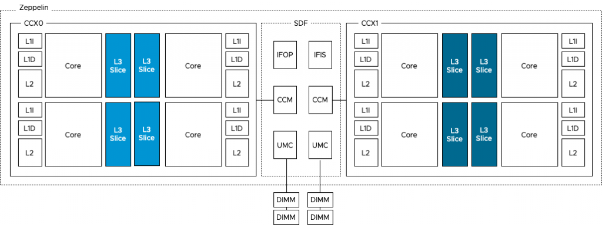
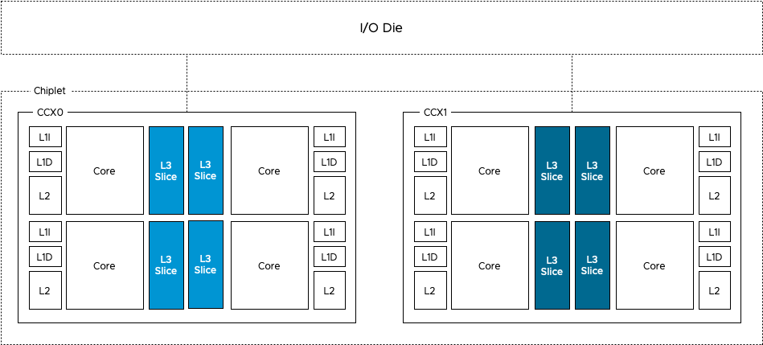
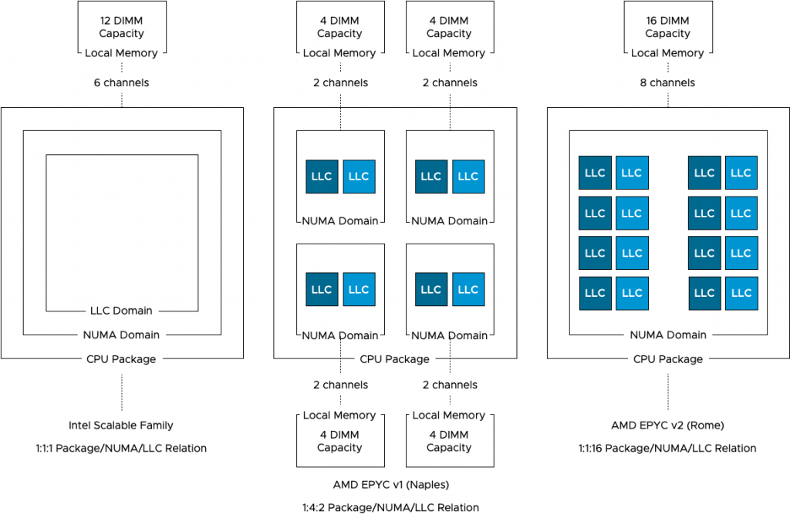
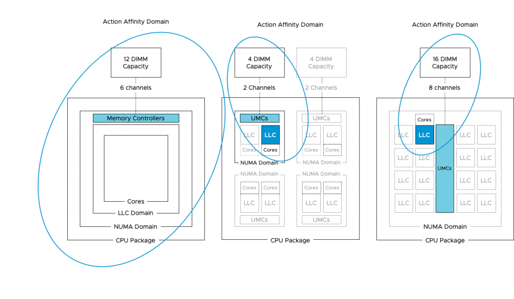
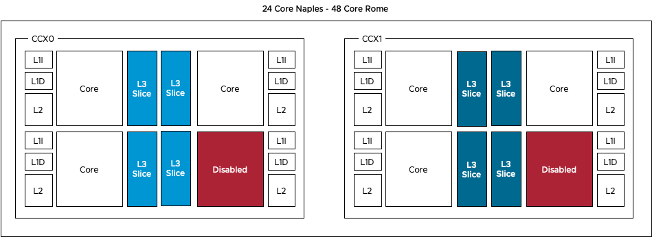

Recently AMD announced the 2nd generation of the AMD EPYC CPU architecture, the [EPYC 7002 series](https://www.amd.com/en/processors/epyc-7002-series). Most refer to the new CPU architecture using its internal codename Rome. When AMD introduced the 1st generation EPYC (Naples), they succeeded in setting a new record of core count and memory capacity per socket. However, due to the CPU multi-chip-module (MCM) architecture, it is not an apples-to-apples comparison when compared to an Intel Xeon architecture. As each chip module contains a memory controller, each module presents a standalone NUMA domain. This impacts OS scheduling decisions and, thus, virtual machine sizing. A detailed look can be found here in [English](https://frankdenneman.nl/2019/02/19/amd-epyc-and-vsphere-vnuma/) or here translated by [Grigory Pryalukhin](https://twitter.com/gpryalukhin) in [Russian](https://medium.com/@pryalukhin/amd-epyc-and-vsphere-vnuma-84ad66841035). Rome is different, the new CPU architecture is more aligned with the single NUMA per Socket paradigm, and this helps with obtaining workload performance consistency. There are some differences between Xeons and Rome. In addition, we made some adjustments to the CPU scheduler to deal with this new architecture. Let's take a closer look at the difference between Naples and Rome.

## 7 nanometer (7 nm) lithography process forcing a new architecture

Rome is using the new 7nm [Zen 2 microarchitecture](https://en.wikichip.org/wiki/amd/microarchitectures/zen_2). A smaller lithography process (7nm vs. [14nm](https://en.wikichip.org/wiki/amd/microarchitectures/zen)) allows CPU manufacturers to cram more CPU cores in a CPU package. However, there are more elements on a CPU chip than CPU cores alone, such as I/O and memory controllers. The scalability of I/O interfaces is limited, and therefore, AMD decided to use a separated and more massive 14nm die that contains the memory and I/O controllers. This die is typically revered to as the server I/O Die (sIOD). In the picture below, you see a side by side comparison of an unlidded Naples (left) and an unlidded Rome, exposing the core chiplet dies and the SIOD. 

<figure>

<figcaption>

AMD EPYC Naples vs. EPYC Rome

</figcaption>

</figure>

## **Naples Zeppelin vs. Rome Chiplet**

The photo above provides a clear overview of the structure of the CPU package. The Naples CPU package contains four Zeppelin dies (black rectangles). A Zeppelin die provides a maximum of eight Zen cores. The cores are divided across two compute complexes (CCX). A Zeppelin of a 32 core EPYC contains 4 cores per CCX. When Simultaneous Multi-Threading (SMT) is enabled, a CCX offers eight threads. Each CCX is connected to the Scalable Data Fabric (SDF) through the Cache-Coherent Master (CCM) that is responsible for sending traffic cross CCXes. The SDF contains two Unified Memory Controllers (UMC) connecting the DRAM memory modules. Each UMC provides a memory channel to two DIMMs. Providing the memory capacity of 4 DIMMs in total. Due to the combination of Cores, cache, and memory controller, a Zeppelin is a NUMA domain. To access a "remote" on-package memory controller, the Infinity Fabric On Package Controller (IFOP) sets up and coordinates the data communication.

<figure>

<figcaption>

Naples Zeppelin

</figcaption>

</figure>

The Rome CPU package contains a 14nm I/O Die (the center black rectangle), and 8 chiplet dies (the smaller black rectangles). A Rome chiplet contains two CCX'es with each containing four cores and L3 cache, but no I/O components or the memory controllers. There is a small Infinity Fabric "controller" on each CCX that connects the CCX to the sIOD. As a result, every memory read beyond the local CCX L3 cache has to go to the sIOD. Even for a cache line (data from memory stored in the cache) that is stored in the LL3 cache of the CCX sharing the same Rome chiplet. A Chiplet is a part of the NUMA Domain.

<figure>

<figcaption>

Rome Chiplet

</figcaption>

</figure>

## NUMA Domain per Socket

As mentioned before, a NUMA Domain, typically called NUMA node, is a combination of CPU cores, cache, and memory capacity connected to a local memory controller. Intel architecture design uses a single NUMA Domain per Socket (NPS), AMD Naples offered four NPS, while Rome is back to a single NPS. Single NPS simplifies VM and application sizing while providing the best and consistent performance.

<figure>

<figcaption>

NUMA per Socket Overview

</figcaption>

</figure>

The bandwidth to local memory differs between each CPU architecture. The Intel [Xeon Scalable Family](https://ark.intel.com/content/www/us/en/ark/products/series/192283/2nd-generation-intel-xeon-scalable-processors.html) provides a maximum of six channels of memory supporting a DDR4-2933 memory type. The [Naples](https://www.amd.com/en/products/cpu/amd-epyc-7601) provides two memory channels to its locally connected memory, supporting a DDR4-2666 memory type. The [Rome](https://www.amd.com/en/products/cpu/amd-epyc-7742) architecture provides eight memory channels to its locally connected memory, supporting a DDR4-3200 memory type. Please note that the memory controllers in the Rome architecture are located on the centralized die, handling all types of I/O and memory traffic, the Intel memory controllers are constructs isolated from any other traffic. Real-life application testing must be used to determine whether this architecture impacts memory bandwidth performance.

| **CPU Architecture** | **Local Channels** | **Mem Types** | **Peak transfer** |
| --- | --- | --- | --- |
| Intel Xeon Scalable | 6 | DDR4-2666 | 127.8 GB/s |
| AMD EPYC v1 (Naples) | 2 | DDR4-2933 | 46.92 GB/s |
| AMD EPYC v2 (Rome) | 8 | DDR4-3200 | 204.8 GB/s |

With a dual-socket system, there are typically two different distances with regards to memory access. Accessing memory connected to the local memory controller and accessing memory connected to the memory controller located on the other socket. With Naples, there are three different distances. The IFOP is used for intra-socket communication, while the Infinity Fabric Inter Socket (IFIS) controller takes care of routing traffic across sockets. As there are eight Zeppelins in a dual-socket system, not every Zeppelin is connected directly to each other and thus sometimes the memory access is routed through the IFIS first before hitting an IFOP to get to the appropriate Zeppelin. 

| **Naples Memory Access** | **Hops** |
| --- | --- |
| Local memory access within a Zeppelin | 0 |
| Intra-socket memory access between Zeppelins | 1 |
| Inter-socket memory access between Zeppelins with direct IFIS connection | 1 |
| Inter-socket memory access between Zeppelins with indirect connection (IFIS+Remote IFOP) | 2 |

AMD Rome provides equidistant memory access within the die and a single hop connection between sockets. Every memory access within the socket, every cache line load within the socket has to go to the I/O die. Every remote memory and cache access goes across the Infinity Fabric between sockets. This is somewhat similar to the Intel architecture that we have been familiar with since Nehalem, which launched in 2008. Why somewhat? Because there is a difference in cache domain design.

## The Importance of Cache in CPU Scheduling

Getting memory capacity as close to the CPU improves performance tremendously. That's the reason why each CPU package contains multiple levels of cache. Each core has a small but extremely fast cache capacity for instructions and data (L1), a slightly larger but relatively slower (L2) cache. A third and larger cache (L3) capacity is shared amongst the cores in the socket (Intel paradigm). Every time when a core request data to be loaded, it makes sense to retrieve this from the closest source possible, typically this is cache. To get an idea of how fast cache is relative to local and remote memory, look at the following table:

| **System Event** | **Actual Latency** | **Human Scaled Latency** |
| --- | --- | --- |
| One CPU cycle (2.3 GHz) | 0.4 ns | 1 second |
| Level 1 cache access | 1.6 ns | 4 seconds |
| Level 2 cache access | 4.8 ns | 12 seconds |
| Level 3 cache access | 15.2 ns | 38 seconds |
| Remote level 3 cache access | 63 ns | 157 seconds |
| Local memory access | 75 ns | 188 seconds (3min) |
| Remote memory access | 130 ns | 325 seconds (5min) |
| Optane PMEM Access | 350 ns | 875 seconds (15min) |
| Optane SSD I/O | 10 us | 7 hours |
| NVMe SSD I/O | 25 us | 17 hours |

Back in the day when you could disable the cache of the CPU, someone tested the effect of cache on loading Windows 95. With cache it took almost five minutes, without the use of the cache, it took over an hour. Cache performance is crucial to get the best performance. And because of this, the vSphere NUMA scheduler and the CPU scheduler work together to optimize workloads that communicate with each other often. As they are communicating, they typically use the same data sources. Therefore, if vSphere can run the workload on the same cores that share the cache, then this could improve performance tremendously. The challenge is that AMD uses a different cache domain design than Intel.

<figure>

<figcaption>

Last Level Cache Domains

</figcaption>

</figure>

As depicted in the diagram above, Intel uses a 1:1:1 relationship model. One socket equals one NUMA domain and contains one Last Level Cache domain. As Intel is used in more than 98% of the dual-socket systems (info based on internal telemetry reports), our scheduling team obviously focused most of their efforts on this model. EPYC Naples introduced a 1:4:2 model, one socket, that contains four NUMA domains, and each NUMA domain contains two LLC domains. Rome provides a NUMA model similar to the XEON, with a single socket and single NUMA domain. However, each chiplet contains two separate LLC domains. A Rome CPU package contains eight chiplets, and thus, 16 different LLC domains exist within a socket & NUMA domain.

### Relational Scheduling

vSphere uses this LLC domain as a target for its relational scheduling functionality. Relational scheduling is better known as Action-Affinity. Its actions have made most customers think that the NUMA scheduler was broken. As the scheduler is optimized for cache sharing, it can happen that a majority of vCPU is running on a single socket, while the cores of the other sockets are idling. When reviewing ESXTOP you might see an unbalanced number of VMs running on the same NUMA Host Node (NHN). As a result, the VMs running in this NUMA domain (or in ESX terminology NHN) might compete with CPU resources and thus experience increased %Ready time.

_Side note: It is my opinion to test the difference of relational scheduling on the performance of the application. Do not test this with synthetic test software. Although %Ready time is something to avoid, some applications benefit more from low-latency and highly consistent memory access than being impacted by an increase of CPU scheduling latency._

Action-Affinity can lead to ready time on an Intel CPU architecture where more than eight cores share the same cache domain, imagine what impact it can have on AMD EPYC systems where the maximum number of cores per cache domain is four. In lower-core count AMD EPYC systems, the cores are disabled per CCX, reducing the scheduling domain any further.

As the majority of the data centers are running on Intel, vSphere is optimized for a CPU topology where the NUMA and LLC domain are of consistent scope, i.e. the same size. With AMD the scopes are different and thus the current CPU scheduler can make "sub-optimal" decisions, impact performance. What happens is that the NUMA scheduler dictates the client size, the number of vCPUs to run on a NUMA Home Node, but it's up to the CPU scheduler discretion to decide which vCPU to run on which physical core. As there are multiple Cache domains within a NUMA client, it can happen that there is an extraordinary amount of vCPU migrations between the cache domains within the NUMA domain. And that means cold cache access and a very crowded group of cores.

Therefore, the CPU team worked very hard to introduce optimizations for the AMD architecture and these optimizations are released in the updates [ESXi 6.5 Update 3 and ESXi 6.7 Update 2](https://kb.vmware.com/s/article/67996).

The fix informs the CPU scheduler about the presence of the multiple cache domains within the NUMA node, allowing it to schedule the vCPU more intelligently. The fix also introduces a automatic virtual NUMA client sizer. By default, a virtual NUMA architecture is exposed to the guest OS when the vCPU count exceeds the physical core count of the physical NUMA domain and if the vCPU count is no less than the numa.vcpu.min setting, which defaults to 9. A physical NUMA domain in Naples counts eight cores, and thus no virtual NUMA topology is exposed. With the patch, this is solved. What is crucial to note is that the virtual NUMA topology is determined at first boot by default. Therefore, existing VMs need to have its virtual NUMA topology reset to leverage this new functionality. This involves a power-down to remove the NUMA settings in the VMX.

When introducing Naples/Rome based systems in your virtual data center, it's strongly recommended to deploy the latest update of your preferred vSphere platform version. This allows you to extract as much performance from your recent investment.
