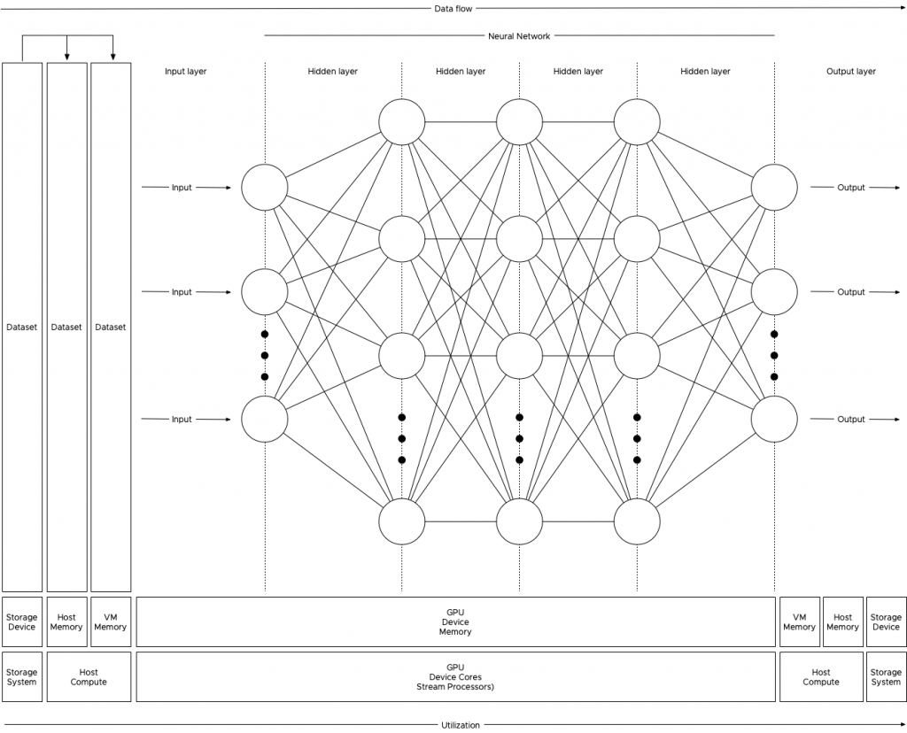
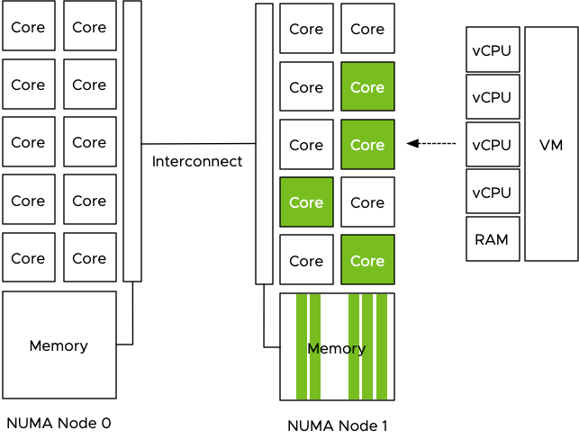

In the previous article "[PCIe Device NUMA Node Locality](https://frankdenneman.nl/2020/01/10/pcie-device-numa-node-locality/)" I covered the physical connection between the processor and the PCIe device briefly touched upon machine learning workloads with regards to PCIe NUMA locality. This article zooms in on why it is important to consider PCIe NUMA locality.

**General-Purpose Computing on Graphics Processing Units**

New compute-intensive workloads take advantage of the new programming model called general-purpose computing on GPU (GPGPU). With GPGPU, the many cores integrated on modern GPUs are used to offload a vast number of (parallel) compute threads from the CPU. By adding another computational device with different characteristics, a heterogeneous compute architecture is born. GPUs are optimized for streaming sequential (or easily predictable) access patterns, while CPUs are designed for general access patterns and concurrency of threads. Combined, they form a GPGPU pipeline, that is exceptionally well-suited to analyze data. The vSphere platform is well-suited to create GPGPU pipelines and optimizations are provided to VMs, such as DirectPath I/O Access (also known as Passthrough). Passthrough allows the application to interface with the accelerator device directly; however, data must be transferred from disk/network through the system (RAM) to the GPU. And controlling the data transfer is of interest to the overall performance of the platform for both GPGPU workload and non-GPGPU workload.

A very popular GPGPU workload is Machine Learning (ML). Many ML workloads process gigabytes of data, sometimes even terabytes, this data flows from the storage device up to the PCIe device. Finetuning the configuration and placement of the virtual machine running the ML workload can benefit the data-scientist and other consumers of the platform. Not every ML workload is latency-sensitive, but most data scientists prefer to get the training done as quickly as possible. This allows them to perform more training iterations to fine-tune the model (also known as the neural network). Due to the movement of data through the system, a ML workload can quickly become the noisiest neighbor you ever saw in your system. But with the right guard-rails in place, data-scientists take advantage of running their workload on a consistent performing platform, while the rest of the organization can consume resources from this platform as well.

**Machine Learning Concepts**

Oversimplified ML is "_using data to answer questions_." With traditional programming models, you create "rules" by using the programming language and apply these rules to the input to get output (results) (output). With ML training, you provide input and the output to train the program to create rules. This creates a predictive model that can be used to analyze previously unseen data to provide accurate answers. The key component of the entire ML process is data. This data is stored on a storage device and fetched to be used as input for the model to be trained on, or to use the trained model to provide results. Training a machine learning model is primarily done by a neural network of nodes that are executed by thousands of cores on GPUs. The nature of the cores (SIMT - Single Instruction, Multiple Data) allows for extremely fast parallel processing, ideal for this sort of workload, hence you want to use GPUs for this task and not the serial-workload optimized CPUs. The heavy lifting of the compute part is done by the GPU, but the challenge is getting the data to the costly GPU cores as fast and consistent as possible. If you do not keep the GPU cores fed with all the data it needs, then a large part of the GPU cores sit idle until new data shows up. And this is the challenge to overcome, handling large quantities of training data that flows from storage, through the host memory, into the VM memory before flowing into the memory of the GPU. High-speed storage systems with fast caching and fast paths between the storage, CPU, server memory and PCIe device are necessary.

**Anatomy of an ML Training Workload**

The collection of training examples is called a dataset, and the golden rule is, the more data you can use during the training, the better the predictive model becomes. That means that the data scientist will unleash copious amounts of data on the system, data so large that it cannot fit inside the memory device of the GPU. Perhaps not even the memory assigned to the virtual machine, as a result, the data is stored on disk and is retrieved in batches. 

The data scientist typically finetunes the size of the batch set, finetuning a batch set size is considered an art form in the world of ML. You, the virtual admin, slowly graduating into an ML infrastructure engineer (managing and help to design the ML platform), can help inform the data scientist by sizing the virtual machine correctly. Look at CPU consumption and determine the correct number of vCPUs necessary to push the workload. Once the GPU receives a batch, the workload is contained within the GPU. Rightsizing the VM can help to improve performance further as the VM might fit a single NUMA node.

To understand the dataflow of an ML workload through the system, let's get familiar with some neural network terminology. Most of the ML workload use the Compute Unified Device Architecture (CUDA) for GPU programming, and when using a batch of the training data, the CUDA program takes the following steps:

1: Allocate space on the GPU device memory

2: Copy (batch set) input data to the device (aka Host to Device (HtoD))

3: Run the algorithm on the GPU cores

4: Copy output (results) back to host memory (aka Device to Host (DtoH))

During training, the program processes all the training examples in the dataset. This cycle is called an **epoch**. As mentioned before, a data scientist can decide to split up the entire dataset into smaller batch sets. The number of training examples used is called a **batch size**. An **iteration** is the number of passes the program needs to use to go through the entire dataset to complete a single epoch. For example, a dataset contains 100.000 samples, and each batch size contains 1000 training examples, then it takes 100 iterations to complete a single epoch. Each iteration uses the previously described CUDA loop. To get a better result, multiple epochs are pushed to get a better convergence of the training model. Within each epoch, the neural network self-tweaks its own parameters (called weights and is done for each node) in the neural network, this finetuning provides a more accurate prediction result when it's used during the inference operation. The interesting part is that the data scientist can also make some adjustments to the (hyper)parameters of the ML model. Simply put, a hyperparameter is a parameter whose value is set before the training process begins. Such as the number of weights or the batch size set. To verify if this tuning was helpful, a new sequence of epochs is kicked off. A great series of videos about neural networks can be found [here](https://www.youtube.com/watch?v=aircAruvnKk&list=PLZHQObOWTQDNU6R1_67000Dx_ZCJB-3pi&index=1).

Josh Simons and Justin Murray gave a 4-hour workshop on ML workload on vSphere at VMworld last year. In this workshop, they stated that the typical values they saw were gigabytes of data (D), 10 to 100s of epochs (E), and 10 or more tuning cycles (T), which can be substantially more (in the 1000s) when researching new models. You can imagine that such data volumes can become a challenge in a shared system such as the hypervisor. Let's take a look at why isolation can benefit both ML workload and the other resident workload on the system.

**CPU Scheduler and NUMA optimizations**

When the data is fetched from the storage device it is stored in memory. The compute schedulers of the VMkernel are optimized to store the memory as close to the CPUs as possible. Let's use the most popular server configuration in today's data center, the dual-socket system. Each socket contains a processor and within the processor, memory controllers exist. Memory modules (DIMMs) attached to these memory controllers are considered local memory capacity. Both processors are connected to each other to allow each processor to access the memory connected to the other processor. Due to the difference in latency and bandwidth, this is considered to be non-uniform memory access (NUMA). For more information about NUMA, check out this series.

Let use the example of a 4 vCPU VM with 32 GB, running on a host with 512GB memory with 2 processors containing 10 cores each. The dataset used is 160GB of data and it cannot be stored in the VM memory and in the GPU device memory, thus the data scientist sets the batch size to 16GB. The program fetches 16GB of training data from the datastore and the NUMA scheduler ensures the data is stored within the local memory of the processor the four vCPU run on. In this case, the vCPUs of the VM are scheduled on the cores of CPU 1 (NUMA node 1) and thus the NUMA scheduler requests the VMkernel memory scheduler to store it in the memory pages belonging to the memory address space managed by the memory controllers of CPU 1.

The VM is configured with a passthrough GPU and the training data is pushed to the GPU. The problem is that the GPU is manually selected by the admin and no direct relation is visible in the UI or command-line, it just shows the type name and a PCI address. GPUs are PCIe devices and they are hardwired and controlled by a CPU.

The admin selected the first GPU in the list and now the dataset is pushed directly from the VM memory to the GPU Device memory to be used by the cores of the GPU. Data now flows through the interconnect to the PCIe controller of CPU 0 and to the GPU device. Each dataset that is retrieved from storage, is stored in NUMA node 1 and then moved through the interconnect to the device, this is done for each iteration, for each epoch and this can be done 1000's of time.

The problem is that the interconnect is used by the entire system. When the CPU needs to rebalance, it can reschedule the vCPU on cores belonging to a different CPU if this improves the overall resource availability for the active virtual machines. Memory can be transferred over to the new NUMA home node of that recently migrated virtual machine, or memory is just accessed across the interconnect. Same with Wide-VMs, VMs that span multiple NUMA nodes, it can happen that these Wide-VMs access a lot of "remote" memory. Also do not forget the data being handled by other PCIe devices. All network traffic has to flow from the NIC to a particular VM, for optimized performance, the kernel prefers to store that data in memory that is local to the vCPUs of that VM. The same goes for data coming from external storage devices, if the HBA or NIC is "hanging" off the other CPU, data has to flow through the interconnect. The interconnect is a highway shared by a lot of components and workloads. These operations can impact the performance of the ML workload but the opposite is also true, pushing 1000 epochs of gigabytes of data to a GPU ensures other workloads will notice the presence of that workload, even if it has a small CPU and memory footprint. Remember, ML is "using data to answer questions."

**PTNumaTopology PowerCLI Module**

To make sense of it all, I created a simple PowerCLI module with two functions that show the VMs that have a passthrough device configured. The output shows the VM name and the PCI address of the device so that you can relate that to what you see in the UI. The next column shows the NUMA node to which the PCIe device is connected. The next column indicates whether the advanced setting numa.affinity is set for that particular VM and its value. The last column shows the power state of the VM. To set the NUMA affinity, the VM has to be powered off.

To run the script, import the module (available at [GitHub](https://github.com/frankdenneman/PTNumaTopology)) and execute the Get-PTNumaTopology command. Specify the FQDN of the ESXi host. For example: `Get-PTNumaTopology -esxhost sc2esx27.vslab.local`. As the script needs to execute a command on the ESXi host locally an SSH session is initiated. This results in a prompt for a (root) username and password in a separate login screen. (The [Github page](https://github.com/frankdenneman/PTNumaTopology) has a thorough walk-through of all the steps involved and a list of requirements.)

**NUMA Affinity Advanced Setting**

In most situations, it is not recommended to set any affinity setting as it simply restricts the scheduler to generate an optimal balance between resource providers (CPUs) and consumers (vCPUs). At the host level and cluster level. However since the VM is configured with a passthrough (PT) GPU, it cannot move to another host and chances are a lot of data will flow to this device. Another assumption is that the host contains a small number of GPUs and thus a small number of VMs are active. If no other restrictions are configured, the CPU and NUMA scheduler can try to work "around" the affined VM and attempt to optimize the placement and resource consumptions of the other active VMs. Hopefully, the isolation of these particular passthrough-enabled VMs are reducing overall system load and thus evening out the possible enforced restrictions. Testing this first before using it on the production workload is always recommended! For more information about the NUMA affinity setting, please consult the VMware Docs for your specific vSphere version, linked is the VMware Docs page for [vSphere 6.7](https://docs.vmware.com/en/VMware-vSphere/6.7/com.vmware.vsphere.resmgmt.doc/GUID-A80A6337-7B99-48C8-B024-EE47E2366C1B.html).

Why set numa.affinity and not use CPU pinning? First of all, CPU pinning is something that should not be done ever. And even when you think you have a valid use case, chances are that CPU pinning will still reduce performance significantly. This topic is rearing its ugly head again and I will soon post another article why CPU pinning is just a bad idea. NUMA affinity creates a rule for the CPU scheduler to find a CPU core or HT within the boundaries of the CPU itself. In the example of the 4 vCPU running on the 10 core CPU. Let's say hyperthreading is enabled, it allows the CPU scheduler to schedule one of these four CPUs on the 20 available logical processors. If the system is not over-utilized, it can use a complete core for a vCPU, it can find the optimal placement for that workload and for the others using the same CPU. With pinning you restrict the vCPUs to only run on that particular logical processor. If chosen incorrectly you might have just selected HTs only.

If you decide to set a NUMA affinity on a particular VM, the Get-PTNumaTopology function can help you to set it correctly. As a failsafe, the script proceeds to ask if you would like to set the NUMA node affinity of a powered off VM. Answer "N" to end the script and return to the command-line. If you answer "Y" for yes, it will then ask you to provide the name of the VM. Please note that this setting can only be applied on a powered-off VM. Setting an advanced setting means that the system is writing to this to the VMX file and the VMX file is in a locked state during the power-on state of a VM. The next step is to provide the NUMA Node you want the vCPUs to set the affinity for. Use the same number listed in the PCI NUMA Node column behind the attached passthrough device.

Once the advanced setting is configurated it shows the configured value. To verify whether the setting matches the NUMA node of the passthrough device, run the command `Get-PTNumaTopology` again. As it has closed the SSH connection after the last run, you are required to log in again with the root user account to retrieve the current settings.

Setting the NUMA node advanced option for a VM is something that should be done for specific reasons, do not use the script for all your virtual machines. The NUMA affinity setting applies to the placement of vCPU only. The NUMA scheduler provides recommendations to the memory scheduler, but it is up to the memory scheduler discretion to store the data. The kernel is optimized to keep the memory close to the vCPUs as possible, but sometimes it cannot fit that memory into that node. Either because the VM configuration exceeds the total capacity of that node, or that other active VMs are already using large amounts of memory of that node. Setting the affinity is not a 100% guarantee that all the resources are local, but in the majority of use-cases, it will. Isolating the workload within a specific NUMA node will help to provide you consistent performance and will reduce a lot of interconnect bandwidth consumption. Enjoy using the script!

_Font used in PowerShell environment: JetBrains Mono - available at -_ [_https://www.jetbrains.com/lp/mono/#intro_](https://www.jetbrains.com/lp/mono/#intro)
