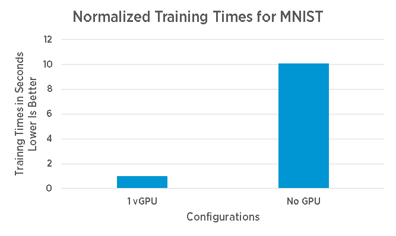
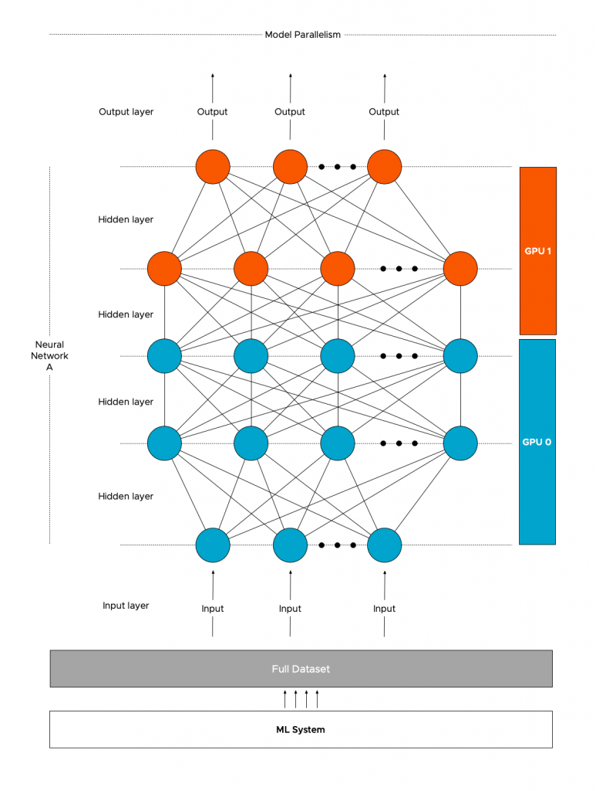
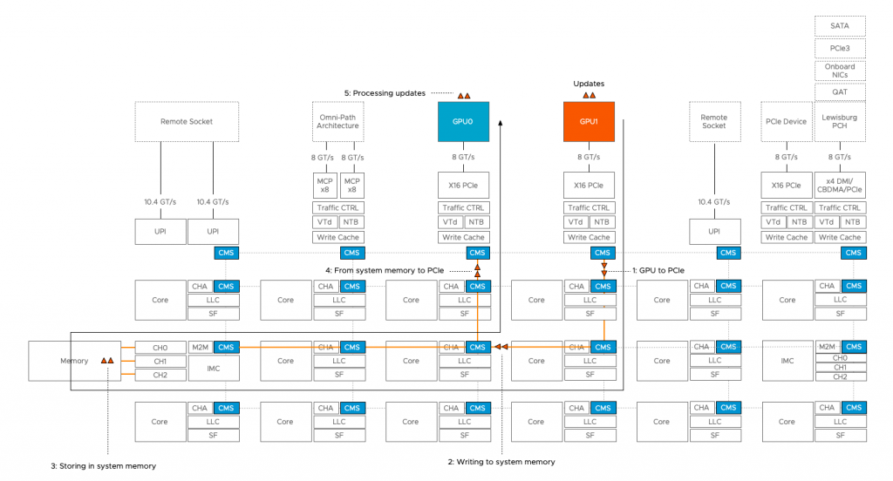

More enterprises are incorporating machine learning (ML) into their operations, products, and services. Similar to other workloads, a hybrid-cloud model strategy is used for ML development and deployment. A common strategy is using the excellent toolset and training data offered by public cloud ML services for generic ML capabilities. These ML activities typically improve an organization's quality of service and increase in productivity. But the real differentiation lies within using the organization's unique data and know-how to create what's called _differentiated_ machine learning. The data used is primarily generated by own processes or through interaction with its customers. As a result, specific rules and regulations come into play when handling and storing that data. Another strong aspect of determining where to deploy ML activities is data gravity. Placing compute close to where the data is generated provides a consistent (often high-performing) service. As a result, many organizations invest in the infrastructure needed to deploy ML and deep learning (DL) solutions.

### Deep Learning

Deep learning is a subset of the more extensive collection of machine learning techniques. The critical difference between ML and DL is the way the data is presented to the solution. ML uses mathematical techniques and data to build predictive models. It uses labeled (structured) data to train the model, and once the model is trained accurately enough, the model keeps on learning by feeding new data. Deep learning does not necessarily need structured or labeled data to create an accurate model to provide a predictive answer. It uses larger neural networks (layers of algorithms, imitating the brain's neural network), and it needs to be fed vast amounts of data to provide an accurate prediction.  

Interestingly, at one point, ML experiences a performance plateau regardless of the amount of incoming new data, while deep learning keeps on improving. For more information, about this phenomenon review the notes from [Andrew Ng Coursera Deep Learning course](https://www.slideshare.net/dataHackerrs/deep-learning-andrew-ng-lecture-notes-001018) or watch his 5-minute clip on youtube: [How Scale is Enabling Deep Learning](https://www.youtube.com/watch?v=LcfLo7YP8O4).

In essence, the magic of deep-learning is that it gets better with data, and thus, how do we create an infrastructure that is capable of feeding, transporting, and processing these vast amounts of data, while still being able to run non-ML/DL workload?

### **Parallelism**

The best way of dealing with massive amounts of data is to process it in a parallel way. And that's where general-purpose computing on GPU (GPGPU) comes into play. A simple [TensorFlow test](https://medium.com/@andriylazorenko/tensorflow-performance-test-cpu-vs-gpu-79fcd39170c) compared the performance between a dual AMD Opteron 6168 (2x12 cores) vs. a system with a (consumer-grade NVIDIA Geforce 1070. The AMD system recorded 440 examples per second, while the Geforce processed 6500 examples per second. There are many performance tests available, but this showed the power of a consumer-grade GPU versus a data center grade CPU system.

Today [data center focused GPUs](https://images.nvidia.com/content/technologies/volta/pdf/volta-v100-datasheet-update-us-1165301-r5.pdf) have more than 5000 cores all optimized to operate in parallel. These cores have access to 32 GB of high bandwidth memory (HBM2) with speeds up to 900 GB/s (theoretical bandwidth). According to the paper "[Analysis of Relationship between SIMD-Processing Features Used in NVIDIA GPUs and NEC SX-Aurora TSUBASA Vector Processors](https://books.google.nl/books?id=X7OmDwAAQBAJ&pg=PA125&lpg=PA125&dq=Analysis+of+Relationship+between+SIMD-Processing+Features+Used+in+NVIDIA+GPUs+and+NEC+SX-Aurora+TSUBASA+Vector+Processors&source=bl&ots=4jlOytDvr9&sig=ACfU3U1fmFty_CXa21NILXmbdg-9cQ8-mA&hl=nl&sa=X&ved=2ahUKEwi26sr73tvnAhUYRhUIHU_LCRoQ6AEwAnoECAoQAQ#v=onepage&q=Analysis%20of%20Relationship%20between%20SIMD-Processing%20Features%20Used%20in%20NVIDIA%20GPUs%20and%20NEC%20SX-Aurora%20TSUBASA%20Vector%20Processors&f=false)" by Ilya.V. Afanasyev et al. the achievable bandwidth on the tested NVIDIA Volta V100 was 809 GB/s. Getting all the data loaded in memory with consistent performance is one element that impacts virtual machine design. See "[Machine Learning Workload and GPGPU NUMA Node Locality](https://frankdenneman.nl/2020/01/30/machine-learning-workload-and-gpgpu-numa-node-locality/)" for more information.

Although the improvement of processing speed is enormous, up to 10x over a CPU according to [this performance study](https://blogs.vmware.com/performance/2016/10/machine-learning-vsphere-nvidia-gpus.html), sometimes this speed-up is not enough. After processing all the training examples in a dataset (called an epoch), a data scientist might make some adjustments as well and start another epoch to improve the prediction model.

It's common to run multiple epochs before getting an adequate trained model (and in the process pushing lots of data through the system). Reducing training time, allows the organization to deploy the trained model faster, and start benefiting from their ML and DL initiatives. A "simple" way to reduce training time is to use multiple GPU devices to increase parallelism.

### **Distributed Deep Learning Strategies**

How do you scale out your training model across the multiple GPUs in your system? You add another layer of parallelism on top of GPUs. Parallelism is a common strategy is distributed deep learning. There are two popular methods of parallelizing DL models: model parallelism and data parallelism.

**Model parallelism**  
With model parallelism, a single model (Neural Network A) is split and distributed across different GPUs (GPU0 and GPU1). The same (full) training data will be processed by the different GPUs depending on which layer is active. Models with a very large number of parameters, that are too big to fit inside a single device's memory, benefit from this type of strategy.

Neural networks have data dependency. The output of the previous layer is the input of the next layer. Asynchronous processing of data can be used to reduce training time, however, model parallelism is more about having the ability to run large models.

Maybe model sequentiality would be a better name for this mode as it primarily is using devices in sequential order. More than often a device is idling, waiting to receive the data from another device. Once the model part is trained on one device, it has to synchronize the outcome with the next layer possibly handled by another device.

This synchronization is interesting when designing your ML platform as specific data to help run the model has to traverse the interconnect either between devices within the ESXi system or between VMs (or containers) running on the platform. More about this in a later paragraph.

**Data parallelism**  
Data parallelism is the most common strategy deployed. As covered in the previous article: "[Machine Learning Workload and GPGPU NUMA node locality](https://frankdenneman.nl/2020/01/30/machine-learning-workload-and-gpgpu-numa-node-locality/)" it is common to split up the entire training dataset into batches (batch 0 and batch1). With data parallelism, these batches are sent to the multiple GPUs (GPU 0 and GPU1). Each GPU will load a full replica of the model (Neural Network A) and run their batch of training examples through the model.

The models running on the GPUs must communicate with each other to share the results. Communication timing and patterns between the GPUs depend on the DL model ( Convolutional Neural Networks (CNN) or Recurrent Neural Networks (RNN)) and on the framework used ([TensorFlow](https://www.tensorflow.org/guide/distributed_training), [Pytorch](https://pytorch.org/tutorials/intermediate/dist_tuto.html), [MXNet](https://mxnet.apache.org/api/faq/distributed_training)).

Currently, there are a few [projects](https://arxiv.org/pdf/1907.13257.pdf\)) active that are exploring the possibility of hybrid parallelization. This strategy uses both model and data parallelization strategies to minimize end-to-end training time.

Parallelism introduces communication between GPUs. Understanding the data-flow is essential to build a system that can provide consistent high-performance while ensuring the DL workloads are isolated enough and do not impact other workloads that are using the system. Various distributions of GPU resources are possible, such as a cluster of single GPU systems or multi-GPUs hosts. The next article focusses only on a single node with a multi-GPU configuration, to highlight the different in-system (on-node) interconnects

### On-Node Interconnect

vSphere allows for different multi-GPU configurations. A VM can be equipped with multiple GPU configured as a passthrough device, or configured with vGPUs with the help of NVIDIA drivers, or by using a Bitfusion solution. Details about the different solutions will be covered in a future article. But regardless of the chosen configuration, the application will be able to use multiple GPUs in a single VM.

When deploying deep learning models across multiple GPUs in a single VM, the ESXi host PCIe bus becomes an inter-GPU network that is used for loading the data from system memory into the device memory. Once the model is active, the PCIe bus is used for GPU to GPU communication for synchronization between models or communication between layers.

If two PCIe devices communicate with each other, then the CPU is involved. Data coming from the source device is stored in system memory before transferring it to the destination device. The new Skylake architecture with it's updated IIO structure, and additional mesh stops improved the CPU to PCIe communication over the previous ring-based architecture featured on the Xeon v1 through v4. (Each mesh stop has a dedicated cache and traffic controller).

<figure>

<figcaption>

CPU to GPU to CPU communication within a single NUMA node (Skylake Architecture)

</figcaption>

</figure>

For this purpose, NVIDIA introduced GPUDirect in CUDA 4.0, allowing direct memory access between two devices. However, this requires a full topology view of the system, and this is something currently vSphere is not exposing. As such, no direct PCI to PCI communication is available (yet).

Discovering this seems like this lack of topology view is an enormous bottleneck, but this doesn't necessarily mean an application performance slowdown. Modern frameworks optimize their GPU code to minimize communication. As a result, communication between devices is just a portion of total time. Depending on the framework used and the parallelism strategy, the performance can still be close to the bare-metal performance.

#### NVIDIA NVLink

In 2016, NVIDIA introduced the NVLink interconnect, a high-speed mesh network that allows GPUs to communicate directly with each other. NVLink is designed to replace the inter GPU-GPU communication across the PCIe lanes, and as a result, NVLINK uses a separate interconnect. A new custom form factor SXM2 (supported by vSphere) allows the GPU to interface with the NVIDIA High-Speed Signalling interconnect (NVHS). The NVHS allows the GPU to communicate with the other GPUs as well as direct system memory access. Currently, NVLink 2.0 (available on NVIDIA Tesla v100 GPUs) provides an aggregate maximum theoretical bidirectional bandwidth of 300 GBps. (AMD does not have any equivalent to NVlink)

<figure>

<figcaption>

NVIDIA V100 SXM2

</figcaption>

</figure>

### Design Decisions

Data movement within an ML system (VM) can be substantial. Fetching the data from storage, storing it into system memory before dispatching it to multiple vGPUs can produce a significant load on the platform. Depending on the neural network, framework, and parallelism strategy, communication between GPUs can add additional load to the system. It's key to understand this behavior before considering retrofitting your current platform with GPU devices or while designing your new vSphere clusters.

Depending on the purpose of the platform it might be interesting to research the value of having a separate interconnect mesh for ML/DL workload. It allows for incredible isolation that will enable you to run other workloads on the ESXi host as well. Couple this the ability to share multiple GPUs with the Bitfusion solution, and you can create a platform that provides consistent high-performance for ML workload to numerous data scientists.
